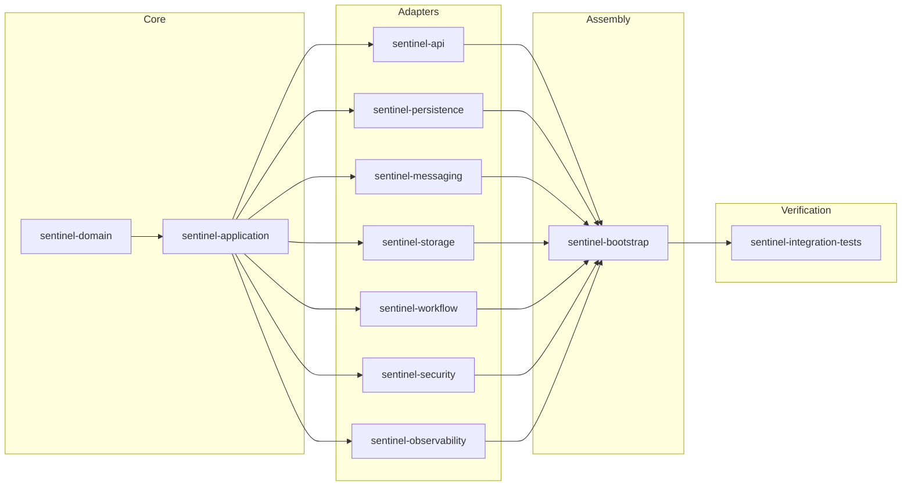

# Sentinel Enforcement Platform

Sentinel Enforcement Platform is an enterprise-grade Java 21 application for **regulatory enforcement and complex case management**. It provides a full lifecycle from report intake through triage, investigation, recommendation, decision, sanction, and appeal — backed by an event-driven messaging layer, embedded Camunda BPMN workflows, and MinIO-based evidence storage. All API access is secured via Keycloak JWT authentication with multi-axis authorization.

The current repo state covers an end-to-end enforcement lifecycle: foundation, intake, authentication/authorization, case lifecycle, embedded Camunda workflow, MinIO-based evidence intake, Kafka reliability, and aggregate recommendation/review/decision/sanction/appeal with stricter case-level authorization. The repo also carries workflow reconciliation tooling added as an additional hardening slice.

## Overview

The Sentinel Enforcement Platform serves regulatory and enforcement agencies that need to manage cases from initial report through final sanction and appeal. It replaces ad-hoc, non-auditable processes with a structured, auditable, event-driven system that enforces business rules at every state transition.

### Non-Responsibilities

The following are explicitly **out of scope** for the platform:
- **Public-Facing Portal** — No public-facing submission portal; reports arrive via the API from internal or integrated systems
- **Document Generation** — No template-based document generation or PDF rendering
- **Notification Delivery** — The platform publishes notification commands to Kafka but does not directly deliver email or SMS
- **Payment Processing** — No financial transaction handling or fine collection
- **Identity Management** — User identity, group membership, and role assignment are managed in Keycloak
- **Data Analytics / BI** — No built-in reporting dashboards or business intelligence tooling
- **Cloud-Native Deployments** — All infrastructure runs locally with containerized equivalents; no cloud-provider-specific dependencies

## Architecture

The platform is a **modular monolith** with **hexagonal (ports & adapters)** architecture. All modules compile and deploy as a single JAR artifact, but dependency direction and package boundaries enforce internal separation.

### Layers

1. **Domain layer** (`sentinel-domain`) — zero internal dependencies; contains aggregates, value objects, enums, domain exceptions, and invariant logic
2. **Application layer** (`sentinel-application`) — depends only on domain; contains use-case services, port interfaces, command/query objects, and authorization abstraction
3. **Adapter layer** — six modules, each depends on `sentinel-application` to implement a port:
   - `sentinel-api` — inbound REST adapter (JAX-RS resources, Bean Validation, JSON, RFC 7807 error envelope)
   - `sentinel-persistence` — outbound MyBatis persistence adapter with Liquibase changelog
   - `sentinel-messaging` — outbound Kafka publisher/consumer with outbox polling, retry, and dead-letter routing
   - `sentinel-storage` — outbound MinIO adapter for evidence presigned URLs
   - `sentinel-workflow` — outbound embedded Camunda BPMN workflow adapter
   - `sentinel-security` — outbound Keycloak JWT verification and multi-axis authorization
   - `sentinel-observability` — health checks, request metrics, and correlation context
4. **Bootstrap layer** (`sentinel-bootstrap`) — assembles all adapters via HK2 dependency injection and starts the Grizzly HTTP server
5. **Integration tests** (`sentinel-integration-tests`) — Testcontainers-based integration tests and Karate REST API suites

### Module Dependency Graph



### Dependency Injection

The platform uses **HK2** (`org.glassfish.hk2.utilities.binding.AbstractBinder`) integrated directly with Jersey's `ResourceConfig`. No Spring Boot or CDI is used. All wiring is explicit in `ApplicationBinder.java`.

## Technology Stack

| Category | Technology |
|---|---|
| Language | Java 21 |
| HTTP Server / REST | Grizzly HTTP server + Jersey JAX-RS (3.1.9) |
| ORM / Data Access | MyBatis 3.5.19 with HikariCP 6.3.0 connection pool |
| Database Migrations | Liquibase 4.31.1 |
| Database | PostgreSQL 18 (via PostgreSQL JDBC 42.7.5) |
| Messaging | Apache Kafka 3.8.1 (KRaft mode, no ZooKeeper) |
| Workflow Engine | Embedded Camunda BPM 7.24.0 |
| Object Storage | MinIO (8.5.17 SDK) |
| Authentication / Authorization | Keycloak 26.6 (JWT via Nimbus JOSE + JWT 10.0.2) |
| Validation | Hibernate Validator 9.0.0 (Jakarta EE) |
| JSON | Jackson 2.18.2 + OpenAPI Generator |
| Mapping | MapStruct 1.6.3 |
| Testing | JUnit 5.11.4, Testcontainers 1.20.5, Karate 2.1.1 |
| Build | Maven 3.9+ (multi-module) |
| Code Quality | Spotless (Google Java Format), Maven Dependency Analyzer |

## Prerequisites

- Java 21+
- Maven 3.9+
- Docker Desktop
- GNU Make (or PowerShell Core on Windows — `SHELL := pwsh.exe`)

## External Systems

The platform depends on the following infrastructure, all running as Docker containers:

| System | Role | Container Image |
|---|---|---|
| **PostgreSQL** | Primary data store | `postgres:18.3-alpine` |
| **Kafka** | Event bus (KRaft mode, no ZooKeeper) | `confluentinc/cp-kafka:7.9.0` |
| **MinIO** | S3-compatible object store for evidence files | `quay.io/minio/minio` |
| **Keycloak** | OIDC provider; JWT token issuer and role manager | `quay.io/keycloak/keycloak:26.6` |
| **Redis** | Available for future caching (container running, not actively used) | `redis:7.2-alpine` |
| **Mailpit** | Catch-all SMTP server for email inspection during development | `axllent/mailpit` |

## Local Setup

```bash
# 1. Restore Maven dependencies
make bootstrap

# 2. Start infrastructure (PostgreSQL, Kafka, Redis, MinIO, Keycloak, Mailpit)
make up

# 3. Run schema migrations and start the application
make migrate

# 4. (Optional) Re-run idempotent seed helpers (MinIO bucket init)
make seed

# 5. Verify the application is running
make smoke-test
```

## Make Targets

### Testing

| Target | Description |
|---|---|
| `make test` | Run all unit and integration tests (`mvn verify`) |
| `make unit-test` | Run unit tests only |
| `make integration-test` | Run integration tests with Testcontainers |
| `make workflow-test` | Run workflow-focused unit tests and `WorkflowTaskApiIT` |
| `make messaging-test` | Run messaging-focused integration test |
| `make e2e-test` | Run full end-to-end integration test slice |
| `make karate-smoke` | Run Karate smoke suite against the running app |
| `make karate-regression` | Run Karate regression suite |
| `make karate-full` | Run Karate full suite |
| `make verify` | Run `mvn verify` with all checks |

### Build & Code Quality

| Target | Description |
|---|---|
| `make compile` | Compile all modules (skip tests) |
| `make package` | Build distributable artifacts (skip tests) |
| `make format` | Apply Spotless/Google Java Format and POM sorting |
| `make lint` | Check formatting with Spotless |
| `make dependency-check` | Analyze dependency usage with Maven |
| `make openapi-validate` | Validate `docs/api/openapi.yaml` |
| `make openapi-generate` | Generate API sources from OpenAPI spec |

### Infrastructure

| Target | Description |
|---|---|
| `make up` | Start all infrastructure containers |
| `make down` | Stop all compose services |
| `make restart` | Restart compose services |
| `make reset` | Stop and remove all compose volumes |
| `make ps` | Show compose service status |
| `make logs` | Tail compose logs |
| `make app-logs` | Tail application logs |

### Database

| Target | Description |
|---|---|
| `make migrate` | Run application + Camunda schema migration, then start app |
| `make rollback` | Roll back latest Liquibase changesets (`ROLLBACK_COUNT=n`) |
| `make db-status` | Show PostgreSQL container status |
| `make db-shell` | Open `psql` shell inside Postgres container |
| `make db-reset` | Reset PostgreSQL data by recreating the container |

### Operations

| Target | Description |
|---|---|
| `make seed` | Re-run idempotent bootstrap helpers (MinIO bucket init) |
| `make smoke-test` | Call `GET /health` endpoint |
| `make minio-init` | Ensure the MinIO evidence bucket exists |
| `make keycloak-import` | Start Keycloak with realm import |
| `make kafka-topics` | List Kafka topics |
| `make kafka-consume` | Tail the `case.lifecycle.v1` topic |
| `make kafka-produce` | Produce a sample notification command message |
| `make bpmn-validate` | Validate the embedded Camunda BPMN model |
| `make bpmn-deploy` | Explain embedded BPMN deployment behavior |
| `make docker-build` | Build application image via Docker Compose |
| `make docker-push-local` | Build and tag image in local Docker daemon |
| `make help` | Show all available targets |

## Current API

All endpoints except `GET /health` require a valid Keycloak-issued Bearer JWT token. The API uses an RFC 7807 error envelope format.

### Health
- `GET /health` — Public health check

### Reports
- `POST /api/v1/reports` — Submit a new report
- `GET /api/v1/reports/{reportId}` — Get report details
- `POST /api/v1/reports/{reportId}/triage` — Triage a report

### Cases
- `POST /api/v1/cases` — Create a case from a triaged report
- `GET /api/v1/cases` — List cases (cursor-based pagination, search, sort)
- `GET /api/v1/cases/{caseId}` — Get case details
- `POST /api/v1/cases/{caseId}/assignments` — Assign investigator
- `POST /api/v1/cases/{caseId}/transitions` — Transition case status
- `GET /api/v1/cases/{caseId}/audit-events` — Get case audit trail

### Evidence
- `POST /api/v1/cases/{caseId}/evidence/upload-sessions` — Create upload session
- `POST /api/v1/evidence/{evidenceId}/versions/finalize` — Finalize evidence version
- `GET /api/v1/evidence/{evidenceId}` — Get evidence metadata
- `POST /api/v1/evidence/{evidenceId}/download-sessions` — Create download session

### Workflow Tasks
- `GET /api/v1/tasks` — List workflow tasks (cursor-based pagination, search, sort)
- `POST /api/v1/tasks/{taskId}/claim` — Claim a task
- `POST /api/v1/tasks/{taskId}/complete` — Complete a task

### Workflow Reconciliation
- `GET /api/v1/workflow-reconciliation` — List reconciliation issues
- `POST /api/v1/workflow-reconciliation/{caseId}/actions` — Execute reconciliation action

### Recommendations & Decisions
- `POST /api/v1/cases/{caseId}/recommendations` — Submit recommendation
- `POST /api/v1/cases/{caseId}/recommendations/{recommendationId}/review` — Review recommendation
- `POST /api/v1/cases/{caseId}/decision` — Submit or publish decision
- `GET /api/v1/cases/{caseId}/decision` — Get decision details

### Sanctions & Appeals
- `POST /api/v1/cases/{caseId}/sanctions` — Create or recalculate sanction obligations
- `GET /api/v1/cases/{caseId}/sanctions` — List sanction obligations
- `POST /api/v1/cases/{caseId}/appeals` — File an appeal
- `GET /api/v1/cases/{caseId}/appeals` — List appeals
- `POST /api/v1/cases/{caseId}/appeals/{appealId}/decision` — Decide an appeal

### Maintenance
- `POST /api/v1/maintenance/recalculate-sanctions` — Trigger overdue sanction recalculation

Contract specifications are located in [docs/api/openapi.yaml](docs/api/openapi.yaml). Generated request/response models for the API layer are built from this spec during the `generate-sources` phase.

The mandatory pattern for list endpoints is available in [docs/api/list-query-pattern.md](docs/api/list-query-pattern.md). All new list APIs must adhere to the combination of `cursor`, `limit`, `q`, `searchField/searchValue`, and enum-based `sortBy/sortDirection` using safe dynamic SQL.

## Messaging

The platform uses Kafka for asynchronous event-driven communication with the following reliability patterns:

### Active Topics
- `case.lifecycle.v1`, `case.assignment.v1` — Case state changes
- `evidence.lifecycle.v1` — Evidence upload and finalization events
- `decision.lifecycle.v1`, `sanction.lifecycle.v1`, `appeal.lifecycle.v1` — Decision/sanction/appeal events
- `notification.command.v1`, `notification.result.v1` — Notification dispatch
- `audit.integration.v1` — Audit event stream

### Reliability Patterns
- **Transactional Outbox** — Every relevant domain change writes an event to `outbox_event` within the same database transaction as the business change
- **Outbox Publisher** — Background daemon thread leases pending rows using `SELECT ... FOR UPDATE SKIP LOCKED`, publishes to Kafka, then marks rows as `PUBLISHED`
- **Inbox Deduplication** — Notification consumer processes events through `inbox_event` with a unique constraint on `(consumer_name, event_id)` so duplicate delivery does not cause duplicate side effects
- **Retry & Dead-Letter** — Failed events are sent to `<topic>.retry` with exponential backoff (2s -> 4s -> 8s -> 16s -> 32s -> 60s max). Repeated failures are moved to `<topic>.dlq`
- **Audit Integration** — Domain audit events are published to `audit.integration.v1`, keeping the append-only audit database and integration stream synchronized

## Background Jobs

The platform runs three persistent background jobs as daemon threads:

1. **Outbox Publisher** (`sentinel-outbox-publisher-{instanceId}`) — Polls `outbox_event`, publishes to Kafka
2. **Notification Consumer** (`sentinel-notification-consumer-{instanceId}`) — Polls Kafka `notification.command.v1`, routes to handlers via idempotent inbox pattern
3. **Camunda Job Executor** — Embedded thread pool for BPMN timers and async continuations

Three Java delegates are registered: `preTriageRoutingDelegate`, `investigationEscalationDelegate`, and `mockWorkflowServiceDelegate`.

## Authorization Model

The platform implements **multi-factor authorization** evaluated in this order:

1. **Admin Bypass** — `SYSTEM_ADMIN` role bypasses all checks
2. **Role-Permission Mapping** — 27 `Permission` enum values across 8 categories, each mapped to required roles
3. **Jurisdiction Match** — Actor must have matching jurisdiction to access a case
4. **Classification Clearance** — Actor clearance (PUBLIC < CONFIDENTIAL < SECRET) must meet or exceed the case classification
5. **Conflict-of-Interest** — Actor denied if their ID is in the case's `conflicted_actor_ids`
6. **Assigned Unit Scope** — Actors with assigned units can only access cases in those units
7. **Direct Assignment** — `INVESTIGATOR` role requires explicit case assignment

The JWT token carries `jurisdictions`, `assigned_units`, `case_classifications`, and `conflicted_actor_ids` custom claims. List endpoints and workflow task visibility share the same authorization rules as single-resource access.

### Roles

| Role | Description |
|---|---|
| `SYSTEM_ADMIN` | Superuser; bypasses all authorization checks |
| `CASE_INTAKE_OFFICER` | Submit and triage reports |
| `TRIAGE_OFFICER` | Triage reports and create cases |
| `INVESTIGATOR` | Investigate assigned cases (requires direct assignment) |
| `CASE_REVIEWER` | Submit recommendations on cases |
| `DECISION_MAKER` | Approve/publish decisions and attach sanctions |
| `APPEAL_OFFICER` | Manage and decide appeals |
| `SUPERVISOR` | Override appeal decisions |
| `AUDITOR` | Read-only access to case data and audit trails |

## Default Runtime Configuration

The default configuration for local development is in `.env.example`. All credentials shown are dummy local-only values.

**Key environment variables:**

| Variable | Default | Description |
|---|---|---|
| `HTTP_PORT` | `8080` | Application HTTP port |
| `DB_URL` | `jdbc:postgresql://localhost:5432/sentinel` | PostgreSQL JDBC URL |
| `DB_MAX_POOL_SIZE` | `12` | HikariCP max pool size |
| `KAFKA_BOOTSTRAP_SERVERS` | `localhost:29092` | Kafka broker address |
| `MINIO_ENDPOINT` | `http://localhost:9000` | MinIO S3 endpoint |
| `KEYCLOAK_ISSUER` | `http://localhost:8081/realms/sentinel` | JWT token issuer |
| `KEYCLOAK_JWKS_URL` | `http://localhost:8081/realms/sentinel/protocol/openid-connect/certs` | JWKS endpoint |
| `OUTBOX_POLL_INTERVAL` | `PT2S` | Outbox publisher poll interval |
| `OUTBOX_LEASE_DURATION` | `PT30S` | Outbox row lease duration |
| `OUTBOX_BATCH_SIZE` | `20` | Outbox batch size |
| `NOTIFICATION_MAX_RETRIES` | `3` | Max inbox consumer retries |
| `EVIDENCE_UPLOAD_URL_TTL` | `PT15M` | Presigned upload URL TTL |
| `EVIDENCE_DOWNLOAD_URL_TTL` | `PT10M` | Presigned download URL TTL |
| `WORKFLOW_ENGINE_NAME` | `sentinel-workflow-engine` | Camunda process engine name |
| `WORKFLOW_INVESTIGATION_ESCALATION_DURATION` | `PT30M` | Boundary timer for investigation SLA |

**Docker Compose overrides:** Inside the app container, service hostnames route via Docker Compose service names (e.g., `postgres:5432`, `kafka:9092`, `minio:9000`, `redis:6379`, `mailpit:1025`, `host.docker.internal:8081` for Keycloak JWKS).

The BPMN `regulatory-enforcement-case.bpmn` is deployed automatically on application startup. The Camunda runtime uses `databaseSchemaUpdate=false` — the Camunda schema must be created beforehand using `make migrate`.

## Default Users

All users have password `sentinel`:

| Username | Role | Jurisdiction | Notes |
|---|---|---|---|
| `intake-jkt` | CASE_INTAKE_OFFICER | JKT | |
| `intake-bdg` | CASE_INTAKE_OFFICER | BDG | |
| `triage-jkt` | TRIAGE_OFFICER | JKT | |
| `triage-bdg` | TRIAGE_OFFICER | BDG | |
| `investigator-jkt` | INVESTIGATOR | JKT | |
| `reviewer-jkt` | CASE_REVIEWER | JKT | |
| `reviewer-jkt-public` | CASE_REVIEWER | JKT | Clearance limited to PUBLIC |
| `reviewer-jkt-conflicted` | CASE_REVIEWER | JKT | Conflict against `investigator-jkt` |
| `decision-jkt` | DECISION_MAKER | JKT | |
| `appeal-jkt` | APPEAL_OFFICER | JKT | |
| `supervisor-jkt` | SUPERVISOR | JKT | |
| `supervisor-jkt-unit-2` | SUPERVISOR | JKT | Assigned unit JKT-UNIT-2 |
| `auditor-jkt` | AUDITOR | JKT | |
| `system-admin` | SYSTEM_ADMIN | — | Superuser |

## Testing Strategy

### Test Pyramid

1. **Unit Tests** — Application service logic, domain transition policy, optimistic locking guards, authorization policy, report triage, evidence lifecycle
2. **Workflow Unit Tests** — BPMN model validation and core stage wiring
3. **Integration Tests** (Testcontainers) — PostgreSQL + Kafka + Keycloak + MinIO + Redis + Mailpit for:
   - Happy path report intake, triage, case lifecycle through close
   - Authorization denial matrix (wrong role, jurisdiction, unit, clearance, conflict-of-interest)
   - Evidence upload session, presigned upload, finalize, checksum mismatch
   - Workflow task query, claim, completion, cursor, search, sort, duplicate-completion safety
   - Workflow reconciliation auto-repair from runtime/history, invalid-runtime termination
   - Outbox reliability when Kafka is unavailable, inbox deduplication
   - `409` invalid transition, `409` stale optimistic-lock version
   - `401` missing bearer token, `403` wrong role/jurisdiction
   - Public health endpoint
4. **Karate Acceptance Tests** — Three suites against the running application:
   - `make karate-smoke` — Health, login, report intake, triage, baseline API readiness
   - `make karate-regression` — Smoke plus workflow task happy paths, evidence, appeal, maintenance, reconciliation
   - `make karate-full` — Full regression plus search/cursor matrix, authorization denial matrix, relationship recursion, locking, duplicate-delivery observability

### Manual Sequence

```bash
make up
make migrate
# Wait for GET /health to return UP
make karate-smoke    # or karate-regression / karate-full
```

## Troubleshooting

| Symptom | Check / Action |
|---|---|
| App fails to start | Verify `DB_URL`, `DB_USERNAME`, `DB_PASSWORD` |
| Camunda tables missing | Run `make migrate` first |
| 401 on report requests | Check `KEYCLOAK_ISSUER`, `KEYCLOAK_JWKS_URL`, and token issuer |
| "Access token issuer is invalid" | Use `localhost` consistently (not mixed with `127.0.0.1`) |
| Evidence upload fails to finalize | Check `MINIO_ENDPOINT`, bucket, Content-Type, SHA-256 checksum |
| MinIO bucket missing | Run `make minio-init` |
| Integration tests fail | Ensure Docker Desktop is running |
| Notifications not appearing | Check `outbox_event` status; see [docs/runbooks/outbox-stuck.md](docs/runbooks/outbox-stuck.md) |
| Dependencies unhealthy | Check host/port configs for Kafka, Redis, Mailpit, workflow |
| Events moved to DLQ | See [docs/runbooks/dead-letter-events.md](docs/runbooks/dead-letter-events.md) |
| Kafka backlog increasing | See [docs/runbooks/kafka-backlog.md](docs/runbooks/kafka-backlog.md) |
| Migration failures | Check changelog at `sentinel-persistence/src/main/resources/db/changelog` |
| Workflow tasks not appearing | Check `workflow_instance` table, BPMN deployment logs |
| Domain/workflow state out of sync | See [docs/runbooks/domain-workflow-mismatch-reconciliation.md](docs/runbooks/domain-workflow-mismatch-reconciliation.md) |

## Additional Documentation

Detailed documentation is available in the [openwiki/](openwiki/) directory:

| Section | Description |
|---|---|
| [Architecture](openwiki/architecture/overview.md) | Modular monolith, hexagonal architecture, ADRs |
| [Domain Behavior](openwiki/domain/behavior.md) | All 7 aggregates, state machines, transitions |
| [API Endpoint Catalog](openwiki/interfaces/endpoint-catalog.md) | Full REST API reference |
| [Business Flows](openwiki/business/business-flows.md) | End-to-end enforcement lifecycle flows |
| [Authorization](openwiki/security/authorization.md) | Multi-axis authorization model |
| [Authentication](openwiki/security/authentication.md) | Keycloak JWT authentication |
| [Event Catalog](openwiki/messaging/event-catalog.md) | Kafka topics, outbox/inbox patterns |
| [Runtime Configuration](openwiki/configuration/runtime-configuration.md) | Environment variables reference |
| [Database Structure](openwiki/data/database-structure.md) | Entity relationships, table schemas |
| [Development Change Guide](openwiki/development/change-guide.md) | How to add features safely |
| [Security & Operations](openwiki/reliability/security-operations.md) | Runbooks, operational procedures |
