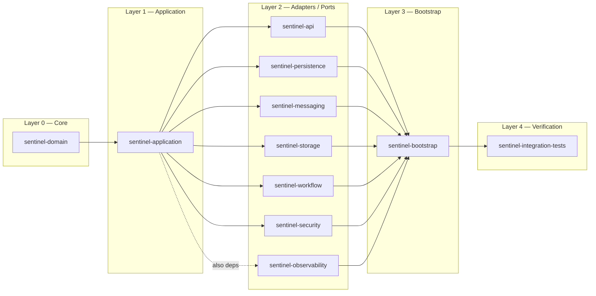
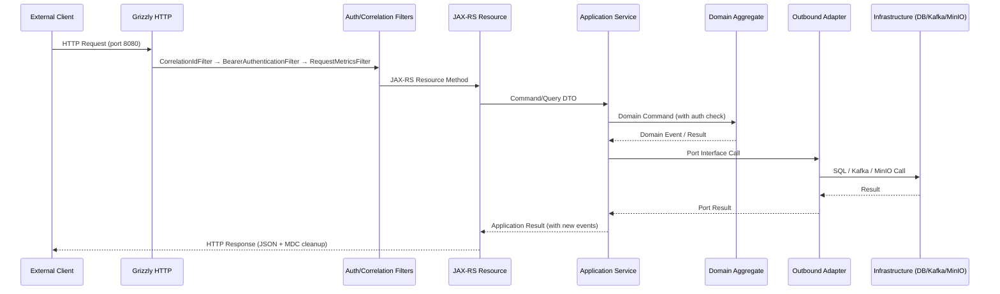

# Architecture Overview

Sentinel Enforcement Platform is a **modular monolith** with a **hexagonal (ports & adapters) architecture**. All modules compile and deploy as a single JAR artifact, but dependency direction and package boundaries enforce internal separation.

## Architectural Pattern

The platform follows strict layered dependency rules:

1. **Domain layer** (`sentinel-domain`) — zero internal dependencies; contains aggregates, value objects, enums, domain exceptions, and invariant logic
2. **Application layer** (`sentinel-application`) — depends only on domain; contains use-case services, port interfaces, command/query objects, and authorization abstraction
3. **Adapter layer** (six modules) — each module depends on `sentinel-application` (and optionally `sentinel-domain`) to implement a port:
   - `sentinel-api` — inbound REST adapter (JAX-RS resources)
   - `sentinel-persistence` — outbound MyBatis persistence adapter
   - `sentinel-messaging` — outbound Kafka messaging adapter
   - `sentinel-storage` — outbound MinIO storage adapter
   - `sentinel-workflow` — outbound Camunda BPMN workflow adapter
   - `sentinel-security` — outbound Keycloak JWT verification adapter
   - `sentinel-observability` — outbound health check / metrics adapter
4. **Bootstrap layer** (`sentinel-bootstrap`) — assembles all adapters, wires dependency injection, and starts the HTTP server
5. **Integration tests** (`sentinel-integration-tests`) — uses all modules at test scope

## Maven Modules

| Module | Responsibility | Internal Dependencies |
|---|---|---|
| `sentinel-domain` | Domain aggregates, value objects, enums, domain exceptions, invariant rules | None |
| `sentinel-application` | Use-case services, port interfaces, command/query objects, authorization abstraction, application transaction manager | `sentinel-domain` |
| `sentinel-api` | JAX-RS resource classes, Bean Validation, JSON serialization, MapStruct DTO mapping, error envelope (RFC 7807), OpenAPI-generated DTOs | `sentinel-application`, `sentinel-domain`, `sentinel-observability` |
| `sentinel-persistence` | MyBatis SQL mappers and repository adapters, Liquibase changelog YAML + SQL, HikariCP configuration | `sentinel-application`, `sentinel-domain` |
| `sentinel-messaging` | Kafka producer/consumer runtime, outbox event polling, inbox idempotent handling, retry/dead-letter routing, notification dispatch | `sentinel-application` |
| `sentinel-storage` | MinIO presigned URL generation, bucket management, evidence object upload/download session support | `sentinel-application` |
| `sentinel-workflow` | Embedded Camunda 7 engine, BPMN model deployment, workflow task query, case-workflow correlation | `sentinel-application`, `sentinel-domain` |
| `sentinel-security` | Keycloak JWT token verification, Nimbus Jose JWT parser, role/permission extraction | `sentinel-application` |
| `sentinel-observability` | Composite health check (database, Kafka, Redis, Mailpit, workflow), request metrics recording, correlation context | `sentinel-application` |
| `sentinel-bootstrap` | Dependency assembly (`ApplicationBinder`), Grizzly HTTP server startup (`ApplicationRuntime`), Liquibase + Camunda schema migration entrypoint | All adapter modules |
| `sentinel-integration-tests` | Testcontainers-based integration tests, Karate REST API smoke/regression/full suites | All modules (test scope) |

## Module Dependency Graph



## Dependency Injection

The platform uses **HK2** (`org.glassfish.hk2.utilities.binding.AbstractBinder`) as its dependency injection framework, integrated directly with Jersey's `ResourceConfig`.

The `ApplicationBinder` (`sentinel-bootstrap/src/main/java/com/sentinel/enforcement/bootstrap/ApplicationBinder.java`) registers all application services and infrastructure singletons:

```java
// Source: sentinel-bootstrap/src/main/java/.../ApplicationBinder.java
@Override
protected void configure() {
    bind(healthStatusService).to(HealthStatusService.class);
    bind(caseApplicationService).to(CaseApplicationService.class);
    bind(evidenceApplicationService).to(EvidenceApplicationService.class);
    bind(recommendationApplicationService).to(RecommendationApplicationService.class);
    bind(decisionApplicationService).to(DecisionApplicationService.class);
    bind(appealApplicationService).to(AppealApplicationService.class);
    bind(workflowTaskApplicationService).to(WorkflowTaskApplicationService.class);
    bind(workflowReconciliationApplicationService)
        .to(WorkflowReconciliationApplicationService.class);
    bind(maintenanceOperationApplicationService).to(MaintenanceOperationApplicationService.class);
    bind(reportApplicationService).to(ReportApplicationService.class);
    bind(authorizationService).to(AuthorizationService.class);
    bind(tokenVerifier).to(TokenVerifier.class);
}
```

No Spring, CDI, or Guice is used. All injection is via `@Inject` (Jakarta `jakarta.inject.Inject`).

## HTTP Server & REST Framework

The application is served by **Grizzly HTTP server** with **Jersey JAX-RS** as the REST framework.

Assembly occurs in `ApplicationRuntime.start()` (`sentinel-bootstrap/src/main/java/com/sentinel/enforcement/bootstrap/ApplicationRuntime.java`):

```java
// Source: sentinel-bootstrap/src/main/java/.../ApplicationRuntime.java (lines 305-369)
ResourceConfig resourceConfig = new ResourceConfig()
    .register(new ApplicationBinder(...))
    .register(RequestMetricsFilter.class)
    .register(JacksonFeature.class)
    .register(ObjectMapperContextResolver.class)
    .register(CorrelationIdFilter.class)
    .register(BearerAuthenticationFilter.class)
    // ... 20+ ExceptionMapper classes ...
    .register(HealthResource.class)
    .register(AppealResource.class)
    // ... 11 JAX-RS resource classes ...
    .property(ServerProperties.WADL_FEATURE_DISABLE, true);

HttpServer server = GrizzlyHttpServerFactory.createHttpServer(
    URI.create("http://0.0.0.0:" + configuration.httpPort() + "/"),
    resourceConfig,
    false);
server.start();
```

The server listens on the configured HTTP port (default `8080`) and binds all JAX-RS resources. WADL generation is explicitly disabled.

## Architectural Role

Sentinel is the **application and data boundary** for regulatory enforcement case management. It owns the full case lifecycle from report intake through sanction enforcement and appeal, including all domain aggregates, persistence, workflow orchestration, messaging, and file storage. The platform operates as a self-contained modular monolith with **no external application dependencies** — it depends only on infrastructure services (PostgreSQL, Kafka, Keycloak, MinIO).

## Major Components

The platform consists of 11 Maven modules organized in a hexagonal (ports & adapters) architecture:

| Component (Module) | Layer | Purpose |
|---|---|---|
| `sentinel-domain` | Core | Domain aggregates, value objects, enums, invariants |
| `sentinel-application` | Core | Use cases, port interfaces, command/query objects, authorization |
| `sentinel-api` | Inbound Adapter | JAX-RS REST resources, filters, OpenAPI DTO mapping |
| `sentinel-persistence` | Outbound Adapter | MyBatis SQL mappers, Liquibase migrations |
| `sentinel-messaging` | Outbound Adapter | Kafka outbox publisher, notification consumer |
| `sentinel-storage` | Outbound Adapter | MinIO evidence storage adapter |
| `sentinel-workflow` | Outbound Adapter | Embedded Camunda BPM workflow adapter |
| `sentinel-security` | Outbound Adapter | Keycloak JWT verification |
| `sentinel-observability` | Outbound Adapter | Health checks, metrics, correlation context |
| `sentinel-bootstrap` | Bootstrap | DI assembly, server startup, schema migration |
| `sentinel-integration-tests` | Verification | Testcontainers + Karate E2E tests |

## Dependency Direction

Dependency direction is enforced by Maven module dependencies: no adapter module may directly depend on another adapter module. All inter-module communication flows through `sentinel-application` port interfaces.

```
sentinel-domain (no dependencies)
    ↓
sentinel-application (depends on domain)
    ↓
Adapter modules (depend on application, optionally domain)
    ├── sentinel-api (inbound REST)
    ├── sentinel-persistence (outbound persistence)
    ├── sentinel-messaging (outbound messaging)
    ├── sentinel-storage (outbound storage)
    ├── sentinel-workflow (outbound workflow)
    ├── sentinel-security (outbound auth)
    └── sentinel-observability (outbound health)
    ↓
sentinel-bootstrap (assembles all adapters)
    ↓
sentinel-integration-tests (test scope only)
```

## Entry Points

| Entry Point | Protocol / Mechanism | Source File |
|---|---|---|
| HTTP REST API | HTTP/1.1 on configurable port (default 8080) | `ApplicationRuntime.java` → Grizzly `HttpServer` |
| Kafka Topics | 9 topics with `.retry`/`.dlq` suffixes | `MessagingTopics.java`, `KafkaOutboxPublisher.java` |
| Command-line (migration) | `java -jar sentinel-bootstrap.jar migrate` | `DatabaseMigrationMain.java` |
| Command-line (rollback) | `java -jar sentinel-bootstrap.jar rollback` | `DatabaseRollbackMain.java` |

## Primary Runtime Flow



The primary request flow follows this path: Grizzly HTTP Server receives the request → JAX-RS Filter Chain (CorrelationIdFilter, BearerAuthenticationFilter, RequestMetricsFilter) → JAX-RS Resource (deserialize DTO, Bean Validation) → Application Service (auth check, domain invocation) → Domain Aggregate (state transition, invariant enforcement) → Port Interface → Outbound Adapter → Infrastructure → Response. Full detail: [Request Flows](../runtime/request-flows.md), [Context Propagation](../runtime/context-propagation.md).

## Background and Asynchronous Processing

- **Outbox Publisher**: Background daemon thread in `MessagingRuntime` polls `outbox_event` table with `FOR UPDATE SKIP LOCKED` and publishes to Kafka. Configurable poll interval (default 5s) and batch size.
- **Notification Consumer**: Background daemon thread in `MessagingRuntime` consumes from notification topics, deduplicates via `inbox_event` table, and dispatches email via Mailpit.
- **Camunda Job Executor**: Embedded Camunda engine shares the Grizzly thread pool for BPMN job execution (timer events, async continuations).
- **Maintenance Operations**: Ad-hoc operations (e.g., `recalculateOverdueSanctionObligations`) triggered via REST API endpoint, run synchronously on the HTTP thread.

See [Asynchronous Processing](../runtime/asynchronous-processing.md) and [Concurrency](../runtime/concurrency.md) for full detail.

## Configuration and Runtime Topology

- **No configuration files**: The platform uses zero `application.properties` or `application.yaml` files. All configuration is via environment variables read by `AppConfiguration.java`.
- **Default port**: 8080 (overridable via `HTTP_PORT`)
- **Database**: PostgreSQL via HikariCP connection pool (configurable pool size via `DB_POOL_SIZE`)
- **Kafka**: Single-node KRaft mode (no ZooKeeper), bootstrap server via `KAFKA_BOOTSTRAP_SERVERS`
- **MinIO**: S3-compatible object storage, endpoint via `MINIO_ENDPOINT`
- **Keycloak**: OIDC provider, JWKS endpoint via `KEYCLOAK_JWKS_URL`
- **Docker Compose**: All infrastructure runs in Docker containers defined in `docker-compose.yaml`

See [Runtime Configuration](../configuration/runtime-configuration.md) for all environment variables.

## Extension Points

| Extension Point | Mechanism | Example |
|---|---|---|
| New domain aggregate | Add to `sentinel-domain`, add repository port + adapter, add application service | See Recipe in [Change Guide](../development/change-guide.md) |
| New REST endpoint | Update `openapi.yaml`, run `make openapi-generate`, add resource class | Contract-first approach (ADR-009) |
| New Kafka event | Define topic in `MessagingTopics.java`, add outbox event type, add consumer | Transactional outbox pattern |
| New infrastructure adapter | Implement port interface from `sentinel-application`, register in `ApplicationBinder` | See `MinioEvidenceStorageAdapter` for pattern |
| New authorization rule | Add `Permission` enum value, add check in `RoleBasedAuthorizationService` | Multi-axis auth |

## Architectural Constraints

1. **Module boundary enforcement**: No adapter module may directly depend on another adapter module.
2. **Domain purity**: `sentinel-domain` must have zero external dependencies — no framework annotations, no MyBatis/HTTP references.
3. **Version-based optimistic locking**: Every aggregate root carries a `version` field. See [Data Consistency](../data/consistency.md).
4. **Transactional outbox**: All domain events destined for Kafka are written to `outbox_event` in the same DB transaction.
5. **Contract-first API**: All REST API changes start with `docs/api/openapi.yaml`.
6. **No cloud-specific dependencies**: All infrastructure has local Docker Compose equivalents. See [Cloud Services](../integrations/cloud-services.md).

## Failure Boundaries

| Failure Scenario | Boundary | Behaviour |
|---|---|---|
| PostgreSQL down | Persistence adapter | HTTP 500 on any DB operation; health check reports DOWN; startup fails |
| Kafka unavailable | Messaging adapter | Outbox events queue in DB; published when Kafka recovers |
| MinIO unavailable | Storage adapter | Evidence upload/download fails; health check reports DOWN |
| Keycloak unreachable | Auth filter | New token verification fails; cached JWKS remains valid |
| Camunda engine failure | Workflow adapter | Workflow operations fail; reconciliation detects mismatches |

## Change Risks

| Change Area | Risk | Mitigation |
|---|---|---|
| Domain aggregate changes | Breaking existing state machines | Verify all state transitions; run `CaseRecordTest.java` |
| Database migration | Irreversible schema changes | Add rollback scripts; test `migrate` and `rollback` |
| API contract changes | Breaking client integrations | Version endpoints; update OpenAPI spec first |
| Authorization logic | Wrong permission assignments | Test each `Permission` against all roles |
| Kafka schema changes | Consumer deserialization failures | Add Testcontainers integration tests |
| Module dependency changes | Violating hexagonal boundaries | Run `mvn dependency:analyze` |

## Knowledge Gaps

- **Thread pool sizing**: Grizzly HTTP thread pool is not explicitly configured; default sizing is opaque.
- **Load testing evidence**: No load tests or performance benchmarks exist in the repository.
- **Production deployment topology**: No production deployment configuration exists.
- **SLA / SLO targets**: No service level agreements or objectives are documented.
- **Disaster recovery procedures**: Only infrastructure-level runbooks in `/docs/runbooks/` exist.
- **Capacity planning**: No scalability limits or capacity documentation exists.

## Architecture Decision Records

### ADR-001 — Modular Monolith

**Context:** The application must support domain isolation without the operational cost of microservices.  
**Decision:** Deploy a single JAR with strict Maven module boundaries and package-level visibility.  
**Consequence:** Simplified deployment, atomic migrations, but requires discipline to enforce module boundaries through Maven dependency rules. Modules communicate only through `sentinel-application` port interfaces.

### ADR-002 — Domain State vs Workflow State

**Context:** Case progression is tracked both in the domain aggregate (`CaseRecord.status`) and in the Camunda BPMN process execution state.  
**Decision:** The domain `CaseStatus` enum is the source of truth for business state. The Camunda workflow state is secondary and reconciled via the `WorkflowReconciliationApplicationService`.  
**Consequence:** Dual state requires periodic reconciliation and careful correlation. The `PhaseSevenCaseProgressionGuard` enforces constraints across recommendation/decision/appeal/sanction before allowing status transitions.

### ADR-003 — MyBatis over ORM

**Context:** The persistence layer needs explicit SQL control for complex enforcement queries and joins.  
**Decision:** Use MyBatis 3 (SQL mapping framework) instead of JPA/Hibernate.  
**Consequence:** Full SQL control, no auto-flush surprises, but requires manual mapping code. Repository adapters in `sentinel-persistence` implement port interfaces defined in `sentinel-application`.

### ADR-004 — Transactional Outbox

**Context:** Domain events (case transitions, evidence finalization, decisions published) must be reliably published to Kafka without dual-write problems.  
**Decision:** Use the transactional outbox pattern: domain events are written to an `outbox_event` table in the same database transaction as the aggregate change, then a background poller publishes to Kafka.  
**Consequence:** Guaranteed at-least-once delivery. The `OutboxRepositoryMyBatisAdapter` and `KafkaOutboxPublisher` implement this pattern with configurable polling interval, batch size, and leasing.

### ADR-005 — Inbox Idempotency

**Context:** Kafka consumers (notification handler, workflow signal receiver) may receive duplicate messages.  
**Decision:** Use an inbox table with idempotent processing — each message is deduplicated by `eventId` before processing.  
**Consequence:** Safe at-least-once consumption. The `InboxRepositoryMyBatisAdapter` stores processed message IDs.

### ADR-006 — Keycloak Local Auth

**Context:** Authentication must support multi-tenant JWT tokens.  
**Decision:** Use Keycloak as the identity provider with JWT verification via the JWKS endpoint.  
**Consequence:** Stateless token verification. The `KeycloakTokenVerifier` validates issuer, audience, and signature. The `BearerAuthenticationFilter` extracts the `ApplicationActor` for each request. The `GET /health` endpoint is public; all other endpoints require a Bearer token.

### ADR-007 — MinIO Evidence Storage

**Context:** Evidence files (documents, images) must be stored securely with access control and versioning.  
**Decision:** Use MinIO (S3-compatible object storage) with presigned URLs for upload and download.  
**Consequence:** Files never stream through the application server. Evidence metadata is stored in PostgreSQL; the actual bytes live in MinIO buckets. `MinioEvidenceStorageAdapter` generates time-bound presigned URLs with configurable TTLs (`EVIDENCE_UPLOAD_URL_TTL`, `EVIDENCE_DOWNLOAD_URL_TTL`).

### ADR-008 — Optimistic Locking

**Context:** Concurrent modification of aggregates (e.g., two officers triaging the same report) must be detected.  
**Decision:** Use optimistic locking with a `version` field on every aggregate root.  
**Consequence:** The domain layer compares expected vs current version and throws `*ConflictException` on mismatch. The HTTP layer maps these to `409 Conflict` responses. No pessimistic locks or database-level row locks are used in the domain layer.

### ADR-009 — API Contract First

**Context:** REST API must be documented, validated, and versioned.  
**Decision:** Use OpenAPI specification (`docs/api/openapi.yaml`) as the single source of truth, with Maven OpenAPI Generator producing DTO classes.  
**Consequence:** DTOs are never hand-written. `Api*Mapper` interfaces (MapStruct) map between OpenAPI-generated DTOs and domain/application objects. Bean Validation annotations are on the generated DTOs.

### ADR-010 — Audit Log Model

**Context:** All state-changing operations must be auditable for regulatory compliance.  
**Decision:** Every action records an `AuditEvent` with actor identity, action type, resource, correlation ID, source IP, before/after summaries, and result.  
**Consequence:** The `AuditEvent` record (`sentinel-domain/src/main/java/.../casefile/AuditEvent.java`) is the universal audit entry. Service methods construct audit events as part of their command flow. The `CaseResource.GET /api/v1/cases/{caseId}/audit-events` endpoint exposes the trail.

## Source References

### Primary Source Files

| File | Role |
|---|---|
| `sentinel-bootstrap/src/main/java/.../ApplicationRuntime.java` | Application assembly, server start, DI wiring |
| `sentinel-bootstrap/src/main/java/.../ApplicationBinder.java` | HK2 dependency injection binder |
| `sentinel-bootstrap/src/main/java/.../AppConfiguration.java` | Runtime configuration record |
| `sentinel-bootstrap/pom.xml` | Module assembly configuration |
| `sentinel-domain/src/main/java/.../domain/` | All domain aggregates and value objects |
| `sentinel-application/src/main/java/.../application/` | Application services and port interfaces |
| `sentinel-api/src/main/java/.../api/` | JAX-RS resource classes and filters |
| `sentinel-persistence/src/main/resources/db/changelog/` | Liquibase migration files |
| `sentinel-workflow/src/main/resources/bpmn/` | Camunda BPMN process definitions |
| `docs/api/openapi.yaml` | OpenAPI contract specification |
| `docker-compose.yaml` | Infrastructure service definitions |
| `Makefile` | Build and test targets |

### Architecture Decision Records

| ADR | Topic | Key Source |
|---|---|---|
| ADR-001 | Modular Monolith | Module separation in `pom.xml` files |
| ADR-002 | Domain State vs Workflow State | `CaseRecord.java`, `WorkflowReconciliationApplicationService.java` |
| ADR-003 | MyBatis over ORM | `sentinel-persistence/.../persistence/*.java` |
| ADR-004 | Transactional Outbox | `OutboxEvent.java`, `KafkaOutboxPublisher.java` |
| ADR-005 | Inbox Idempotency | `InboxEvent.java`, `KafkaNotificationConsumer.java` |
| ADR-006 | Keycloak Local Auth | `KeycloakTokenVerifier.java`, `BearerAuthenticationFilter.java` |
| ADR-007 | MinIO Evidence Storage | `MinioEvidenceStorageAdapter.java` |
| ADR-008 | Optimistic Locking | `CaseRecord.java` version field, MyBatis mappers |
| ADR-009 | API Contract First | `docs/api/openapi.yaml`, `sentinel-api/pom.xml` |
| ADR-010 | Audit Log Model | `AuditEvent.java`, `CaseResource.java` |
