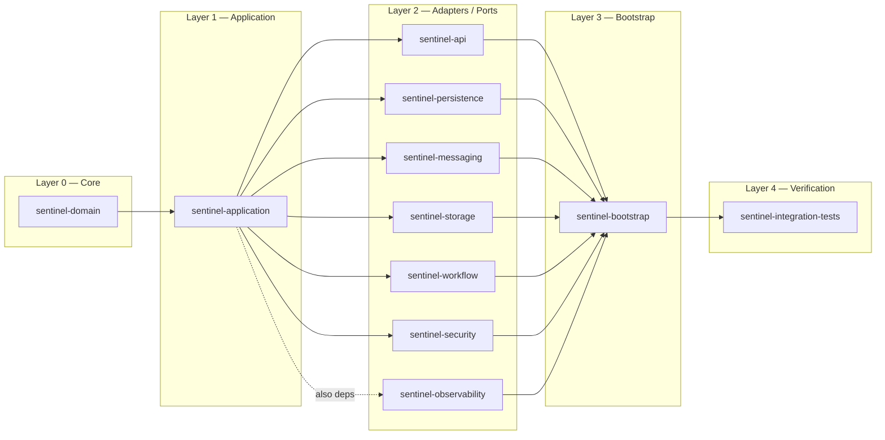

# Architecture Overview

Sentinel Enforcement Platform is a **modular monolith** with a **hexagonal (ports & adapters) architecture**. All modules compile and deploy as a single JAR artifact, but dependency direction and package boundaries enforce internal separation.

## Architectural Pattern

The platform follows strict layered dependency rules:

1. **Domain layer** (`sentinel-domain`) — zero internal dependencies; contains aggregates, value objects, enums, domain exceptions, and invariant logic
2. **Application layer** (`sentinel-application`) — depends only on domain; contains use-case services, port interfaces, command/query objects, and authorization abstraction
3. **Adapter layer** (six modules) — each module depends on `sentinel-application` (and optionally `sentinel-domain`) to implement a port:
   - `sentinel-api` — inbound REST adapter (JAX-RS resources)
   - `sentinel-persistence` — outbound MyBatis persistence adapter
   - `sentinel-messaging` — outbound Kafka messaging adapter
   - `sentinel-storage` — outbound MinIO storage adapter
   - `sentinel-workflow` — outbound Camunda BPMN workflow adapter
   - `sentinel-security` — outbound Keycloak JWT verification adapter
   - `sentinel-observability` — outbound health check / metrics adapter
4. **Bootstrap layer** (`sentinel-bootstrap`) — assembles all adapters, wires dependency injection, and starts the HTTP server
5. **Integration tests** (`sentinel-integration-tests`) — uses all modules at test scope

## Maven Modules

| Module | Responsibility | Internal Dependencies |
|---|---|---|
| `sentinel-domain` | Domain aggregates, value objects, enums, domain exceptions, invariant rules | None |
| `sentinel-application` | Use-case services, port interfaces, command/query objects, authorization abstraction, application transaction manager | `sentinel-domain` |
| `sentinel-api` | JAX-RS resource classes, Bean Validation, JSON serialization, MapStruct DTO mapping, error envelope (RFC 7807), OpenAPI-generated DTOs | `sentinel-application`, `sentinel-domain`, `sentinel-observability` |
| `sentinel-persistence` | MyBatis SQL mappers and repository adapters, Liquibase changelog YAML + SQL, HikariCP configuration | `sentinel-application`, `sentinel-domain` |
| `sentinel-messaging` | Kafka producer/consumer runtime, outbox event polling, inbox idempotent handling, retry/dead-letter routing, notification dispatch | `sentinel-application` |
| `sentinel-storage` | MinIO presigned URL generation, bucket management, evidence object upload/download session support | `sentinel-application` |
| `sentinel-workflow` | Embedded Camunda 7 engine, BPMN model deployment, workflow task query, case-workflow correlation | `sentinel-application`, `sentinel-domain` |
| `sentinel-security` | Keycloak JWT token verification, Nimbus Jose JWT parser, role/permission extraction | `sentinel-application` |
| `sentinel-observability` | Composite health check (database, Kafka, Redis, Mailpit, workflow), request metrics recording, correlation context | `sentinel-application` |
| `sentinel-bootstrap` | Dependency assembly (`ApplicationBinder`), Grizzly HTTP server startup (`ApplicationRuntime`), Liquibase + Camunda schema migration entrypoint | All adapter modules |
| `sentinel-integration-tests` | Testcontainers-based integration tests, Karate REST API smoke/regression/full suites | All modules (test scope) |

## Module Dependency Graph



## Dependency Injection

The platform uses **HK2** (`org.glassfish.hk2.utilities.binding.AbstractBinder`) as its dependency injection framework, integrated directly with Jersey's `ResourceConfig`.

The `ApplicationBinder` (`sentinel-bootstrap/src/main/java/com/sentinel/enforcement/bootstrap/ApplicationBinder.java`) registers all application services and infrastructure singletons:

```java
// Source: sentinel-bootstrap/src/main/java/.../ApplicationBinder.java
@Override
protected void configure() {
    bind(healthStatusService).to(HealthStatusService.class);
    bind(caseApplicationService).to(CaseApplicationService.class);
    bind(evidenceApplicationService).to(EvidenceApplicationService.class);
    bind(recommendationApplicationService).to(RecommendationApplicationService.class);
    bind(decisionApplicationService).to(DecisionApplicationService.class);
    bind(appealApplicationService).to(AppealApplicationService.class);
    bind(workflowTaskApplicationService).to(WorkflowTaskApplicationService.class);
    bind(workflowReconciliationApplicationService)
        .to(WorkflowReconciliationApplicationService.class);
    bind(maintenanceOperationApplicationService).to(MaintenanceOperationApplicationService.class);
    bind(reportApplicationService).to(ReportApplicationService.class);
    bind(authorizationService).to(AuthorizationService.class);
    bind(tokenVerifier).to(TokenVerifier.class);
}
```

No Spring, CDI, or Guice is used. All injection is via `@Inject` (Jakarta `jakarta.inject.Inject`).

## HTTP Server & REST Framework

The application is served by **Grizzly HTTP server** with **Jersey JAX-RS** as the REST framework.

Assembly occurs in `ApplicationRuntime.start()` (`sentinel-bootstrap/src/main/java/com/sentinel/enforcement/bootstrap/ApplicationRuntime.java`):

```java
// Source: sentinel-bootstrap/src/main/java/.../ApplicationRuntime.java (lines 305-369)
ResourceConfig resourceConfig = new ResourceConfig()
    .register(new ApplicationBinder(...))
    .register(RequestMetricsFilter.class)
    .register(JacksonFeature.class)
    .register(ObjectMapperContextResolver.class)
    .register(CorrelationIdFilter.class)
    .register(BearerAuthenticationFilter.class)
    // ... 20+ ExceptionMapper classes ...
    .register(HealthResource.class)
    .register(AppealResource.class)
    // ... 11 JAX-RS resource classes ...
    .property(ServerProperties.WADL_FEATURE_DISABLE, true);

HttpServer server = GrizzlyHttpServerFactory.createHttpServer(
    URI.create("http://0.0.0.0:" + configuration.httpPort() + "/"),
    resourceConfig,
    false);
server.start();
```

The server listens on the configured HTTP port (default `8080`) and binds all JAX-RS resources. WADL generation is explicitly disabled.

## Architecture Decision Records

### ADR-001 — Modular Monolith

**Context:** The application must support domain isolation without the operational cost of microservices.  
**Decision:** Deploy a single JAR with strict Maven module boundaries and package-level visibility.  
**Consequence:** Simplified deployment, atomic migrations, but requires discipline to enforce module boundaries through Maven dependency rules. Modules communicate only through `sentinel-application` port interfaces.

### ADR-002 — Domain State vs Workflow State

**Context:** Case progression is tracked both in the domain aggregate (`CaseRecord.status`) and in the Camunda BPMN process execution state.  
**Decision:** The domain `CaseStatus` enum is the source of truth for business state. The Camunda workflow state is secondary and reconciled via the `WorkflowReconciliationApplicationService`.  
**Consequence:** Dual state requires periodic reconciliation and careful correlation. The `PhaseSevenCaseProgressionGuard` enforces constraints across recommendation/decision/appeal/sanction before allowing status transitions.

### ADR-003 — MyBatis over ORM

**Context:** The persistence layer needs explicit SQL control for complex enforcement queries and joins.  
**Decision:** Use MyBatis 3 (SQL mapping framework) instead of JPA/Hibernate.  
**Consequence:** Full SQL control, no auto-flush surprises, but requires manual mapping code. Repository adapters in `sentinel-persistence` implement port interfaces defined in `sentinel-application`.

### ADR-004 — Transactional Outbox

**Context:** Domain events (case transitions, evidence finalization, decisions published) must be reliably published to Kafka without dual-write problems.  
**Decision:** Use the transactional outbox pattern: domain events are written to an `outbox_event` table in the same database transaction as the aggregate change, then a background poller publishes to Kafka.  
**Consequence:** Guaranteed at-least-once delivery. The `OutboxRepositoryMyBatisAdapter` and `KafkaOutboxPublisher` implement this pattern with configurable polling interval, batch size, and leasing.

### ADR-005 — Inbox Idempotency

**Context:** Kafka consumers (notification handler, workflow signal receiver) may receive duplicate messages.  
**Decision:** Use an inbox table with idempotent processing — each message is deduplicated by `eventId` before processing.  
**Consequence:** Safe at-least-once consumption. The `InboxRepositoryMyBatisAdapter` stores processed message IDs.

### ADR-006 — Keycloak Local Auth

**Context:** Authentication must support multi-tenant JWT tokens.  
**Decision:** Use Keycloak as the identity provider with JWT verification via the JWKS endpoint.  
**Consequence:** Stateless token verification. The `KeycloakTokenVerifier` validates issuer, audience, and signature. The `BearerAuthenticationFilter` extracts the `ApplicationActor` for each request. The `GET /health` endpoint is public; all other endpoints require a Bearer token.

### ADR-007 — MinIO Evidence Storage

**Context:** Evidence files (documents, images) must be stored securely with access control and versioning.  
**Decision:** Use MinIO (S3-compatible object storage) with presigned URLs for upload and download.  
**Consequence:** Files never stream through the application server. Evidence metadata is stored in PostgreSQL; the actual bytes live in MinIO buckets. `MinioEvidenceStorageAdapter` generates time-bound presigned URLs with configurable TTLs (`EVIDENCE_UPLOAD_URL_TTL`, `EVIDENCE_DOWNLOAD_URL_TTL`).

### ADR-008 — Optimistic Locking

**Context:** Concurrent modification of aggregates (e.g., two officers triaging the same report) must be detected.  
**Decision:** Use optimistic locking with a `version` field on every aggregate root.  
**Consequence:** The domain layer compares expected vs current version and throws `*ConflictException` on mismatch. The HTTP layer maps these to `409 Conflict` responses. No pessimistic locks or database-level row locks are used in the domain layer.

### ADR-009 — API Contract First

**Context:** REST API must be documented, validated, and versioned.  
**Decision:** Use OpenAPI specification (`docs/api/openapi.yaml`) as the single source of truth, with Maven OpenAPI Generator producing DTO classes.  
**Consequence:** DTOs are never hand-written. `Api*Mapper` interfaces (MapStruct) map between OpenAPI-generated DTOs and domain/application objects. Bean Validation annotations are on the generated DTOs.

### ADR-010 — Audit Log Model

**Context:** All state-changing operations must be auditable for regulatory compliance.  
**Decision:** Every action records an `AuditEvent` with actor identity, action type, resource, correlation ID, source IP, before/after summaries, and result.  
**Consequence:** The `AuditEvent` record (`sentinel-domain/src/main/java/.../casefile/AuditEvent.java`) is the universal audit entry. Service methods construct audit events as part of their command flow. The `CaseResource.GET /api/v1/cases/{caseId}/audit-events` endpoint exposes the trail.

## Key Source

The primary assembly class is `ApplicationRuntime` at:

```
sentinel-bootstrap/src/main/java/com/sentinel/enforcement/bootstrap/ApplicationRuntime.java
```

This class:
- Creates the HikariCP connection pool, MyBatis `SqlSessionFactory`, and all repository adapters
- Instantiates the `WorkflowRuntime` (embedded Camunda), `MessagingRuntime` (Kafka + outbox/inbox)
- Wires all application services with their dependencies (transaction manager, repositories, storage, workflow port)
- Registers all JAX-RS resources, filters, exception mappers, and the HK2 binder
- Starts the Grizzly HTTP server on the configured port
- Exposes `start()` (production) and `migrate()` (schema migration) static factory methods
