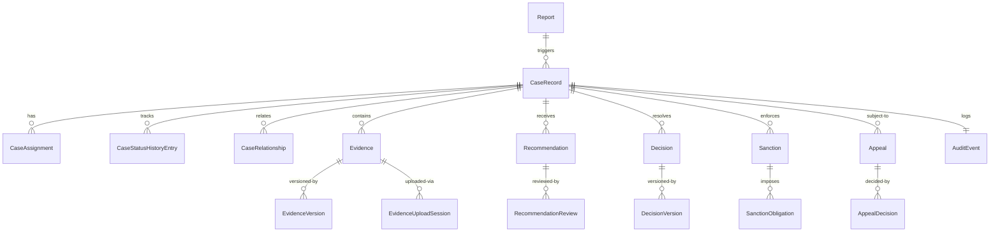
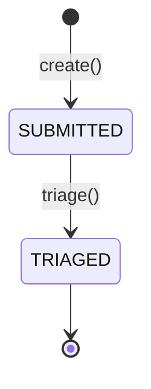
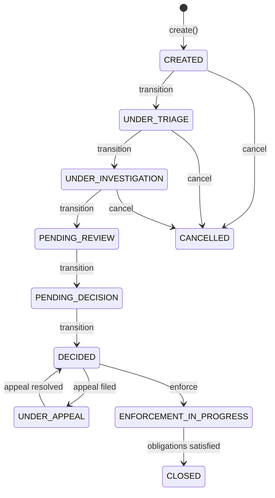
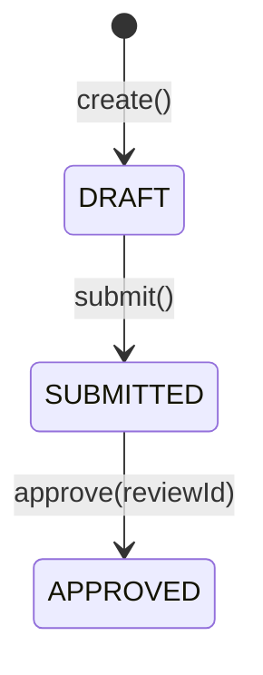
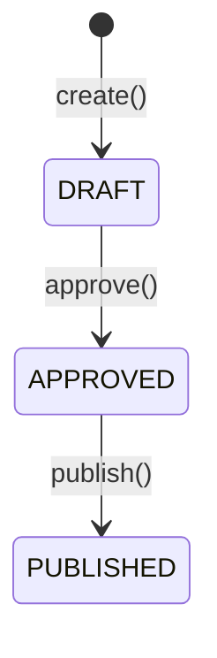
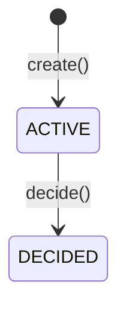

# Sentinel Business Entities and Data

The Sentinel Enforcement Platform manages **7 core aggregates**, each defined as an **immutable Java record** in the `sentinel-domain` module (`com.sentinel.enforcement.domain.*`). This page documents all entities with their fields, state machines, and inter-entity relationships.

## Entity-Relationship Overview



**Source:** `sentinel-domain/src/main/java/com/sentinel/enforcement/domain/` (all aggregate records)

---

## 1. Report

**Source:** `sentinel-domain/src/main/java/com/sentinel/enforcement/domain/report/Report.java`

A **Report** is the entry point into the enforcement lifecycle. It captures an initial allegation or notification submitted by a reporter.

```java
public record Report(
    UUID id,
    String title,
    String description,
    String jurisdictionCode,
    String reporterName,
    ReportStatus status,
    Instant createdAt,
    String createdBy,
    Instant updatedAt,
    String updatedBy,
    long version
) { }
```

### Statuses

| Status | Description |
|---|---|
| `SUBMITTED` | Initial state; report has been filed |
| `TRIAGED` | Report has passed initial triage review |

**Source:** `sentinel-domain/src/main/java/com/sentinel/enforcement/domain/report/ReportStatus.java`

### Lifecycle



### Transitions

| Method | Guard | Description |
|---|---|---|
| `triage(actorId, expectedVersion, reason, now)` | `status == SUBMITTED`; `reason` not blank; `actorId` not blank | Moves to `TRIAGED` |

### Triage Flow

The triage flow is initiated by `ReportApplicationService.triageReport()`, which:
1. Authorizes the actor for `Permission.TRIAGE_REPORT` with jurisdiction check
2. Verifies the report exists
3. Delegates to `Report.triage()` which enforces the status guard and optimistic lock
4. Persists the updated report

**Source:** `sentinel-application/src/main/java/com/sentinel/enforcement/application/report/ReportApplicationService.java`

---

## 2. CaseRecord

**Source:** `sentinel-domain/src/main/java/com/sentinel/enforcement/domain/casefile/CaseRecord.java`

A **CaseRecord** is the central aggregate that orchestrates the entire enforcement process. It is created from a triaged report and progresses through a multi-stage lifecycle.

```java
public record CaseRecord(
    UUID id,
    String caseNumber,
    UUID reportId,
    String title,
    String summary,
    String jurisdictionCode,
    CaseClassification classification,
    CaseStatus status,
    String assignedUnitId,
    String assigneeUserId,
    Instant createdAt,
    String createdBy,
    Instant updatedAt,
    String updatedBy,
    long version
) { }
```

### Statuses (Full Lifecycle)

| Status | Terminal | Description |
|---|---|---|
| `CREATED` | No | Initial state on case creation |
| `UNDER_TRIAGE` | No | Case is being triaged |
| `UNDER_INVESTIGATION` | No | Active investigation in progress |
| `PENDING_REVIEW` | No | Awaiting review of investigation findings |
| `PENDING_DECISION` | No | Awaiting decision after recommendation approved |
| `DECIDED` | No | Decision has been published |
| `UNDER_APPEAL` | No | Decision is being appealed |
| `ENFORCEMENT_IN_PROGRESS` | No | Sanction enforcement is active |
| `CLOSED` | **Yes** | Case fully resolved and closed |
| `CANCELLED` | **Yes** | Case cancelled before resolution |

**Source:** `sentinel-domain/src/main/java/com/sentinel/enforcement/domain/casefile/CaseStatus.java`

### Lifecycle



### Transitions

`CaseRecord` exposes an `assignTo()` method (guarded by role check via `CaseActionContext`) and internal transition methods. Transition orchestration is handled by `CaseApplicationService.transitionCase()`.

**Source:** `sentinel-application/src/main/java/com/sentinel/enforcement/application/casefile/CaseApplicationService.java`

### Classification

| Classification | Description |
|---|---|
| `PUBLIC` | No special handling |
| `CONFIDENTIAL` | Restricted access clearance required |
| `SECRET` | Highest clearance level required |

**Source:** `sentinel-domain/src/main/java/com/sentinel/enforcement/domain/casefile/CaseClassification.java`

### Assignments

**Source:** `sentinel-domain/src/main/java/com/sentinel/enforcement/domain/casefile/CaseAssignment.java`

Each assignment records the **unit** and **individual** assigned to a case:

```java
public record CaseAssignment(
    UUID id,
    UUID caseId,
    String assignedUnitId,
    String assigneeUserId,
    String assignmentReason,
    Instant assignedAt,
    String assignedBy,
    Instant createdAt,
    String createdBy,
    Instant updatedAt,
    String updatedBy,
    long version
) { }
```

Assignment requires `TRIAGE_OFFICER` or `SUPERVISOR` role and checks that the case is not in a terminal state.

### Relationships

**Source:** `sentinel-domain/src/main/java/com/sentinel/enforcement/domain/casefile/CaseRelationship.java`
**Source:** `sentinel-domain/src/main/java/com/sentinel/enforcement/domain/casefile/CaseRelationshipType.java`

Cases can be linked via typed relationships:

| Relationship Type | Description |
|---|---|
| `MERGE` | Child case merged into parent |
| `DERIVATION` | Child case derived from parent |
| `SPLIT` | Child case split out from parent |

The invariant `parentCaseId != childCaseId` is enforced in the compact constructor.

### Status History

**Source:** `sentinel-domain/src/main/java/com/sentinel/enforcement/domain/casefile/CaseStatusHistoryEntry.java`

Every status transition is recorded as an append-only entry recording `fromStatus`, `toStatus`, `transitionReason`, `transitionedAt`, and `transitionedBy`.

---

## 3. Evidence

**Source:** `sentinel-domain/src/main/java/com/sentinel/enforcement/domain/evidence/Evidence.java`

```java
public record Evidence(
    UUID id,
    UUID caseId,
    String title,
    EvidenceClassification classification,
    EvidenceStorageStatus storageStatus,
    int latestVersion,
    Instant createdAt,
    String createdBy,
    Instant updatedAt,
    String updatedBy,
    long version
) { }
```

### Storage Status

| Status | Description |
|---|---|
| `PENDING_UPLOAD` | Evidence record created but no file uploaded yet |
| `ACTIVE` | At least one version has been finalized |

**Source:** `sentinel-domain/src/main/java/com/sentinel/enforcement/domain/evidence/EvidenceStorageStatus.java`

### Classification

| Classification | Description |
|---|---|
| `PUBLIC` | No access restrictions |
| `CONFIDENTIAL` | Restricted clearance needed |
| `SECRET` | Highest clearance level |

**Source:** `sentinel-domain/src/main/java/com/sentinel/enforcement/domain/evidence/EvidenceClassification.java`

### Evidence Versions

**Source:** `sentinel-domain/src/main/java/com/sentinel/enforcement/domain/evidence/EvidenceVersion.java`

Each finalized upload creates an immutable version record:

```java
public record EvidenceVersion(
    UUID id,
    UUID evidenceId,
    int versionNumber,          // >= 1
    String originalFilename,
    String generatedFilename,
    String bucket,              // MinIO bucket
    String objectKey,           // /{jurisdiction}/{caseId}/{evidenceId}/{version}/{filename}
    String mediaType,
    long sizeBytes,             // >= 0
    String sha256Checksum,      // lowercase hex SHA-256
    Instant uploadedAt,
    String uploadedBy,
    Instant createdAt,
    String createdBy
) { }
```

### Evidence Upload Sessions

**Source:** `sentinel-domain/src/main/java/com/sentinel/enforcement/domain/evidence/EvidenceUploadSession.java`

Upload sessions are short-lived contracts that bind a presigned URL to a specific file expectation:

```java
public record EvidenceUploadSession(
    UUID id,
    UUID caseId,
    UUID evidenceId,
    int targetVersionNumber,    // >= 1
    String originalFilename,
    String generatedFilename,
    String bucket,
    String objectKey,
    String mediaType,
    long sizeBytes,
    String sha256Checksum,
    EvidenceClassification classification,
    EvidenceUploadSessionStatus status,  // PENDING | FINALIZED
    Instant expiresAt,
    Instant createdAt,
    String createdBy,
    Instant updatedAt,
    String updatedBy,
    long version
) { }
```

**Session statuses:**

| Status | Description |
|---|---|
| `PENDING` | Session active, upload not yet finalized |
| `FINALIZED` | File uploaded and verified |

**Source:** `sentinel-domain/src/main/java/com/sentinel/enforcement/domain/evidence/EvidenceUploadSessionStatus.java`

### SHA-256 Verification

At finalization, `EvidenceApplicationService.finalizeEvidenceVersion()` performs three checks against the stored object:

1. **Size** — `storedObject.sizeBytes() == uploadSession.sizeBytes()`
2. **Media type** — `normalizedMediaType(storedObject.mediaType()).equals(uploadSession.mediaType())`
3. **Checksum** — `calculateSha256(bucket, objectKey).equals(uploadSession.sha256Checksum())`

On mismatch, an `EvidenceConflictException` is thrown with one of: `EVIDENCE_SIZE_MISMATCH`, `EVIDENCE_MEDIA_TYPE_MISMATCH`, `EVIDENCE_CHECKSUM_MISMATCH`.

**Source:** `sentinel-application/src/main/java/com/sentinel/enforcement/application/evidence/EvidenceApplicationService.java` (lines 193–209)

---

## 4. Recommendation

**Source:** `sentinel-domain/src/main/java/com/sentinel/enforcement/domain/recommendation/Recommendation.java`

A **Recommendation** is the formal proposal for case outcome, prepared after investigation.

```java
public record Recommendation(
    UUID id,
    UUID caseId,
    String title,
    String summary,
    String proposedDecision,
    String proposedSanction,
    RecommendationStatus status,
    Instant submittedAt,
    String submittedBy,
    UUID approvedReviewId,
    Instant createdAt,
    String createdBy,
    Instant updatedAt,
    String updatedBy,
    long version
) { }
```

### Statuses

| Status | Description |
|---|---|
| `DRAFT` | Initial state; being prepared |
| `SUBMITTED` | Submitted for review |
| `APPROVED` | Reviewed and approved |

**Source:** `sentinel-domain/src/main/java/com/sentinel/enforcement/domain/recommendation/RecommendationStatus.java`

### Lifecycle



### Recommendation Review

**Source:** `sentinel-domain/src/main/java/com/sentinel/enforcement/domain/recommendation/RecommendationReview.java`

Each approval creates a review record:

```java
public record RecommendationReview(
    UUID id,
    UUID recommendationId,
    RecommendationReviewOutcome outcome,  // APPROVED
    String reviewSummary,
    Instant reviewedAt,
    String reviewedBy,
    Instant createdAt,
    String createdBy,
    long version
) { }
```

**Outcome:** `APPROVED` (only positive outcome supported — rejection is a state machine denial, not a review outcome)

**Source:** `sentinel-domain/src/main/java/com/sentinel/enforcement/domain/recommendation/RecommendationReviewOutcome.java`

---

## 5. Decision

**Source:** `sentinel-domain/src/main/java/com/sentinel/enforcement/domain/decision/Decision.java`

The **Decision** is the authoritative resolution of a case. It may find a violation proven or not, and if proven, prescribes sanctions.

```java
public record Decision(
    UUID id,
    UUID caseId,
    UUID recommendationId,
    String title,
    String summary,
    boolean violationProven,
    String sanctionSummary,
    String obligationTitle,
    String obligationDetails,
    LocalDate obligationDueDate,
    LocalDate appealDeadline,
    DecisionStatus status,
    Instant approvedAt,
    String approvedBy,
    Instant publishedAt,
    String publishedBy,
    Instant createdAt,
    String createdBy,
    Instant updatedAt,
    String updatedBy,
    long version
) { }
```

### Statuses

| Status | Description |
|---|---|
| `DRAFT` | Initial state; being drafted |
| `APPROVED` | Approved by decision-maker |
| `PUBLISHED` | Published and actionable |

**Source:** `sentinel-domain/src/main/java/com/sentinel/enforcement/domain/decision/DecisionStatus.java`

### Lifecycle



### Decision Version History

**Source:** `sentinel-domain/src/main/java/com/sentinel/enforcement/domain/decision/DecisionVersion.java`

Each publish creates an immutable version snapshot:

```java
public record DecisionVersion(
    UUID id,
    UUID decisionId,
    int versionNumber,       // >= 1
    String title,
    String summary,
    boolean violationProven,
    String sanctionSummary,
    String obligationTitle,
    String obligationDetails,
    LocalDate obligationDueDate,
    LocalDate appealDeadline,
    Instant publishedAt,
    String publishedBy,
    Instant createdAt,
    String createdBy
) { }
```

When `violationProven` is `true`, sanction and obligation fields are required. When `false`, obligation fields are nulled.

---

## 6. Sanction

**Source:** `sentinel-domain/src/main/java/com/sentinel/enforcement/domain/sanction/Sanction.java`

A **Sanction** represents the enforcement action stemming from a published decision.

```java
public record Sanction(
    UUID id,
    UUID caseId,
    UUID decisionId,
    String summary,
    SanctionStatus status,
    Instant createdAt,
    String createdBy,
    Instant updatedAt,
    String updatedBy,
    long version
) { }
```

### Statuses

| Status | Description |
|---|---|
| `ACTIVE` | Sanction is in effect |
| `CANCELLED` | Sanction has been cancelled |

**Source:** `sentinel-domain/src/main/java/com/sentinel/enforcement/domain/sanction/SanctionStatus.java`

### Sanction Obligations

**Source:** `sentinel-domain/src/main/java/com/sentinel/enforcement/domain/sanction/SanctionObligation.java`

Each sanction can impose one or more **obligations** — specific actions the subject must complete:

```java
public record SanctionObligation(
    UUID id,
    UUID sanctionId,
    String title,
    String details,
    LocalDate dueDate,
    SanctionObligationStatus status,
    Instant createdAt,
    String createdBy,
    Instant updatedAt,
    String updatedBy,
    long version
) { }
```

### Obligation Statuses

| Status | Description |
|---|---|
| `ACTIVE` | Obligation is pending completion |
| `OVERDUE` | Due date has passed without satisfaction (recalculated via maintenance job) |
| `SATISFIED` | Obligation has been fulfilled |
| `CANCELLED` | Obligation has been cancelled (e.g., appeal granted) |

**Source:** `sentinel-domain/src/main/java/com/sentinel/enforcement/domain/sanction/SanctionObligationStatus.java`

Overdue recalculation is performed by `MaintenanceOperationApplicationService.recalculateOverdueSanctionObligations()` which locks the obligation table with `REPEATABLE_READ` isolation.

**Source:** `sentinel-application/src/main/java/com/sentinel/enforcement/application/operations/MaintenanceOperationApplicationService.java`

---

## 7. Appeal

**Source:** `sentinel-domain/src/main/java/com/sentinel/enforcement/domain/appeal/Appeal.java`

An **Appeal** challenges a published decision. It may include a supervisor override flag to bypass standard review.

```java
public record Appeal(
    UUID id,
    UUID caseId,
    UUID decisionId,
    String rationale,
    boolean supervisorOverride,
    String supervisorOverrideReason,
    AppealStatus status,
    Instant submittedAt,
    String submittedBy,
    UUID decidedByAppealDecisionId,
    Instant createdAt,
    String createdBy,
    Instant updatedAt,
    String updatedBy,
    long version
) { }
```

### Statuses

| Status | Description |
|---|---|
| `ACTIVE` | Appeal is pending review |
| `DECIDED` | Appeal has been decided |

**Source:** `sentinel-domain/src/main/java/com/sentinel/enforcement/domain/appeal/AppealStatus.java`

### Appeal Decision

**Source:** `sentinel-domain/src/main/java/com/sentinel/enforcement/domain/appeal/AppealDecision.java`

```java
public record AppealDecision(
    UUID id,
    UUID appealId,
    AppealDecisionOutcome outcome,
    String summary,
    Instant decidedAt,
    String decidedBy,
    Instant createdAt,
    String createdBy,
    long version
) { }
```

### Outcomes

| Outcome | Description |
|---|---|
| `DENIED` | Original decision upheld |
| `GRANTED` | Appeal successful; decision overturned |

**Source:** `sentinel-domain/src/main/java/com/sentinel/enforcement/domain/appeal/AppealDecisionOutcome.java`

### Lifecycle



---

## 8. Audit Events

**Source:** `sentinel-domain/src/main/java/com/sentinel/enforcement/domain/casefile/AuditEvent.java`

Every state change across all aggregates is recorded as an immutable AuditEvent — an **append-only log** that cannot be modified or deleted.

```java
public record AuditEvent(
    UUID eventId,
    String eventType,
    String actorType,
    String actorId,
    String actorRoles,
    String action,
    String resourceType,
    String resourceId,
    UUID caseId,
    Instant timestamp,
    String correlationId,
    String sourceIp,
    String result,
    String reason,
    String beforeSummary,
    String afterSummary,
    String metadata
) { }
```

All fields are required except `sourceIp`, `reason`, `beforeSummary`, and `afterSummary`, which may be null. `metadata` defaults to empty string.

Audit events are:
- Written to the database within the same transaction as the state change (`case_repository.appendAuditEvent()`)
- Published to the `audit.integration.v1` Kafka topic via the transactional outbox for downstream integration
- Exposed for querying via `CaseApplicationService.listAuditEvents()` with cursor-based pagination

**Source:** `sentinel-application/src/main/java/com/sentinel/enforcement/application/casefile/CaseApplicationService.java`
**Source:** `sentinel-application/src/main/java/com/sentinel/enforcement/application/messaging/MessagingEventFactory.java` (`auditIntegrated()` method)

---

## Entity Field Summary

| Entity | Key Identifier | Status Enum | Versioned |
|---|---|---|---|
| `Report` | `UUID id` | `ReportStatus` | Yes |
| `CaseRecord` | `UUID id`, `String caseNumber` | `CaseStatus` | Yes |
| `CaseAssignment` | `UUID id` | — | Yes |
| `CaseRelationship` | `UUID id` | — | Yes |
| `CaseStatusHistoryEntry` | `UUID id` | — | No (`fromStatus`/`toStatus`) |
| `Evidence` | `UUID id` | `EvidenceStorageStatus` | Yes |
| `EvidenceVersion` | `UUID id` | — | No |
| `EvidenceUploadSession` | `UUID id` | `EvidenceUploadSessionStatus` | Yes |
| `Recommendation` | `UUID id` | `RecommendationStatus` | Yes |
| `RecommendationReview` | `UUID id` | — | Yes |
| `Decision` | `UUID id` | `DecisionStatus` | Yes |
| `DecisionVersion` | `UUID id` | — | No |
| `Sanction` | `UUID id` | `SanctionStatus` | Yes |
| `SanctionObligation` | `UUID id` | `SanctionObligationStatus` | Yes |
| `Appeal` | `UUID id` | `AppealStatus` | Yes |
| `AppealDecision` | `UUID id` | — | Yes |
| `AuditEvent` | `UUID eventId` | — | No (append-only) |

---

## Key Source References

All domain records are in `sentinel-domain/src/main/java/com/sentinel/enforcement/domain/`:

| Aggregate | Package |
|---|---|
| Report | `.report.*` |
| CaseRecord, CaseAssignment, CaseRelationship, CaseStatusHistoryEntry, AuditEvent | `.casefile.*` |
| Evidence, EvidenceVersion, EvidenceUploadSession | `.evidence.*` |
| Recommendation, RecommendationReview | `.recommendation.*` |
| Decision, DecisionVersion | `.decision.*` |
| Sanction, SanctionObligation | `.sanction.*` |
| Appeal, AppealDecision | `.appeal.*` |

Application services orchestrating these entities are in `sentinel-application/src/main/java/com/sentinel/enforcement/application/`:

| Service | File |
|---|---|
| ReportApplicationService | `report/ReportApplicationService.java` |
| CaseApplicationService | `casefile/CaseApplicationService.java` |
| EvidenceApplicationService | `evidence/EvidenceApplicationService.java` |
| RecommendationApplicationService | `recommendation/RecommendationApplicationService.java` |
| DecisionApplicationService | `decision/DecisionApplicationService.java` |
| AppealApplicationService | `appeal/AppealApplicationService.java` |
| MaintenanceOperationApplicationService | `operations/MaintenanceOperationApplicationService.java` |
