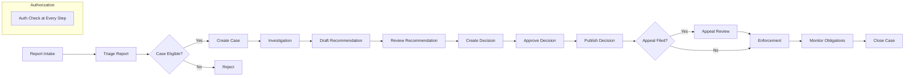
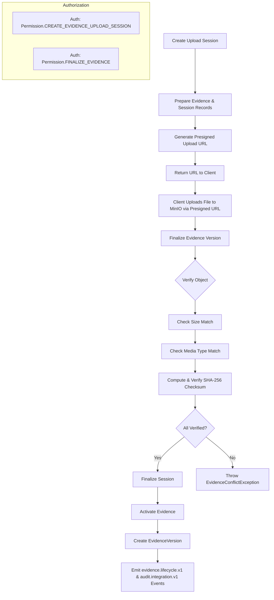
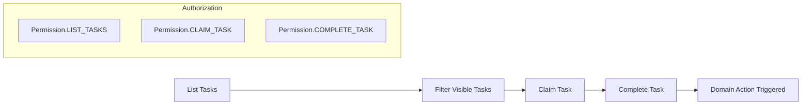
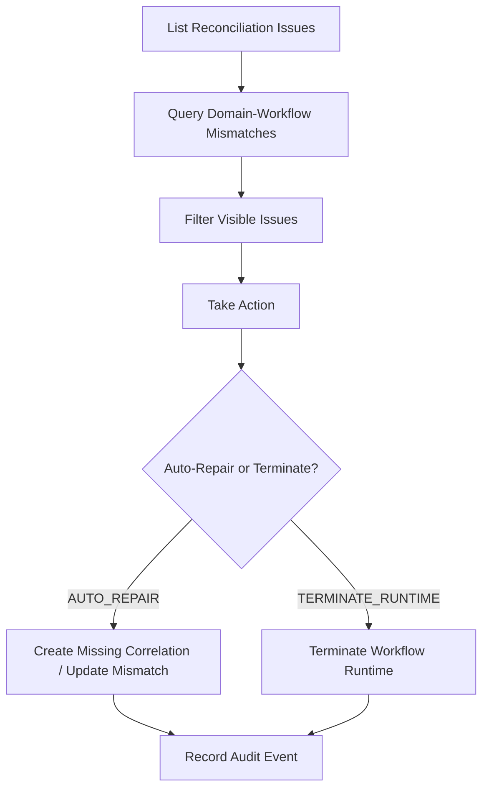
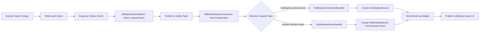
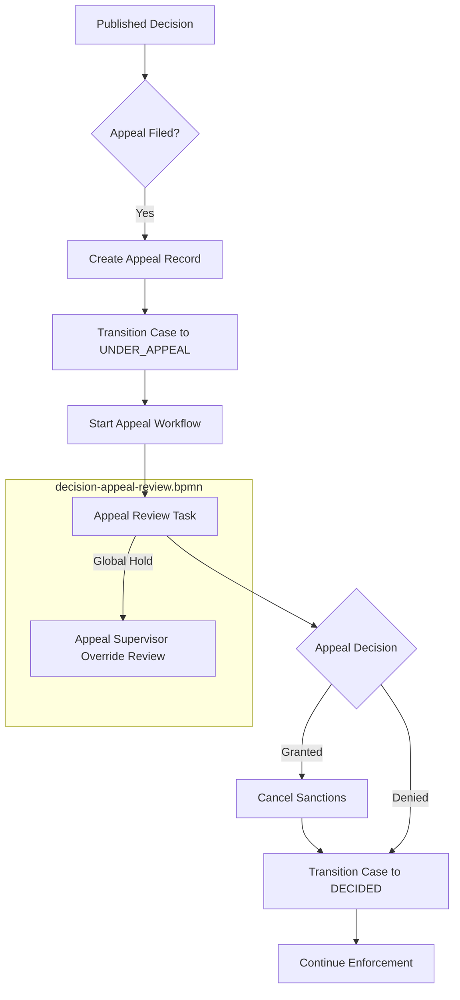
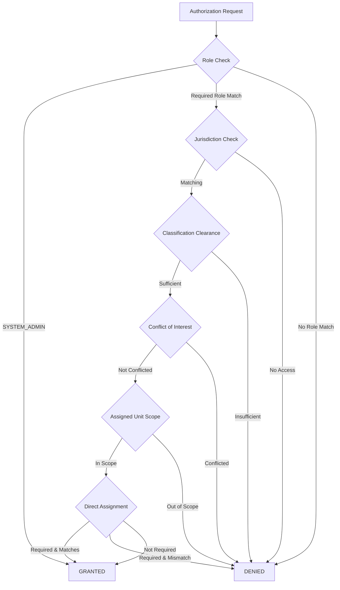

# Sentinel End-to-End Business Flows

This page documents the **end-to-end business flows** of the Sentinel Enforcement Platform. Each flow is traced through the application services, domain aggregates, and BPMN workflows.

**Source Modules:**
- `sentinel-application/src/main/java/com/sentinel/enforcement/application/` — Application services
- `sentinel-workflow/src/main/resources/bpmn/` — BPMN process definitions
- `sentinel-workflow/src/main/java/com/sentinel/enforcement/workflow/` — Workflow adapters

---

## 1. Main Enforcement Lifecycle

The end-to-end enforcement lifecycle proceeds through these stages:

1. **Report Intake** → A report is filed by a `CASE_INTAKE_OFFICER`
2. **Triage** → A `TRIAGE_OFFICER` or `SUPERVISOR` triages the report
3. **Case Creation** → A new `CaseRecord` is created from the triaged report
4. **Investigation** → Evidence is collected and analyzed by `INVESTIGATOR`
5. **Recommendation** → An investigation recommendation is drafted, submitted, and reviewed
6. **Decision** → A `DECISION_MAKER` drafts, approves, and publishes a decision
7. **Enforcement** → Sanctions are applied and obligations monitored
8. **Appeal** → The decision may be appealed and reviewed by an `APPEAL_OFFICER`

### Flowchart

### Authorization at Every Step

Every flow step includes an authorization check via `RoleBasedAuthorizationService.requirePermission()`. Each step checks:
- **Role hierarchy** — Actor must have one of the required roles for the permission
- **Jurisdiction match** — Actor must have jurisdiction access for the resource's jurisdiction
- **Classification clearance** — Actor must have sufficient clearance for `CONFIDENTIAL` / `SECRET` classifications
- **Conflict-of-interest** — Actor must not be conflicted with the resource owner
- **Assigned unit scope** — Non-admin actors are scoped to the case's assigned unit
- **Direct assignment** — `INVESTIGATOR` role requires direct assignment to the case for write operations

**Source:** `sentinel-security/src/main/java/com/sentinel/enforcement/security/RoleBasedAuthorizationService.java`

---

## 2. Report Intake → Triage → Case Creation

### Flow

1. **Create Report** — `ReportApplicationService.createReport()`:
   - Authorizes `Permission.CREATE_REPORT` (role: `CASE_INTAKE_OFFICER`)
   - Validates jurisdiction via `AuthorizationContext`
   - Creates a new `Report` with status `SUBMITTED`

2. **Triage Report** — `ReportApplicationService.triageReport()`:
   - Authorizes `Permission.TRIAGE_REPORT` (role: `TRIAGE_OFFICER` or `SUPERVISOR`)
   - Calls `Report.triage(actorId, expectedVersion, reason, now)`, which:
     - Checks optimistic lock (`expectedVersion == version`)
     - Guards on `status == SUBMITTED`
     - Returns new `Report` with status `TRIAGED`, incremented version

3. **Create Case** — `CaseApplicationService.createCase()`:
   - Verifies report exists and is `TRIAGED` (throws `REPORT_NOT_TRIAGED` otherwise)
   - Authorizes `Permission.CREATE_CASE` (role: `TRIAGE_OFFICER` or `SUPERVISOR`)
   - Generates `caseNumber` via `caseRepository.nextCaseNumber(jurisdictionCode, year)`
   - Creates `CaseRecord` with status `CREATED`
   - Starts BPMN workflow instance via `workflowPort.startCaseWorkflow()`
   - Enqueues `case.lifecycle.v1` outbox event (`CaseCreated`)
   - Records `AuditEvent`

**Flow source:** `CaseApplicationService.createCase()` lines 69–140
**Source:** `sentinel-application/src/main/java/com/sentinel/enforcement/application/casefile/CaseApplicationService.java`

---

## 3. Evidence Management Flow

The evidence flow involves a **presigned URL upload session** pattern:

### Detailed Steps

1. **Create Upload Session** — `EvidenceApplicationService.createUploadSession()`:
   - Authorizes `Permission.CREATE_EVIDENCE_UPLOAD_SESSION`
   - Creates `EvidenceUploadSession` with target version, checksum, size, media type
   - Generates object key: `/{jurisdiction}/{caseId}/{evidenceId}/{version}/{filename}`
   - Generates presigned upload URL via `evidenceStoragePort.createPresignedUploadUrl()` (TTL configurable)
   - Returns `PreparedEvidenceUploadSession` with the URL and expiry

2. **Client Upload** — Client uploads the file directly to MinIO using the presigned URL

3. **Finalize Version** — `EvidenceApplicationService.finalizeEvidenceVersion()`:
   - Authorizes `Permission.FINALIZE_EVIDENCE`
   - Verifies session belongs to evidence
   - Verifies session targets a version > current latest
   - **Verification checks**:
     - Object existence (stat)
     - `storedObject.sizeBytes() == uploadSession.sizeBytes()` → `EVIDENCE_SIZE_MISMATCH`
     - `normalizedMediaType(storedObject.mediaType()) == uploadSession.mediaType()` → `EVIDENCE_MEDIA_TYPE_MISMATCH`
     - `calculateSha256(bucket, objectKey) == uploadSession.sha256Checksum()` → `EVIDENCE_CHECKSUM_MISMATCH`
   - Finalizes session, activates evidence, creates `EvidenceVersion`
   - Publishes `evidence.lifecycle.v1` and `audit.integration.v1` events

4. **Download Session** — `EvidenceApplicationService.createDownloadSession()`:
   - Authorizes `Permission.CREATE_EVIDENCE_DOWNLOAD_SESSION`
   - Generates presigned download URL

**Source:** `sentinel-application/src/main/java/com/sentinel/enforcement/application/evidence/EvidenceApplicationService.java`

---

## 4. Workflow Task Flow

The BPMN engine (Camunda) manages user tasks throughout the case lifecycle. The `WorkflowTaskApplicationService` provides a task management interface.

### Task Keys

The BPMN process `regulatory-enforcement-case.bpmn` defines these user task keys:

| Task Key | Candidate Groups | Purpose |
|---|---|---|
| `triageTask` | `TRIAGE_OFFICER`, `SUPERVISOR` | Initial triage review |
| `optionalLegalAdvisoryTask` | `CASE_REVIEWER`, `SUPERVISOR` | Optional legal review |
| `financialReviewTask` | `CASE_REVIEWER`, `SUPERVISOR` | Optional financial analysis |
| `investigationTask` | `INVESTIGATOR`, `SUPERVISOR` | Main investigation |
| `legalAdvisoryTask` | `CASE_REVIEWER`, `SUPERVISOR` | Legal advisory |
| `reviewTask` | `CASE_REVIEWER`, `SUPERVISOR` | Review findings |
| `supervisorReviewTask` | `SUPERVISOR` | Supervisor review |
| `recommendationRevisionTask` | `INVESTIGATOR`, `SUPERVISOR` | Revise recommendation |
| `decisionTask` | `DECISION_MAKER`, `SUPERVISOR` | Draft decision |
| `reviewRegistryFailureTask` | `SUPERVISOR` | Handle registry failure |
| `reviewNotificationFailureTask` | `SUPERVISOR` | Handle notification failure |
| `supervisorOverrideReviewTask` | `SUPERVISOR`, `SYSTEM_ADMIN` | Supervisor override |
| `globalHoldOverrideReviewTask` | `SUPERVISOR`, `SYSTEM_ADMIN` | Global hold review |
| `monitorPaymentObligationTask` | `SUPERVISOR` | Monitor payment |
| `monitorCorrectiveActionTask` | `SUPERVISOR` | Monitor corrective action |
| `monitorReportingObligationTask` | `SUPERVISOR` | Monitor reporting |
| `additionalEnforcementActionTask` | `SUPERVISOR` | Additional enforcement |

**Source:** `sentinel-workflow/src/main/resources/bpmn/regulatory-enforcement-case.bpmn`
**Source:** `sentinel-application/src/main/java/com/sentinel/enforcement/application/workflow/WorkflowTaskApplicationService.java`

### Task Flow

1. **List Tasks** — `WorkflowTaskApplicationService.listTasks()`:
   - Authorizes `Permission.LIST_TASKS` (roles: `TRIAGE_OFFICER`, `INVESTIGATOR`, `CASE_REVIEWER`, `DECISION_MAKER`, `APPEAL_OFFICER`, `SUPERVISOR`)
   - Fetches active tasks from the BPMN engine via `workflowPort.listActiveTasks()`
   - Filters by visibility: checks jurisdiction, classification clearance, and unit scope
   - Applies cursor-based pagination

2. **Claim Task** — Authorizes `Permission.CLAIM_TASK`; assigns the task to the actor in the BPMN engine

3. **Complete Task** — Authorizes `Permission.COMPLETE_TASK`; completes the task and triggers downstream domain actions via the case application service

---

## 5. Workflow Reconciliation Flow

The reconciliation process detects and resolves mismatches between the **domain case status** and the **BPMN workflow runtime state**.

**Source:** `sentinel-application/src/main/java/com/sentinel/enforcement/application/workflow/WorkflowReconciliationApplicationService.java`

### Issue Types

| Issue Type | Description |
|---|---|
| `ACTIVE_RUNTIME_MISSING_CORRELATION` | Workflow running but no correlation record in store |
| `ACTIVE_RUNTIME_CORRELATION_MISMATCH` | Workflow runtime and correlation reference different instances |
| `ACTIVE_CASE_WORKFLOW_NOT_RUNNING` | Case is active but no workflow is running |
| `ACTIVE_CASE_CORRELATION_TERMINAL` | Case is active but correlation points to a terminated workflow |
| `TERMINAL_CASE_RUNTIME_ACTIVE` | Case is terminal (CLOSED/CANCELLED) but workflow runtime still active |
| `TERMINAL_CASE_CORRELATION_ACTIVE` | Case is terminal but correlation references an active runtime |
| `TERMINAL_CASE_MISSING_CORRELATION` | Case is terminal with no correlation record |

**Source:** `sentinel-application/src/main/java/com/sentinel/enforcement/application/workflow/WorkflowReconciliationIssueType.java`

### Flow

### Actions

| Action | Effect |
|---|---|
| `AUTO_REPAIR` | Creates a missing correlation record or updates a mismatched correlation in the `WorkflowInstanceStore` |
| `TERMINATE_RUNTIME` | Cancels the active BPMN process instance |

**Source:** `sentinel-application/src/main/java/com/sentinel/enforcement/application/workflow/WorkflowReconciliationAction.java`

---

## 6. Notification Flow

Notifications are sent when domain state changes occur. The flow uses the **transactional outbox** pattern for reliability.

### Domain Change → Outbox

When a domain state change occurs (e.g., case created, evidence finalized), the application service:

1. Writes the domain event to the database as an `AuditEvent`
2. Enqueues an `OutboxEvent` with the serialized `EventEnvelope` to the `outbox_event` table
3. Both operations occur within the same **database transaction**

### Outbox → Kafka

The `KafkaOutboxPublisher` background process:

1. Claims pending outbox events with `FOR UPDATE SKIP LOCKED` and `leaseOwner` + `leaseDuration`
2. Serializes the `EventEnvelope` to JSON
3. Publishes to the target Kafka topic
4. Marks as `published` on success, or releases for retry on failure with exponential backoff

**Source:** `sentinel-messaging/src/main/java/com/sentinel/enforcement/messaging/KafkaOutboxPublisher.java`

### Kafka → Notification

The `KafkaNotificationConsumer`:

1. Polls subscribed topics (domain lifecycle topics + `notification.command.v1`)
2. Deserializes the `EventEnvelope`
3. Routes to `NotificationCommandHandler` (for `notification.command.v1`) or `NotificationEventHandler` (for domain events)
4. On failure, routes to `{topic}.retry` or `{topic}.dlq` after max retries

**Source:** `sentinel-messaging/src/main/java/com/sentinel/enforcement/messaging/KafkaNotificationConsumer.java`

---

## 7. Appeal Handling Flow

The appeal flow involves the **main case workflow** and a **dedicated appeal review workflow** (`decision-appeal-review.bpmn`).

### BPMN Appeal Process (`decision-appeal-review.bpmn`)

The appeal review workflow handles:
- **Appeal review task** — Candidate groups: `APPEAL_OFFICER`, `SUPERVISOR`
- **Appeal review reminder** — Timer boundary event at `P1D` (1 day)
- **Global hold signal** — If `appealGlobalHoldRequested == true`, triggers a signal
- **Supervisor override sub-process** — Triggered by `Signal_GlobalHold`; candidates: `SUPERVISOR`, `SYSTEM_ADMIN`

**Source:** `sentinel-workflow/src/main/resources/bpmn/decision-appeal-review.bpmn`

### Application Service Flow

`AppealApplicationService.createAppeal()`:

1. Verifies decision is `PUBLISHED`
2. Authorizes `Permission.CREATE_APPEAL`
3. Creates `Appeal` with status `ACTIVE`
4. Transitions case to `UNDER_APPEAL` via `CaseApplicationService.transitionCase()`
5. Starts appeal workflow via `workflowPort.startAppealWorkflow()`
6. Enqueues `appeal.lifecycle.v1` outbox event

`AppealApplicationService.decideAppeal()`:

1. Authorizes `Permission.DECIDE_APPEAL`
2. Creates `AppealDecision` with outcome `DENIED` or `GRANTED`
3. Updates appeal status to `DECIDED`
4. If granted: cancels sanctions and obligations
5. Transitions case back to `DECIDED`

**Source:** `sentinel-application/src/main/java/com/sentinel/enforcement/application/appeal/AppealApplicationService.java`

---

## 8. Cross-Cutting: Authorization Check

Every single business flow step includes an authorization check. The authorization model evaluates **six axes**:

**Source:** `sentinel-security/src/main/java/com/sentinel/enforcement/security/RoleBasedAuthorizationService.java`

### Permission-to-Role Mapping

| Permission | Required Roles |
|---|---|
| `CREATE_REPORT` | `CASE_INTAKE_OFFICER` |
| `READ_REPORT` | `CASE_INTAKE_OFFICER`, `TRIAGE_OFFICER`, `AUDITOR` |
| `TRIAGE_REPORT` | `TRIAGE_OFFICER`, `SUPERVISOR` |
| `CREATE_CASE` | `TRIAGE_OFFICER`, `SUPERVISOR` |
| `READ_CASE`, `LIST_CASES` | All non-intake officer roles |
| `CREATE_EVIDENCE_*`, `READ_EVIDENCE` | All non-intake officer roles |
| `CREATE_RECOMMENDATION`, `SUBMIT_RECOMMENDATION` | `INVESTIGATOR`, `SUPERVISOR` |
| `REVIEW_RECOMMENDATION` | `CASE_REVIEWER`, `SUPERVISOR` |
| `CREATE_DECISION`, `APPROVE_DECISION`, `PUBLISH_DECISION` | `DECISION_MAKER`, `SUPERVISOR` |
| `CREATE_APPEAL`, `DECIDE_APPEAL` | `APPEAL_OFFICER`, `SUPERVISOR` |
| `ASSIGN_CASE` | `TRIAGE_OFFICER`, `SUPERVISOR` |
| `TRANSITION_CASE` | All non-intake officer roles |
| `READ_CASE_AUDIT` | `SUPERVISOR`, `AUDITOR` |
| `LIST_TASKS`, `CLAIM_TASK`, `COMPLETE_TASK` | All non-intake officer roles |
| `RECONCILE_WORKFLOW` | `SUPERVISOR` |
| `RUN_MAINTENANCE_OPERATION` | `SUPERVISOR` |

**Direct assignment requirement:** Pure `INVESTIGATOR` role (without `SUPERVISOR`, `TRIAGE_OFFICER`, etc.) requires direct assignment to the case for `READ_CASE`, `TRANSITION_CASE`, and evidence/recommendation operations.

---

## BPMN Process References

### Main Enforcement Process

**File:** `sentinel-workflow/src/main/resources/bpmn/regulatory-enforcement-case.bpmn`

The process `regulatoryEnforcementCase` covers the full lifecycle:
- **Start:** Message event `CaseCreatedMessage`
- **Service tasks:** Pre-Triage Routing, Investigation Escalation, External Evidence Request, Sanction Registry, Notification
- **User tasks:** Triage, Investigation, Legal Advisory, Financial Review, Review, Decision, Supervisor Override, Obligation Monitoring
- **Escalations:** Triage SLA warning (30 min timer), Supervisor override escalation
- **Messages:** `CaseCreatedMessage`, `ExternalEvidenceDelivered`, `SanctionRegistryAcknowledged`, `NotificationResultReceived`, `AppealFiled`, `AppealResolved`
- **Signals:** `GlobalHoldSignal`

### Appeal Review Process

**File:** `sentinel-workflow/src/main/resources/bpmn/decision-appeal-review.bpmn`

The process `decisionAppealReview` handles appeals:
- **Start:** Message event `AppealWorkflowStarted`
- **User tasks:** Appeal Review, Appeal Supervisor Override Review
- **Timer:** Appeal review reminder at `P1D`
- **Signals:** `GlobalHoldSignal`
