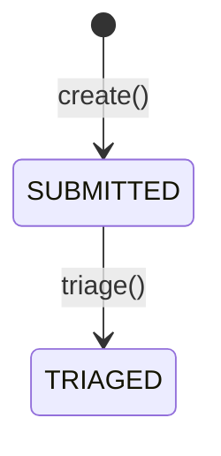
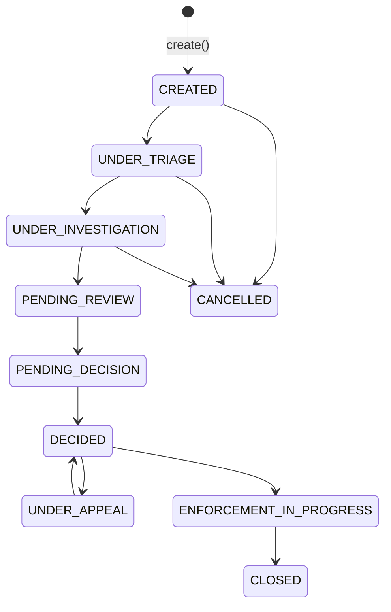
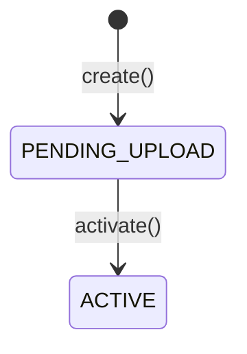
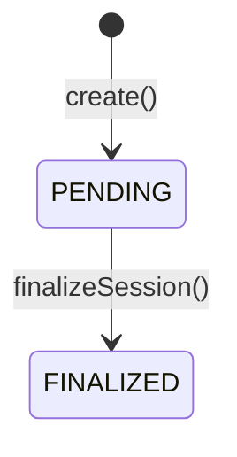
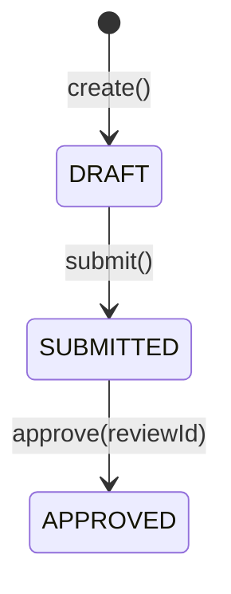
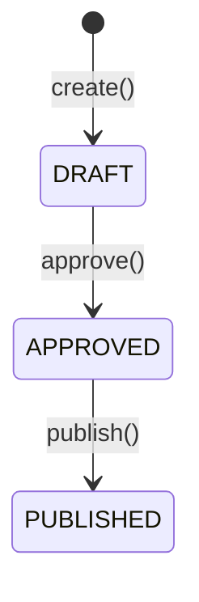
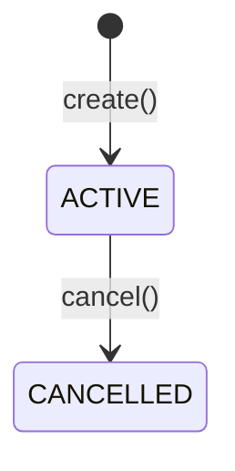
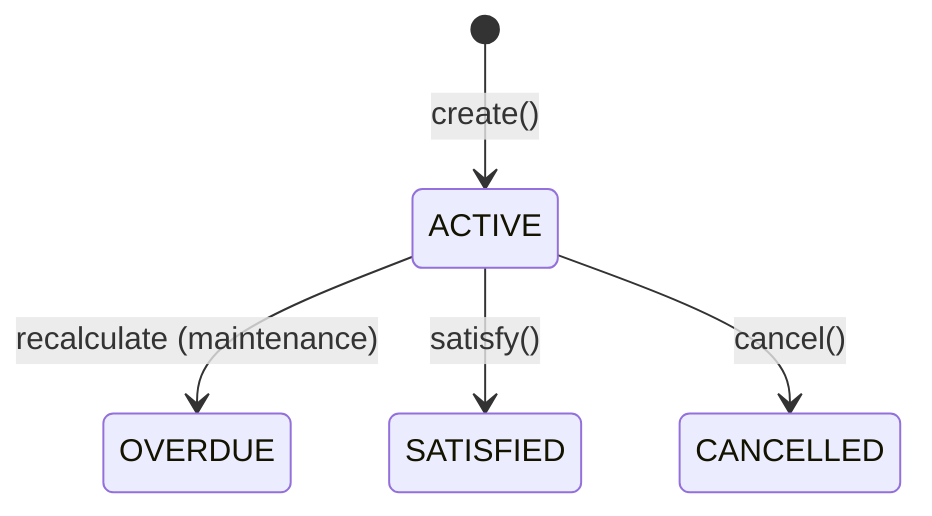
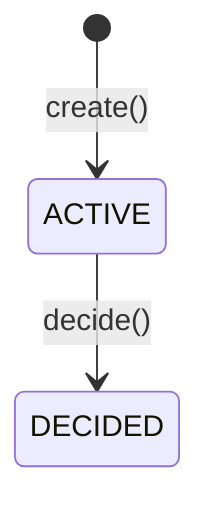
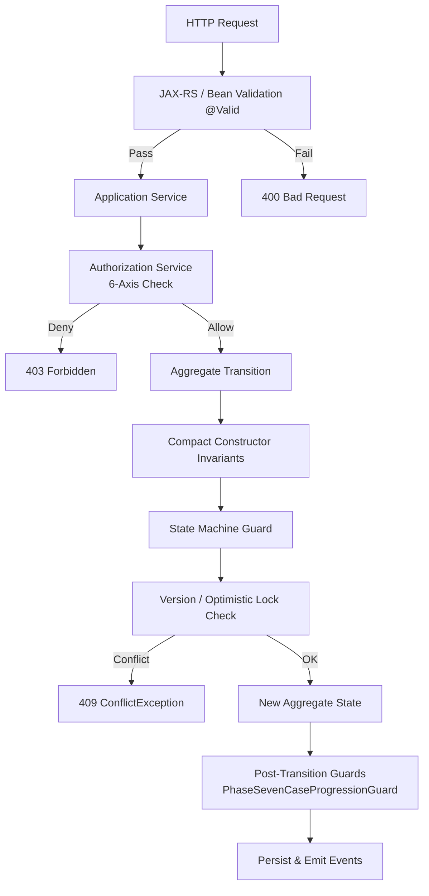

# Sentinel Business Rules and Validation

This page documents all **business rules, invariants, and validation constraints** enforced by the Sentinel Enforcement Platform. Rules are organized by enforcement layer: domain invariants (hard constraints), state machine rules, authorization rules, application guards, and API-level validation.

---

## 1. Domain Invariants (Compact Constructors)

Every domain aggregate is an **immutable Java record** with a **compact constructor** that enforces invariants at construction time. These rules apply to **all 7 aggregates**.

### Universal Invariants

| Rule | Enforcement | Source Examples |
|---|---|---|
| **Non-null identifiers** | `Objects.requireNonNull(id, ...)` | All records |
| **Non-blank string fields** | `requireNonBlank(value, fieldName)` | `title`, `summary`, `description`, `jurisdictionCode`, etc. |
| **Version ≥ 0** | `if (version < 0) throw ...` | All versioned records |
| **Timestamps non-null** | `Objects.requireNonNull(createdAt, ...)` | `createdAt`, `updatedAt` on all records |
| **Actor fields non-blank** | `requireNonBlank(createdBy, ...)` | `createdBy`, `updatedBy` on all records |

**Source:** Every domain record under `sentinel-domain/src/main/java/com/sentinel/enforcement/domain/`

### Aggregate-Specific Invariants

| Aggregate | Additional Invariant | Rule |
|---|---|---|
| `Report` | None beyond universal | — |
| `CaseRecord` | `assignedUnitId` must not be blank **when provided** | Line 44–46 |
| `CaseRecord` | `assigneeUserId` must not be blank **when provided** | Line 47–49 |
| `CaseRelationship` | `parentCaseId` must differ from `childCaseId` | Line 23–25 |
| `Evidence` | `latestVersion` must be ≥ 0 | Line 30–32 |
| `EvidenceVersion` | `versionNumber` must be ≥ 1 | Line 36–38 |
| `EvidenceVersion` | `sizeBytes` must be ≥ 0 | Line 39–41 |
| `EvidenceUploadSession` | `targetVersionNumber` must be ≥ 1 | Line 45–47 |
| `EvidenceUploadSession` | `sizeBytes` must be ≥ 0 | Line 48–50 |
| `Decision` | If `violationProven`, sanction/obligation fields are **required** (non-null, non-blank) | Lines 37–41 |
| `Decision` | If `!violationProven`, obligation fields are **nulled** | Lines 43–47 |
| `Recommendation` | `proposedSanction` must not be blank **when provided** | Lines 30–32 |
| `Appeal` | If `supervisorOverride`, `supervisorOverrideReason` is required and non-blank | Lines 29–31 |

---

## 2. State Machine Transition Rules

Each aggregate enforces its own state machine guards in its transition methods.

### Report State Machine



| Transition | Guard | Conflict Code |
|---|---|---|
| `triage()` | `status == SUBMITTED` | `REPORT_TRIAGE_NOT_ALLOWED` |
| `triage()` | `reason` not blank | `IllegalArgumentException` |
| `triage()` | `actorId` not blank | `IllegalArgumentException` |
| `triage()` | `expectedVersion == version` | `CONCURRENT_MODIFICATION` |

**Source:** `sentinel-domain/src/main/java/com/sentinel/enforcement/domain/report/Report.java`

### CaseRecord State Machine



| Transition | Guard | Conflict Code |
|---|---|---|
| `assignTo()` | `status` not terminal | `CASE_ASSIGNMENT_NOT_ALLOWED` |
| `assignTo()` | Actor has `TRIAGE_OFFICER` or `SUPERVISOR` role | `CASE_ASSIGNMENT_NOT_ALLOWED` |
| Transitions | `CaseProgressionGuard.requireTargetStatePrerequisites()` | `CASE_TRANSITION_NOT_ALLOWED` |

**Source:** `sentinel-domain/src/main/java/com/sentinel/enforcement/domain/casefile/CaseRecord.java`

### Evidence State Machine



| Transition | Guard | Conflict Code |
|---|---|---|
| `activate(newLatestVersion, now, actorId)` | `newLatestVersion >= 1` | `IllegalArgumentException` |

**Source:** `sentinel-domain/src/main/java/com/sentinel/enforcement/domain/evidence/Evidence.java`

### EvidenceUploadSession State Machine



| Transition | Guard | Conflict Code |
|---|---|---|
| `finalizeSession()` | `status == PENDING` | `EVIDENCE_UPLOAD_SESSION_ALREADY_FINALIZED` |
| `finalizeSession()` | `expiresAt.isAfter(now)` | `EVIDENCE_UPLOAD_SESSION_EXPIRED` |

**Source:** `sentinel-domain/src/main/java/com/sentinel/enforcement/domain/evidence/EvidenceUploadSession.java`

### Recommendation State Machine



| Transition | Guard | Conflict Code |
|---|---|---|
| `submit()` | `status == DRAFT` | `RECOMMENDATION_SUBMIT_NOT_ALLOWED` |
| `approve()` | `status == SUBMITTED` | `RECOMMENDATION_REVIEW_NOT_ALLOWED` |

**Source:** `sentinel-domain/src/main/java/com/sentinel/enforcement/domain/recommendation/Recommendation.java`

### Decision State Machine



| Transition | Guard | Conflict Code |
|---|---|---|
| `approve()` | `status == DRAFT` | `DECISION_APPROVE_NOT_ALLOWED` |
| `publish()` | `status == APPROVED` | `DECISION_PUBLISH_NOT_ALLOWED` |

**Source:** `sentinel-domain/src/main/java/com/sentinel/enforcement/domain/decision/Decision.java`

### Sanction State Machine



### SanctionObligation State Machine



### Appeal State Machine



| Transition | Guard | Conflict Code |
|---|---|---|
| `decide()` | `status == ACTIVE` | `APPEAL_DECISION_NOT_ALLOWED` |

**Source:** `sentinel-domain/src/main/java/com/sentinel/enforcement/domain/appeal/Appeal.java`

**Application-level guard:** Appeal can only be filed against `PUBLISHED` decisions (enforced in `AppealApplicationService.createAppeal()`, not in the domain record).

**Source:** `sentinel-application/src/main/java/com/sentinel/enforcement/application/appeal/AppealApplicationService.java` (line 78)

### Case Creation Guard

Only a **TRIAGED** report can create a case:
```java
if (report.status() != ReportStatus.TRIAGED) {
  throw new CaseConflictException("REPORT_NOT_TRIAGED",
    "Report " + report.id() + " must be triaged before a case can be created.");
}
```
**Source:** `CaseApplicationService.createCase()` lines 87–91

---

## 3. Authorization Rules

**Source:** `sentinel-security/src/main/java/com/sentinel/enforcement/security/RoleBasedAuthorizationService.java`

The authorization system evaluates **six axes** in sequence:

### 3.1 Role Hierarchy

`SYSTEM_ADMIN` bypasses **all** authorization checks (returns immediately).

### 3.2 Role Membership

The actor must hold at least one required role for the permission. See [business-flows.md](./business-flows.md#permission-to-role-mapping) for the full permission-to-role mapping matrix.

### 3.3 Jurisdiction Match

If the `AuthorizationContext` specifies a `jurisdictionCode`, the actor must have jurisdiction access through `actor.hasJurisdiction(jurisdictionCode)`.

### 3.4 Classification Clearance

If the `AuthorizationContext` specifies a `caseClassification` (`PUBLIC`, `CONFIDENTIAL`, or `SECRET`), the actor must have sufficient clearance via `actor.hasCaseClassification(classification)`.

### 3.5 Conflict-of-Interest

If the `AuthorizationContext` specifies a `resourceOwnerId`, the actor must not be conflicted with the resource owner: `!actor.isConflictedWith(resourceOwnerId)`.

### 3.6 Assigned Unit Scope

For non-admin actors with roles like `TRIAGE_OFFICER`, `INVESTIGATOR`, `CASE_REVIEWER`, `DECISION_MAKER`, or `APPEAL_OFFICER` (but not `AUDITOR` or `SYSTEM_ADMIN`):

| Scope Mode | Behavior |
|---|---|
| `NONE` | No unit restriction |
| `RESTRICTED_TO_ASSIGNED_UNITS` | Actor must be assigned to the resource's unit |
| `RESTRICTED_TO_ASSIGNED_UNITS_WHEN_PRESENT` | Only enforced when the resource has a unit; unassigned resources are visible to all |

### 3.7 Direct Assignment

For the `INVESTIGATOR` role (without `SUPERVISOR`, `TRIAGE_OFFICER`, `CASE_REVIEWER`, `DECISION_MAKER`, `APPEAL_OFFICER`, or `AUDITOR` roles), **direct assignment** is required for these permissions:

- `READ_CASE`
- `TRANSITION_CASE`
- `CREATE_EVIDENCE_UPLOAD_SESSION`
- `FINALIZE_EVIDENCE`
- `READ_EVIDENCE`
- `CREATE_EVIDENCE_DOWNLOAD_SESSION`
- `CREATE_RECOMMENDATION`
- `SUBMIT_RECOMMENDATION`

Direct assignment means the actor's `username()` must match the `assigneeUserId` on the resource.

---

## 4. Optimistic Locking (Concurrency Control)

All versioned domain aggregates implement **optimistic concurrency control** via a `long version` field.

### Pattern

Every transition method follows this pattern:

```java
public Aggregate transition(..., long expectedVersion, ...) {
    if (expectedVersion != version) {
        throw new *ConflictException("CONCURRENT_MODIFICATION", ...);
    }
    return new Aggregate(..., version + 1);
}
```

**Sources:**

| Aggregate | File | Example |
|---|---|---|
| Report | `Report.java` line 39 | `report.triage(actorId, expectedVersion, ...)` |
| CaseRecord | `CaseRecord.java` | `validateExpectedVersion(context)` in all transitions |
| Evidence | `Evidence.java` | `activate()` increments version |
| EvidenceUploadSession | `EvidenceUploadSession.java` | `finalizeSession()` increments version |
| Recommendation | `Recommendation.java` | `submit()`, `approve()` increment version |
| Decision | `Decision.java` | `approve()`, `publish()` increment version |
| Sanction | `Sanction.java` | `cancel()` increments version |
| SanctionObligation | `SanctionObligation.java` | `cancel()` increments version |
| Appeal | `Appeal.java` | `decide()` increments version |

The `expectedVersion` is provided by the application service after reading the current aggregate state from the database. The version check ensures that two concurrent updates cannot silently overwrite each other.

---

## 5. Case Progression Guard (PhaseSevenCaseProgressionGuard)

**Source:** `sentinel-application/src/main/java/com/sentinel/enforcement/application/casefile/PhaseSevenCaseProgressionGuard.java`

Before a case can transition to certain states, the guard validates **prerequisites**:

| Target Status | Prerequisite | Conflict Code |
|---|---|---|
| `PENDING_DECISION` | An **approved recommendation** must exist for the case | `CASE_TRANSITION_NOT_ALLOWED` — "Case cannot move to PENDING_DECISION without an approved recommendation." |
| `DECIDED` | A **published decision** must exist for the case | `CASE_TRANSITION_NOT_ALLOWED` — "Case cannot move to DECIDED without a published decision." |
| `UNDER_APPEAL` | An **active appeal** must exist for the case | `CASE_TRANSITION_NOT_ALLOWED` — "Case cannot move to UNDER_APPEAL without an active appeal." |
| `ENFORCEMENT_IN_PROGRESS` | A **published decision** must exist for the case | `CASE_TRANSITION_NOT_ALLOWED` — "Case cannot move to ENFORCEMENT_IN_PROGRESS without a published decision." |
| `CLOSED` | **No active sanction obligations** may remain | `CASE_TRANSITION_NOT_ALLOWED` — "Case cannot be closed while active sanction obligations remain." |

Other target statuses (`CREATED`, `UNDER_TRIAGE`, `UNDER_INVESTIGATION`, `PENDING_REVIEW`, `CANCELLED`) have no prerequisites (the guard's `default` case is a no-op).

The guard is a pluggable `CaseProgressionGuard` interface (`@FunctionalInterface`), allowing different progression rules to be injected:

```java
@FunctionalInterface
public interface CaseProgressionGuard {
    CaseProgressionGuard NO_OP = (caseId, targetStatus) -> {};
    void requireTargetStatePrerequisites(UUID caseId, CaseStatus targetStatus);
}
```

**Source:** `sentinel-application/src/main/java/com/sentinel/enforcement/application/casefile/CaseProgressionGuard.java`

---

## 6. Evidence Finalize Verification

**Source:** `sentinel-application/src/main/java/com/sentinel/enforcement/application/evidence/EvidenceApplicationService.java` (lines 193–209)

When finalizing an evidence version, three verification checks are performed against the uploaded object in the storage backend:

| Check | Rule | Error Code |
|---|---|---|
| **Object existence** | The object must exist at the expected key | `EVIDENCE_UPLOAD_SESSION_NOT_FOUND` (via session lookup) |
| **Size match** | `storedObject.sizeBytes() == uploadSession.sizeBytes()` | `EVIDENCE_SIZE_MISMATCH` |
| **Media type match** | `normalizedMediaType(storedObject.mediaType()).equals(uploadSession.mediaType())` | `EVIDENCE_MEDIA_TYPE_MISMATCH` |
| **SHA-256 checksum** | `calculateSha256(bucket, objectKey).equals(uploadSession.sha256Checksum())` | `EVIDENCE_CHECKSUM_MISMATCH` |

Additional constraints enforced during finalization:

- Upload session must belong to the evidence being finalized (`EVIDENCE_UPLOAD_SESSION_MISMATCH`)
- Upload session must target a version greater than the current latest version (`EVIDENCE_UPLOAD_SESSION_STALE`)
- Evidence title must remain the same across versions (`EVIDENCE_TITLE_MISMATCH`)
- Evidence classification must remain the same across versions (`EVIDENCE_CLASSIFICATION_MISMATCH`)
- Uploaded evidence must belong to the same case (`EVIDENCE_CASE_MISMATCH`)

---

## 7. Maintenance Operation Conflict Detection

**Source:** `sentinel-application/src/main/java/com/sentinel/enforcement/application/operations/MaintenanceOperationApplicationService.java`

Maintenance operations use **table-level locking** and `REPEATABLE_READ` isolation to prevent concurrent conflicts.

### Recalculate Overdue Sanctions

```java
transactionManager.required(
    TransactionOptions.write(
        TransactionIsolation.REPEATABLE_READ,
        "recalculate-overdue-sanction-obligations"),
    () -> {
        maintenanceOperationRepository.lockSanctionObligationTable();
        maintenanceOperationRepository.recalculateOverdueSanctionObligations(
            runId, command.effectiveDate(), actor.username());
        ...
    });
```

The `lockSanctionObligationTable()` method (implementation-dependent, likely `LOCK TABLE` or `SELECT FOR UPDATE` on the entire table) ensures that only one maintenance operation runs at a time.

Authorized via `Permission.RUN_MAINTENANCE_OPERATION` (role: `SUPERVISOR`).

---

## 8. Bean Validation on API Request Bodies

All REST API endpoints accept request bodies annotated with Jakarta Bean Validation (`@Valid`). Validation is enforced at the JAX-RS layer before the request reaches the application service.

**Source:** Request DTOs under `sentinel-api/src/main/java/com/sentinel/enforcement/api/`

Common validation annotations include:

| Annotation | Applied To |
|---|---|
| `@NotNull` | All required fields |
| `@NotBlank` | All required string fields |
| `@Size(min, max)` | String length constraints |
| `@Positive` | Numeric fields (e.g., `sizeBytes`, `versionNumber`) |

Violations return a standard error envelope with HTTP 400 status before any business logic executes.

---

## 9. Summary: Validation Layers



## Source References

1. **Domain Aggregates** — `sentinel-domain/src/main/java/.../domain/report/Report.java`, `.../casefile/CaseRecord.java`, `.../evidence/Evidence.java`, `.../evidence/EvidenceUploadSession.java`, `.../recommendation/Recommendation.java`, `.../decision/Decision.java`, `.../sanction/Sanction.java`, `.../sanction/SanctionObligation.java`, `.../appeal/Appeal.java`
2. **Application Services** — `sentinel-application/src/main/java/.../application/appeal/AppealApplicationService.java`, `.../casefile/CaseApplicationService.java`, `.../casefile/PhaseSevenCaseProgressionGuard.java`, `.../casefile/CaseProgressionGuard.java`, `.../evidence/EvidenceApplicationService.java`, `.../operations/MaintenanceOperationApplicationService.java`
3. **Authorization** — `sentinel-security/src/main/java/.../security/RoleBasedAuthorizationService.java`, `sentinel-application/src/main/java/.../security/AuthorizationService.java`, `sentinel-application/src/main/java/.../security/Permission.java`
4. **API Validation** — Request DTOs under `sentinel-api/src/main/java/.../api/`
