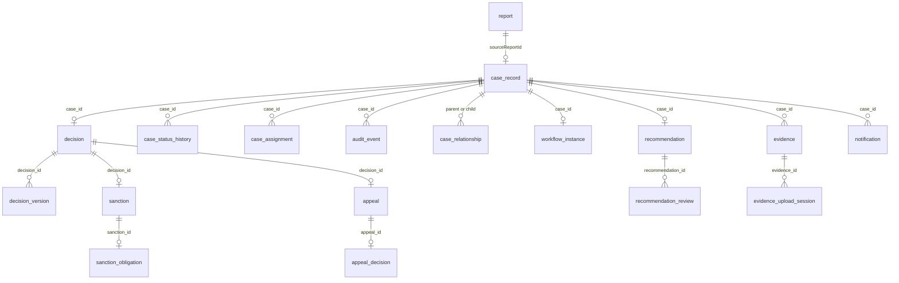

# Database Schema and Entity Relationships

## Overview

The Sentinel Enforcement Platform uses **PostgreSQL 16** as its primary database. All schema changes are managed via Liquibase (see [database-programmability.md](database-programmability.md)). Every table uses UUID primary keys. Every mutable aggregate carries a `version BIGINT` column with `CHECK (version >= 0)` for optimistic concurrency control (see [consistency.md](consistency.md)).

**Source:** `sentinel-persistence/src/main/resources/db/changelog/releases/*.yaml` (11 release files)

---

## Entity-Relationship Diagram



---

## Table Reference

### 1. `report`

Source: `0001-foundation.yaml`, `0004-evidence.yaml`

| Column | Type | Constraints |
|---|---|---|
| `id` | `UUID` | `PK NOT NULL` |
| `title` | `VARCHAR(200)` | `NOT NULL` |
| `description` | `TEXT` | `NOT NULL` |
| `jurisdiction_code` | `VARCHAR(16)` | `NOT NULL` |
| `reporter_name` | `VARCHAR(100)` | `NOT NULL` |
| `status` | `VARCHAR(32)` | `NOT NULL`, `CHECK (status IN ('SUBMITTED', 'TRIAGED'))` |
| `created_at` | `TIMESTAMPTZ` | `NOT NULL` |
| `created_by` | `VARCHAR(100)` | `NOT NULL` |
| `updated_at` | `TIMESTAMPTZ` | `NOT NULL` |
| `updated_by` | `VARCHAR(100)` | `NOT NULL` |
| `version` | `BIGINT` | `NOT NULL DEFAULT 0`, `CHECK (version >= 0)` |

**Indexes:**

| Index | Columns |
|---|---|
| `idx_report_jurisdiction_created_at` | `jurisdiction_code`, `created_at` |
| `idx_report_jurisdiction_status_created_at` | `jurisdiction_code`, `status`, `created_at` |

---

### 2. `case_record`

Source: `0002-case-management.yaml`, `0007-phase8-case-authorization.yaml`

| Column | Type | Constraints |
|---|---|---|
| `id` | `UUID` | `PK NOT NULL` |
| `case_number` | `VARCHAR(32)` | `NOT NULL`, `UNIQUE` |
| `report_id` | `UUID` | `NOT NULL`, `FK → report(id)` |
| `title` | `VARCHAR(200)` | `NOT NULL` |
| `summary` | `TEXT` | `NOT NULL` |
| `jurisdiction_code` | `VARCHAR(16)` | `NOT NULL` |
| `status` | `VARCHAR(32)` | `NOT NULL`, `CHECK (status IN ('CREATED','UNDER_TRIAGE','UNDER_INVESTIGATION','PENDING_REVIEW','PENDING_DECISION','DECIDED','UNDER_APPEAL','ENFORCEMENT_IN_PROGRESS','CLOSED','CANCELLED'))` |
| `classification` | `VARCHAR(32)` | `NOT NULL DEFAULT 'CONFIDENTIAL'`, `CHECK (classification IN ('PUBLIC','CONFIDENTIAL','SECRET'))` |
| `assigned_unit_id` | `VARCHAR(64)` | — |
| `assignee_user_id` | `VARCHAR(100)` | — |
| `created_at` | `TIMESTAMPTZ` | `NOT NULL` |
| `created_by` | `VARCHAR(100)` | `NOT NULL` |
| `updated_at` | `TIMESTAMPTZ` | `NOT NULL` |
| `updated_by` | `VARCHAR(100)` | `NOT NULL` |
| `version` | `BIGINT` | `NOT NULL DEFAULT 0`, `CHECK (version >= 0)` |

**Indexes:**

| Index | Columns |
|---|---|
| `idx_case_record_jurisdiction_status_created_at` | `jurisdiction_code`, `status`, `created_at` |
| `idx_case_record_assignee_created_at` | `assignee_user_id`, `created_at` |
| `idx_case_record_jurisdiction_unit_classification_created_at` | `jurisdiction_code`, `assigned_unit_id`, `classification`, `created_at` |

---

### 3. `case_status_history`

Source: `0002-case-management.yaml`

| Column | Type | Constraints |
|---|---|---|
| `id` | `UUID` | `PK NOT NULL` |
| `case_id` | `UUID` | `NOT NULL`, `FK → case_record(id)` |
| `from_status` | `VARCHAR(32)` | — |
| `to_status` | `VARCHAR(32)` | `NOT NULL` |
| `transition_reason` | `VARCHAR(500)` | `NOT NULL` |
| `transitioned_at` | `TIMESTAMPTZ` | `NOT NULL` |
| `transitioned_by` | `VARCHAR(100)` | `NOT NULL` |
| `created_at` | `TIMESTAMPTZ` | `NOT NULL` |
| `created_by` | `VARCHAR(100)` | `NOT NULL` |

**Indexes:**

| Index | Columns |
|---|---|
| `idx_case_status_history_case_transitioned_at` | `case_id`, `transitioned_at` |

---

### 4. `case_assignment`

Source: `0002-case-management.yaml`, `0009-advanced-persistence-assignment.yaml`

| Column | Type | Constraints |
|---|---|---|
| `id` | `UUID` | `PK NOT NULL` |
| `case_id` | `UUID` | `NOT NULL`, `FK → case_record(id)` |
| `assigned_unit_id` | `VARCHAR(64)` | `NOT NULL` |
| `assignee_user_id` | `VARCHAR(100)` | `NOT NULL` |
| `assignment_reason` | `VARCHAR(500)` | `NOT NULL` |
| `assigned_at` | `TIMESTAMPTZ` | `NOT NULL` |
| `assigned_by` | `VARCHAR(100)` | `NOT NULL` |
| `released_at` | `TIMESTAMPTZ` | — |
| `released_by` | `VARCHAR(100)` | — |
| `superseded_by_assignment_id` | `UUID` | — |
| `is_active` | `BOOLEAN` | `NOT NULL DEFAULT TRUE` |
| `active_case_id` | `UUID` | — |
| `created_at` | `TIMESTAMPTZ` | `NOT NULL` |
| `created_by` | `VARCHAR(100)` | `NOT NULL` |
| `updated_at` | `TIMESTAMPTZ` | `NOT NULL` |
| `updated_by` | `VARCHAR(100)` | `NOT NULL` |
| `version` | `BIGINT` | `NOT NULL DEFAULT 0`, `CHECK (version >= 0)` |

**Check constraint** `ck_case_assignment_release_state` enforces mutual exclusion: active assignments have `is_active=TRUE`, `active_case_id=case_id`, and null release fields; inactive assignments have the opposite.

**Unique constraint** `uk_case_assignment_active_case` (`active_case_id`) — `DEFERRABLE INITIALLY IMMEDIATE` — ensures at most one active assignment per case.

**Indexes:**

| Index | Columns |
|---|---|
| `idx_case_assignment_case_assigned_at` | `case_id`, `assigned_at` |
| `idx_case_assignment_active_case_lookup` | `active_case_id` |

---

### 5. `audit_event`

Source: `0002-case-management.yaml`

| Column | Type | Constraints |
|---|---|---|
| `event_id` | `UUID` | `PK NOT NULL` |
| `event_type` | `VARCHAR(64)` | `NOT NULL` |
| `actor_type` | `VARCHAR(32)` | `NOT NULL` |
| `actor_id` | `VARCHAR(100)` | `NOT NULL` |
| `actor_roles` | `VARCHAR(500)` | `NOT NULL` |
| `action` | `VARCHAR(64)` | `NOT NULL` |
| `resource_type` | `VARCHAR(64)` | `NOT NULL` |
| `resource_id` | `VARCHAR(100)` | `NOT NULL` |
| `case_id` | `UUID` | `NOT NULL`, `FK → case_record(id)` |
| `timestamp` | `TIMESTAMPTZ` | `NOT NULL` |
| `correlation_id` | `VARCHAR(100)` | `NOT NULL` |
| `source_ip` | `VARCHAR(128)` | — |
| `result` | `VARCHAR(32)` | `NOT NULL` |
| `reason` | `VARCHAR(500)` | — |
| `before_summary` | `TEXT` | — |
| `after_summary` | `TEXT` | — |
| `metadata` | `TEXT` | `NOT NULL DEFAULT ''` |

**Indexes:**

| Index | Columns |
|---|---|
| `idx_audit_event_case_timestamp` | `case_id`, `timestamp` |

---

### 6. `evidence`

Source: `0004-evidence.yaml`

| Column | Type | Constraints |
|---|---|---|
| `id` | `UUID` | `PK NOT NULL` |
| `case_id` | `UUID` | `NOT NULL`, `FK → case_record(id)` |
| `title` | `VARCHAR(200)` | `NOT NULL` |
| `classification` | `VARCHAR(32)` | `NOT NULL`, `CHECK (classification IN ('PUBLIC','CONFIDENTIAL','SECRET'))` |
| `storage_status` | `VARCHAR(32)` | `NOT NULL`, `CHECK (storage_status IN ('PENDING_UPLOAD','ACTIVE'))` |
| `latest_version` | `INTEGER` | `NOT NULL DEFAULT 0`, `CHECK (latest_version >= 0)` |
| `created_at` | `TIMESTAMPTZ` | `NOT NULL` |
| `created_by` | `VARCHAR(100)` | `NOT NULL` |
| `updated_at` | `TIMESTAMPTZ` | `NOT NULL` |
| `updated_by` | `VARCHAR(100)` | `NOT NULL` |
| `version` | `BIGINT` | `NOT NULL DEFAULT 0`, `CHECK (version >= 0)` |

**Indexes:**

| Index | Columns |
|---|---|
| `idx_evidence_case_updated_at` | `case_id`, `updated_at` |

---

### 7. `evidence_version`

Source: `0004-evidence.yaml`

| Column | Type | Constraints |
|---|---|---|
| `id` | `UUID` | `PK NOT NULL` |
| `evidence_id` | `UUID` | `NOT NULL`, `FK → evidence(id)` |
| `version_number` | `INTEGER` | `NOT NULL` |
| `created_at` | `TIMESTAMPTZ` | `NOT NULL` |
| `created_by` | `VARCHAR(100)` | `NOT NULL` |

(Metadata for each version is stored in the corresponding `evidence_upload_session` row.)

---

### 8. `evidence_upload_session`

Source: `0004-evidence.yaml`

| Column | Type | Constraints |
|---|---|---|
| `id` | `UUID` | `PK NOT NULL` |
| `case_id` | `UUID` | `NOT NULL`, `FK → case_record(id)` |
| `evidence_id` | `UUID` | `NOT NULL`, `FK → evidence(id)` |
| `target_version_number` | `INTEGER` | `NOT NULL` |
| `original_filename` | `VARCHAR(255)` | `NOT NULL` |
| `generated_filename` | `VARCHAR(255)` | `NOT NULL` |
| `bucket` | `VARCHAR(100)` | `NOT NULL` |
| `object_key` | `TEXT` | `NOT NULL` |
| `media_type` | `VARCHAR(255)` | `NOT NULL` |
| `size_bytes` | `BIGINT` | `NOT NULL` |
| `sha256_checksum` | `CHAR(64)` | `NOT NULL` |
| `classification` | `VARCHAR(32)` | `NOT NULL` |
| `status` | `VARCHAR(32)` | `NOT NULL` |
| `expires_at` | `TIMESTAMPTZ` | `NOT NULL` |
| `created_at` | `TIMESTAMPTZ` | `NOT NULL` |
| `created_by` | `VARCHAR(100)` | `NOT NULL` |

---

### 9. `outbox_event`

Source: `0005-messaging.yaml`

| Column | Type | Constraints |
|---|---|---|
| `event_id` | `UUID` | `PK NOT NULL` |
| `topic` | `VARCHAR(120)` | `NOT NULL` |
| `message_key` | `VARCHAR(120)` | `NOT NULL` |
| `event_type` | `VARCHAR(120)` | `NOT NULL` |
| `event_version` | `INTEGER` | `NOT NULL`, `CHECK (event_version > 0)` |
| `aggregate_type` | `VARCHAR(80)` | `NOT NULL` |
| `aggregate_id` | `UUID` | `NOT NULL` |
| `occurred_at` | `TIMESTAMPTZ` | `NOT NULL` |
| `correlation_id` | `VARCHAR(120)` | — |
| `causation_id` | `VARCHAR(120)` | — |
| `actor_type` | `VARCHAR(32)` | `NOT NULL` |
| `actor_id` | `VARCHAR(120)` | `NOT NULL` |
| `payload_json` | `JSONB` | `NOT NULL` |
| `status` | `VARCHAR(32)` | `NOT NULL`, `CHECK (status IN ('PENDING','PUBLISHED'))` |
| `available_at` | `TIMESTAMPTZ` | `NOT NULL` |
| `lease_owner` | `VARCHAR(120)` | — |
| `lease_expires_at` | `TIMESTAMPTZ` | — |
| `publish_attempts` | `INTEGER` | `NOT NULL DEFAULT 0`, `CHECK (publish_attempts >= 0)` |
| `last_error` | `TEXT` | — |
| `published_at` | `TIMESTAMPTZ` | — |
| `created_at` | `TIMESTAMPTZ` | `NOT NULL` |
| `created_by` | `VARCHAR(120)` | `NOT NULL` |
| `updated_at` | `TIMESTAMPTZ` | `NOT NULL` |
| `updated_by` | `VARCHAR(120)` | `NOT NULL` |
| `version` | `BIGINT` | `NOT NULL DEFAULT 0`, `CHECK (version >= 0)` |

**Indexes:**

| Index | Columns |
|---|---|
| `idx_outbox_event_pending` | `status`, `available_at`, `occurred_at` |
| `idx_outbox_event_lease` | `lease_expires_at` |

---

### 10. `inbox_event`

Source: `0005-messaging.yaml`

| Column | Type | Constraints |
|---|---|---|
| `id` | `UUID` | `PK NOT NULL` |
| `consumer_name` | `VARCHAR(120)` | `NOT NULL` |
| `event_id` | `UUID` | `NOT NULL` |
| `topic` | `VARCHAR(120)` | `NOT NULL` |
| `created_at` | `TIMESTAMPTZ` | `NOT NULL` |
| `created_by` | `VARCHAR(120)` | `NOT NULL` |
| `processed_at` | `TIMESTAMPTZ` | — |
| `result_reference` | `VARCHAR(120)` | — |
| `version` | `BIGINT` | `NOT NULL DEFAULT 0`, `CHECK (version >= 0)` |

**Unique constraint** `uk_inbox_event_consumer_event` (`consumer_name`, `event_id`) — this is the deduplication key.

**Indexes:**

| Index | Columns |
|---|---|
| `idx_inbox_event_created_at` | `created_at` |

---

### 11. `notification`

Source: `0005-messaging.yaml`, `0008-phase8-observability-notification.yaml`

| Column | Type | Constraints |
|---|---|---|
| `id` | `UUID` | `PK NOT NULL` |
| `consumer_name` | `VARCHAR(120)` | `NOT NULL` |
| `event_id` | `UUID` | `NOT NULL` |
| `case_id` | `UUID` | `FK → case_record(id)` (nullable) |
| `notification_type` | `VARCHAR(120)` | `NOT NULL` |
| `title` | `VARCHAR(200)` | `NOT NULL` |
| `body` | `TEXT` | `NOT NULL` |
| `status` | `VARCHAR(32)` | `NOT NULL`, `CHECK (status IN ('GENERATED','SENT','FAILED'))` |
| `created_at` | `TIMESTAMPTZ` | `NOT NULL` |
| `created_by` | `VARCHAR(120)` | `NOT NULL` |
| `updated_at` | `TIMESTAMPTZ` | `NOT NULL` |
| `updated_by` | `VARCHAR(120)` | `NOT NULL` |
| `version` | `BIGINT` | `NOT NULL DEFAULT 0`, `CHECK (version >= 0)` |

**Unique constraint** `uk_notification_consumer_event` (`consumer_name`, `event_id`).

**Indexes:**

| Index | Columns |
|---|---|
| `idx_notification_case_created_at` | `case_id`, `created_at` |

---

### 12. `recommendation`

Source: `0006-phase7-decision-appeal.yaml`

| Column | Type | Constraints |
|---|---|---|
| `id` | `UUID` | `PK NOT NULL` |
| `case_id` | `UUID` | `NOT NULL`, `UNIQUE`, `FK → case_record(id)` |
| `title` | `VARCHAR(200)` | `NOT NULL` |
| `summary` | `TEXT` | `NOT NULL` |
| `proposed_decision` | `TEXT` | `NOT NULL` |
| `proposed_sanction` | `TEXT` | — |
| `status` | `VARCHAR(32)` | `NOT NULL`, `CHECK (status IN ('DRAFT','SUBMITTED','APPROVED'))` |
| `submitted_at` | `TIMESTAMPTZ` | — |
| `submitted_by` | `VARCHAR(100)` | — |
| `approved_review_id` | `UUID` | — |
| `created_at` | `TIMESTAMPTZ` | `NOT NULL` |
| `created_by` | `VARCHAR(100)` | `NOT NULL` |
| `updated_at` | `TIMESTAMPTZ` | `NOT NULL` |
| `updated_by` | `VARCHAR(100)` | `NOT NULL` |
| `version` | `BIGINT` | `NOT NULL DEFAULT 0`, `CHECK (version >= 0)` |

**Key constraint:** `case_id` is `UNIQUE` — exactly one recommendation per case.

---

### 13. `recommendation_review` (review_record)

Source: `0006-phase7-decision-appeal.yaml`

| Column | Type | Constraints |
|---|---|---|
| `id` | `UUID` | `PK NOT NULL` |
| `recommendation_id` | `UUID` | `NOT NULL`, `FK → recommendation(id)` |
| `outcome` | `VARCHAR(32)` | `NOT NULL`, `CHECK (outcome IN ('APPROVED'))` |
| `review_summary` | `TEXT` | `NOT NULL` |
| `reviewed_at` | `TIMESTAMPTZ` | `NOT NULL` |
| `reviewed_by` | `VARCHAR(100)` | `NOT NULL` |
| `created_at` | `TIMESTAMPTZ` | `NOT NULL` |
| `created_by` | `VARCHAR(100)` | `NOT NULL` |
| `version` | `BIGINT` | `NOT NULL DEFAULT 0`, `CHECK (version >= 0)` |

---

### 14. `decision`

Source: `0006-phase7-decision-appeal.yaml`

| Column | Type | Constraints |
|---|---|---|
| `id` | `UUID` | `PK NOT NULL` |
| `case_id` | `UUID` | `NOT NULL`, `UNIQUE`, `FK → case_record(id)` |
| `recommendation_id` | `UUID` | `NOT NULL`, `FK → recommendation(id)` |
| `title` | `VARCHAR(200)` | `NOT NULL` |
| `summary` | `TEXT` | `NOT NULL` |
| `violation_proven` | `BOOLEAN` | `NOT NULL` |
| `sanction_summary` | `TEXT` | — |
| `obligation_title` | `VARCHAR(200)` | — |
| `obligation_details` | `TEXT` | — |
| `obligation_due_date` | `DATE` | — |
| `appeal_deadline` | `DATE` | `NOT NULL` |
| `status` | `VARCHAR(32)` | `NOT NULL`, `CHECK (status IN ('DRAFT','APPROVED','PUBLISHED'))` |
| `approved_at` | `TIMESTAMPTZ` | — |
| `approved_by` | `VARCHAR(100)` | — |
| `published_at` | `TIMESTAMPTZ` | — |
| `published_by` | `VARCHAR(100)` | — |
| `created_at` | `TIMESTAMPTZ` | `NOT NULL` |
| `created_by` | `VARCHAR(100)` | `NOT NULL` |
| `updated_at` | `TIMESTAMPTZ` | `NOT NULL` |
| `updated_by` | `VARCHAR(100)` | `NOT NULL` |
| `version` | `BIGINT` | `NOT NULL DEFAULT 0`, `CHECK (version >= 0)` |

**Key constraint:** `case_id` is `UNIQUE` — exactly one decision per case. A `case_record` has a 1:1 relationship with `recommendation` and `decision`.

---

### 15. `decision_version`

Source: `0006-phase7-decision-appeal.yaml`

| Column | Type | Constraints |
|---|---|---|
| `id` | `UUID` | `PK NOT NULL` |
| `decision_id` | `UUID` | `NOT NULL`, `FK → decision(id)` |
| `version_number` | `INTEGER` | `NOT NULL` |
| `title` | `VARCHAR(200)` | `NOT NULL` |
| `summary` | `TEXT` | `NOT NULL` |
| `violation_proven` | `BOOLEAN` | `NOT NULL` |
| `sanction_summary` | `TEXT` | — |
| `obligation_title` | `VARCHAR(200)` | — |
| `obligation_details` | `TEXT` | — |
| `obligation_due_date` | `DATE` | — |
| `appeal_deadline` | `DATE` | `NOT NULL` |
| `published_at` | `TIMESTAMPTZ` | `NOT NULL` |
| `published_by` | `VARCHAR(100)` | `NOT NULL` |
| `created_at` | `TIMESTAMPTZ` | `NOT NULL` |
| `created_by` | `VARCHAR(100)` | `NOT NULL` |

**Unique constraint** `uk_decision_version_decision_version` (`decision_id`, `version_number`).

---

### 16. `sanction`

Source: `0006-phase7-decision-appeal.yaml`

| Column | Type | Constraints |
|---|---|---|
| `id` | `UUID` | `PK NOT NULL` |
| `case_id` | `UUID` | `NOT NULL`, `FK → case_record(id)` |
| `decision_id` | `UUID` | `NOT NULL`, `UNIQUE`, `FK → decision(id)` |
| `summary` | `TEXT` | `NOT NULL` |
| `status` | `VARCHAR(32)` | `NOT NULL`, `CHECK (status IN ('ACTIVE','CANCELLED'))` |
| `created_at` | `TIMESTAMPTZ` | `NOT NULL` |
| `created_by` | `VARCHAR(100)` | `NOT NULL` |
| `updated_at` | `TIMESTAMPTZ` | `NOT NULL` |
| `updated_by` | `VARCHAR(100)` | `NOT NULL` |
| `version` | `BIGINT` | `NOT NULL DEFAULT 0`, `CHECK (version >= 0)` |

---

### 17. `sanction_obligation`

Source: `0006-phase7-decision-appeal.yaml`, `0011-advanced-persistence-maintenance-operations.yaml`

| Column | Type | Constraints |
|---|---|---|
| `id` | `UUID` | `PK NOT NULL` |
| `sanction_id` | `UUID` | `NOT NULL`, `UNIQUE`, `FK → sanction(id)` |
| `title` | `VARCHAR(200)` | `NOT NULL` |
| `details` | `TEXT` | `NOT NULL` |
| `due_date` | `DATE` | `NOT NULL` |
| `status` | `VARCHAR(32)` | `NOT NULL`, `CHECK (status IN ('ACTIVE','OVERDUE','SATISFIED','CANCELLED'))` |
| `created_at` | `TIMESTAMPTZ` | `NOT NULL` |
| `created_by` | `VARCHAR(100)` | `NOT NULL` |
| `updated_at` | `TIMESTAMPTZ` | `NOT NULL` |
| `updated_by` | `VARCHAR(100)` | `NOT NULL` |
| `version` | `BIGINT` | `NOT NULL DEFAULT 0`, `CHECK (version >= 0)` |

The `OVERDUE` status was added in release `0011` and is set by the stored procedure `recalculate_overdue_sanction_obligations`.

---

### 18. `appeal`

Source: `0006-phase7-decision-appeal.yaml`

| Column | Type | Constraints |
|---|---|---|
| `id` | `UUID` | `PK NOT NULL` |
| `case_id` | `UUID` | `NOT NULL`, `FK → case_record(id)` |
| `decision_id` | `UUID` | `NOT NULL`, `UNIQUE`, `FK → decision(id)` |
| `rationale` | `TEXT` | `NOT NULL` |
| `supervisor_override` | `BOOLEAN` | `NOT NULL` |
| `supervisor_override_reason` | `TEXT` | — |
| `status` | `VARCHAR(32)` | `NOT NULL`, `CHECK (status IN ('ACTIVE','DECIDED'))` |
| `submitted_at` | `TIMESTAMPTZ` | `NOT NULL` |
| `submitted_by` | `VARCHAR(100)` | `NOT NULL` |
| `decided_by_appeal_decision_id` | `UUID` | — |
| `created_at` | `TIMESTAMPTZ` | `NOT NULL` |
| `created_by` | `VARCHAR(100)` | `NOT NULL` |
| `updated_at` | `TIMESTAMPTZ` | `NOT NULL` |
| `updated_by` | `VARCHAR(100)` | `NOT NULL` |
| `version` | `BIGINT` | `NOT NULL DEFAULT 0`, `CHECK (version >= 0)` |

---

### 19. `appeal_decision`

Source: `0006-phase7-decision-appeal.yaml`

| Column | Type | Constraints |
|---|---|---|
| `id` | `UUID` | `PK NOT NULL` |
| `appeal_id` | `UUID` | `NOT NULL`, `UNIQUE`, `FK → appeal(id)` |
| `outcome` | `VARCHAR(32)` | `NOT NULL`, `CHECK (outcome IN ('DENIED','GRANTED'))` |
| `summary` | `TEXT` | `NOT NULL` |
| `decided_at` | `TIMESTAMPTZ` | `NOT NULL` |
| `decided_by` | `VARCHAR(100)` | `NOT NULL` |
| `created_at` | `TIMESTAMPTZ` | `NOT NULL` |
| `created_by` | `VARCHAR(100)` | `NOT NULL` |
| `version` | `BIGINT` | `NOT NULL DEFAULT 0`, `CHECK (version >= 0)` |

---

### 20. `workflow_instance`

Source: `0003-workflow.yaml`, `0006-phase7-decision-appeal.yaml`

| Column | Type | Constraints |
|---|---|---|
| `case_id` | `UUID` | `PK NOT NULL` (composite with `workflow_type`) |
| `workflow_type` | `VARCHAR(32)` | `PK NOT NULL DEFAULT 'CASE_MAIN'`, `CHECK (workflow_type IN ('CASE_MAIN','APPEAL'))` |
| `process_instance_id` | `VARCHAR(64)` | `NOT NULL`, `UNIQUE` |
| `process_definition_id` | `VARCHAR(128)` | `NOT NULL` |
| `process_definition_version` | `INTEGER` | `NOT NULL`, `CHECK (process_definition_version > 0)` |
| `business_key` | `VARCHAR(100)` | `NOT NULL` |
| `status` | `VARCHAR(32)` | `NOT NULL`, `CHECK (status IN ('ACTIVE','COMPLETED','CANCELLED'))` |
| `created_at` | `TIMESTAMPTZ` | `NOT NULL` |
| `updated_at` | `TIMESTAMPTZ` | `NOT NULL` |

**Indexes:**

| Index | Columns |
|---|---|
| `idx_workflow_instance_status` | `status` |

---

### 21. `case_relationship`

Source: `0010-advanced-persistence-case-relationships.yaml`

| Column | Type | Constraints |
|---|---|---|
| `id` | `UUID` | `PK NOT NULL` |
| `parent_case_id` | `UUID` | `NOT NULL`, `FK → case_record(id)` |
| `child_case_id` | `UUID` | `NOT NULL`, `FK → case_record(id)` |
| `relationship_type` | `VARCHAR(32)` | `NOT NULL`, `CHECK (relationship_type IN ('MERGE','DERIVATION','SPLIT'))` |
| `relationship_reason` | `VARCHAR(500)` | `NOT NULL` |
| `created_at` | `TIMESTAMPTZ` | `NOT NULL` |
| `created_by` | `VARCHAR(100)` | `NOT NULL` |
| `updated_at` | `TIMESTAMPTZ` | `NOT NULL` |
| `updated_by` | `VARCHAR(100)` | `NOT NULL` |
| `version` | `BIGINT` | `NOT NULL DEFAULT 0`, `CHECK (version >= 0)` |

**Check constraint** `ck_case_relationship_not_self` ensures `parent_case_id <> child_case_id`.
**Unique constraint** `uk_case_relationship_edge` (`parent_case_id`, `child_case_id`, `relationship_type`).

**Indexes:**

| Index | Columns |
|---|---|
| `idx_case_relationship_parent` | `parent_case_id`, `relationship_type` |
| `idx_case_relationship_child` | `child_case_id`, `relationship_type` |

---

### 22. `case_assignment_rotation`

The `case_assignment_rotation` table is **not separately defined** in the current Liquibase changelogs. The assignment rotation logic is implemented via the active-flag and released-at columns on the `case_assignment` table itself (release `0009`), using denormalised tracking fields (`is_active`, `superseded_by_assignment_id`, `released_at`). A dedicated rotation table may be introduced in a future release.

---

### 23. `maintenance_operation_run` (maintenance_operation)

Source: `0011-advanced-persistence-maintenance-operations.yaml`

| Column | Type | Constraints |
|---|---|---|
| `id` | `UUID` | `PK NOT NULL` |
| `operation_name` | `VARCHAR(128)` | `NOT NULL` |
| `requested_by` | `VARCHAR(100)` | `NOT NULL` |
| `requested_at` | `TIMESTAMPTZ` | `NOT NULL` |
| `completed_at` | `TIMESTAMPTZ` | — |
| `effective_date` | `DATE` | `NOT NULL` |
| `result_status` | `VARCHAR(32)` | `NOT NULL`, `CHECK (result_status IN ('RUNNING','COMPLETED','FAILED'))` |
| `affected_rows` | `BIGINT` | `NOT NULL DEFAULT 0`, `CHECK (affected_rows >= 0)` |
| `details_json` | `JSONB` | `NOT NULL` |

**Indexes:**

| Index | Columns |
|---|---|
| `idx_maintenance_operation_run_name_requested_at` | `operation_name`, `requested_at` |

---

### 24. `case_number_sequence`

Source: `0002-case-management.yaml`

| Column | Type | Constraints |
|---|---|---|
| `jurisdiction_code` | `VARCHAR(16)` | `PK NOT NULL` |
| `calendar_year` | `INTEGER` | `PK NOT NULL` |
| `next_value` | `BIGINT` | `NOT NULL` |

This table is the backing store for the `generate_case_number()` PostgreSQL function. See [database-programmability.md](database-programmability.md).

---

## Key Relationships Summary

| Relationship | Cardinality | FK Column | Referenced Table |
|---|---|---|---|
| report → case_record | 1→1 (optional) | `case_record.report_id` | `report(id)` |
| case_record → evidence | 1→* | `evidence.case_id` | `case_record(id)` |
| case_record → case_status_history | 1→* | `case_status_history.case_id` | `case_record(id)` |
| case_record → case_assignment | 1→* | `case_assignment.case_id` | `case_record(id)` |
| case_record → audit_event | 1→* | `audit_event.case_id` | `case_record(id)` |
| case_record → workflow_instance | 1→1 | `workflow_instance.case_id` | `case_record(id)` |
| case_record → recommendation | 1→1 | `recommendation.case_id` | `case_record(id)` (UNIQUE) |
| case_record → decision | 1→1 | `decision.case_id` | `case_record(id)` (UNIQUE) |
| case_record → notification | 1→* | `notification.case_id` | `case_record(id)` |
| case_record → case_relationship | 1→* | `parent_case_id` / `child_case_id` | `case_record(id)` |
| decision → decision_version | 1→* | `decision_version.decision_id` | `decision(id)` |
| decision → sanction | 1→1 | `sanction.decision_id` | `decision(id)` |
| decision → appeal | 1→1 | `appeal.decision_id` | `decision(id)` |
| recommendation → recommendation_review | 1→* | `recommendation_review.recommendation_id` | `recommendation(id)` |
| evidence → evidence_upload_session | 1→* | `evidence_upload_session.evidence_id` | `evidence(id)` |
| sanction → sanction_obligation | 1→1 | `sanction_obligation.sanction_id` | `sanction(id)` |
| appeal → appeal_decision | 1→1 | `appeal_decision.appeal_id` | `appeal(id)` |

---

## Pattern: Optimistic Concurrency

Every mutable aggregate table includes:

```sql
version BIGINT NOT NULL DEFAULT 0,
CHECK (version >= 0)
```

Updates use `WHERE id = ? AND version = ?` and check that exactly one row was affected (see [consistency.md](consistency.md)).

---

## Pattern: Cursor Pagination Composite Indexes

List endpoints use composite indexes optimised for cursor-based pagination. Each index starts with the filter columns and ends with the sort column:

| Table | Index | Strategy |
|---|---|---|
| `report` | `idx_report_jurisdiction_status_created_at` | Filter by jurisdiction+status, sort by created_at |
| `case_record` | `idx_case_record_jurisdiction_status_created_at` | Filter by jurisdiction+status, sort by created_at |
| `case_record` | `idx_case_record_assignee_created_at` | Filter by assignee, sort by created_at |
| `evidence` | `idx_evidence_case_updated_at` | Filter by case, sort by updated_at |
| `audit_event` | `idx_audit_event_case_timestamp` | Filter by case, sort by timestamp |
| `case_status_history` | `idx_case_status_history_case_transitioned_at` | Filter by case, sort by transitioned_at |
| `case_assignment` | `idx_case_assignment_case_assigned_at` | Filter by case, sort by assigned_at |
| `notification` | `idx_notification_case_created_at` | Filter by case, sort by created_at |
| `case_relationship` | `idx_case_relationship_parent` | Filter by parent + type |
| `case_relationship` | `idx_case_relationship_child` | Filter by child + type |

Each index enables `WHERE filter_col = ? AND sort_col < ? ORDER BY sort_col DESC LIMIT ?` without a sort.
