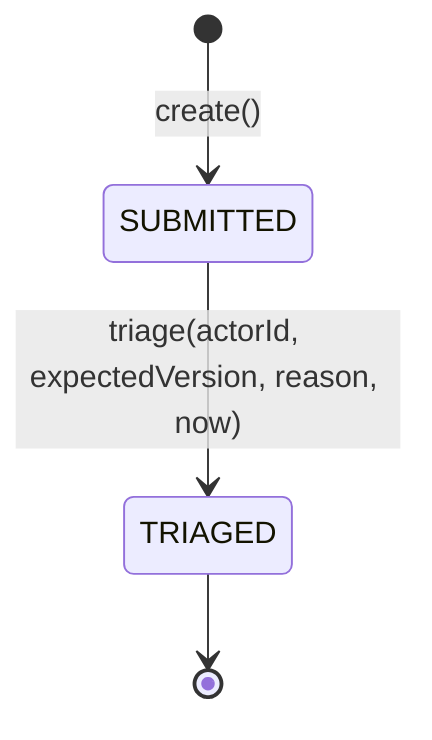
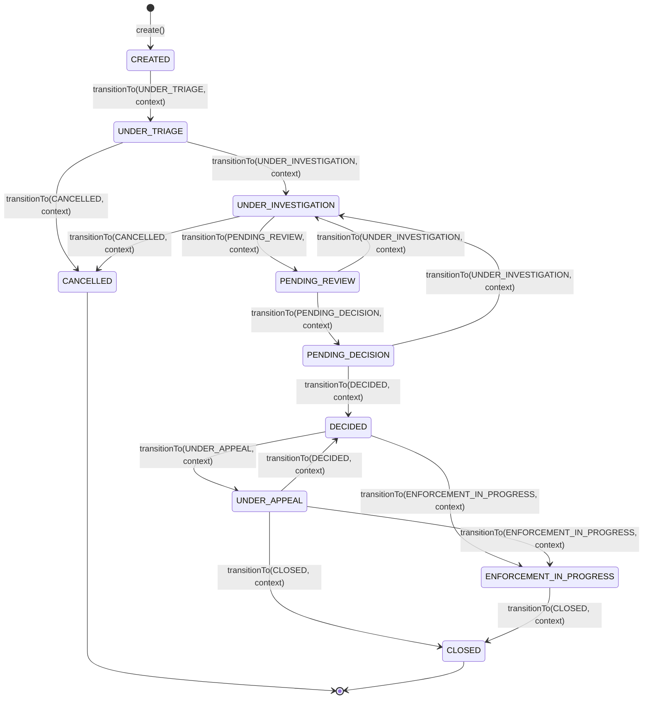
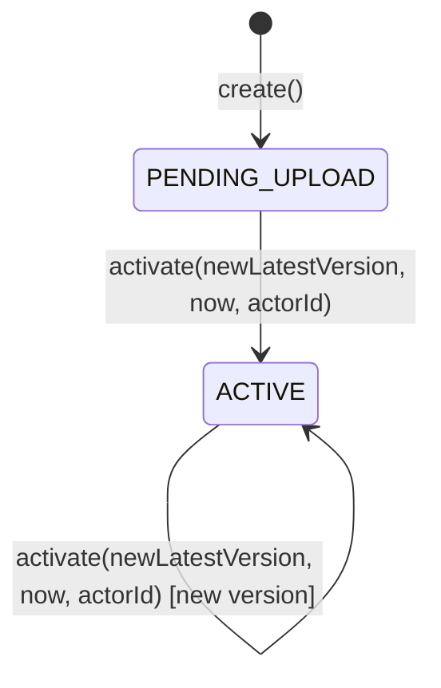
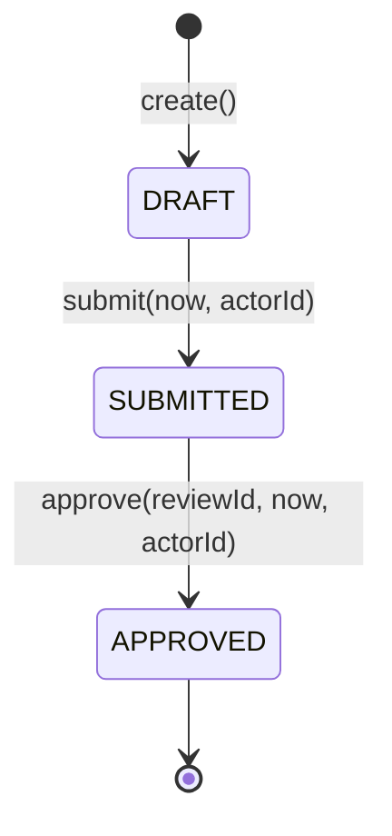
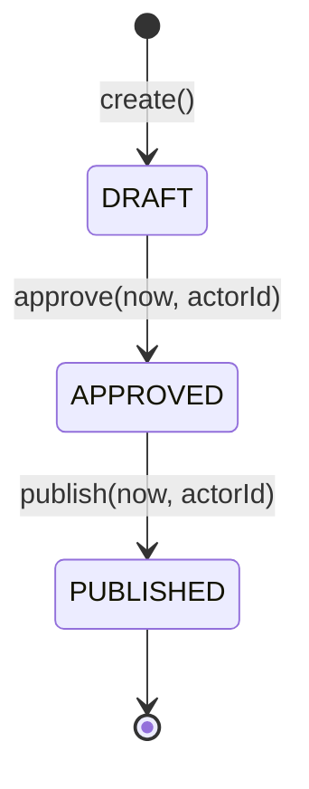
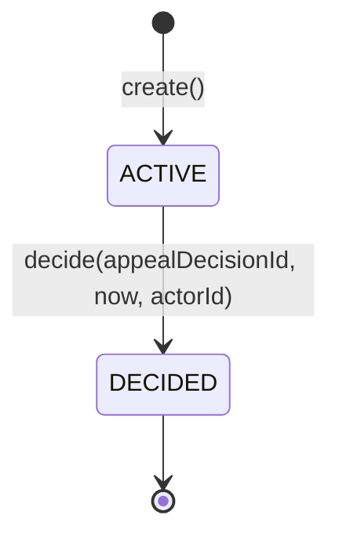
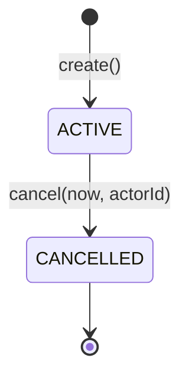

# Domain Aggregate Behavior

The domain layer (`sentinel-domain` module, package `com.sentinel.enforcement.domain`) contains **7 aggregate roots** that encapsulate all business invariants. Each aggregate is an **immutable Java record** with compact constructors for validation and **transition methods that return new instances** (functional style). Optimistic concurrency is enforced via a `long version` field checked on every transition.

## Design Principles

- **Immutability** — All aggregates are `record` types. State transitions produce new instances rather than mutating existing ones.
- **Compact constructors** — Every record has a compact constructor that validates all required fields, null checks, blank checks, and business invariants (e.g., `version >= 0`).
- **Static factory methods** — Aggregates are created via `create(...)` static methods that set initial status and version `0L`.
- **Explicit version check** — Every transition method verifies `expectedVersion == version` and throws an aggregate-specific `*ConflictException` with code `CONCURRENT_MODIFICATION` on mismatch.
- **Audit-ready** — Aggregates with significant state expose `auditSummary()` methods for inclusion in `AuditEvent`.

---

## 1. Report

**Source:** `sentinel-domain/src/main/java/com/sentinel/enforcement/domain/report/Report.java`

```java
public record Report(
    UUID id,
    String title,
    String description,
    String jurisdictionCode,
    String reporterName,
    ReportStatus status,
    Instant createdAt,
    String createdBy,
    Instant updatedAt,
    String updatedBy,
    long version
) { ... }
```

### State Machine



| Status | Description |
|---|---|
| `SUBMITTED` | Initial state after report creation |
| `TRIAGED` | Report has been reviewed and triaged into a case |

### Transitions

| Method | Guard | Description |
|---|---|---|
| `triage(actorId, expectedVersion, reason, now)` | `status == SUBMITTED`, `reason` not blank, `actorId` not blank | Moves report to `TRIAGED`; increments version |

### Domain Exception

- `ReportConflictException` — codes: `CONCURRENT_MODIFICATION`, `REPORT_TRIAGE_NOT_ALLOWED`

---

## 2. CaseRecord

**Source:** `sentinel-domain/src/main/java/com/sentinel/enforcement/domain/casefile/CaseRecord.java`

```java
public record CaseRecord(
    UUID id,
    String caseNumber,
    UUID reportId,
    String title,
    String summary,
    String jurisdictionCode,
    CaseClassification classification,
    CaseStatus status,
    String assignedUnitId,
    String assigneeUserId,
    Instant createdAt,
    String createdBy,
    Instant updatedAt,
    String updatedBy,
    long version
) { ... }
```

### State Machine



| Status | Description | Terminal |
|---|---|---|
| `CREATED` | Case has been opened from a triaged report | No |
| `UNDER_TRIAGE` | Case is being triaged by an officer | No |
| `UNDER_INVESTIGATION` | Case is under active investigation | No |
| `PENDING_REVIEW` | Investigation complete; awaiting review | No |
| `PENDING_DECISION` | Review complete; awaiting a decision | No |
| `DECIDED` | Decision has been made (published) | No |
| `UNDER_APPEAL` | A party has appealed the decision | No |
| `ENFORCEMENT_IN_PROGRESS` | Sanction obligations are being enforced | No |
| `CLOSED` | Case is closed | **Yes** |
| `CANCELLED` | Case was cancelled before completion | **Yes** |

### Transitions

| Method | Guard | Description |
|---|---|---|
| `assignTo(unitId, userId, context)` | `!status.isTerminal()`, actor has `TRIAGE_OFFICER` or `SUPERVISOR` role | Assigns case to a unit/officer |
| `transitionTo(targetStatus, context)` | Target is a valid next state per the matrix below, actor role permitted | Moves case to target status |

### Allowed Transition Matrix

| From | To |
|---|---|
| `CREATED` | `UNDER_TRIAGE` |
| `UNDER_TRIAGE` | `UNDER_INVESTIGATION`, `CANCELLED` |
| `UNDER_INVESTIGATION` | `PENDING_REVIEW`, `CANCELLED` |
| `PENDING_REVIEW` | `UNDER_INVESTIGATION`, `PENDING_DECISION` |
| `PENDING_DECISION` | `UNDER_INVESTIGATION`, `DECIDED` |
| `DECIDED` | `UNDER_APPEAL`, `ENFORCEMENT_IN_PROGRESS` |
| `UNDER_APPEAL` | `DECIDED`, `ENFORCEMENT_IN_PROGRESS`, `CLOSED` |
| `ENFORCEMENT_IN_PROGRESS` | `CLOSED` |
| `CLOSED`, `CANCELLED` | (none — terminal) |

### Related Value Objects

- `CaseActionContext` — Records actor ID, roles, expected version, reason, and timestamp for each transition (source: `CaseActionContext.java`)
- `CaseAssignment` — Immutable record of a unit/user assignment with assignment reason (source: `CaseAssignment.java`)
- `CaseRelationship` — Links two cases via MERGE, DERIVATION, or SPLIT (source: `CaseRelationship.java`)
- `CaseStatusHistoryEntry` — Records each status transition event (source: `CaseStatusHistoryEntry.java`)
- `CaseClassification` — Enum: `PUBLIC`, `CONFIDENTIAL`, `SECRET` (source: `CaseClassification.java`)
- `CaseRelationshipType` — Enum: `MERGE`, `DERIVATION`, `SPLIT` (source: `CaseRelationshipType.java`)

### Domain Exception

- `CaseConflictException` — codes: `CONCURRENT_MODIFICATION`, `CASE_ASSIGNMENT_NOT_ALLOWED`, `CASE_TRANSITION_NOT_ALLOWED`

---

## 3. Evidence

**Source:** `sentinel-domain/src/main/java/com/sentinel/enforcement/domain/evidence/Evidence.java`

```java
public record Evidence(
    UUID id,
    UUID caseId,
    String title,
    EvidenceClassification classification,
    EvidenceStorageStatus storageStatus,
    int latestVersion,
    Instant createdAt,
    String createdBy,
    Instant updatedAt,
    String updatedBy,
    long version
) { ... }
```

### State Machine



| Status | Description |
|---|---|
| `PENDING_UPLOAD` | Evidence metadata created; no file uploaded yet |
| `ACTIVE` | At least one file version has been uploaded and finalized |

### Transitions

| Method | Guard | Description |
|---|---|---|
| `activate(newLatestVersion, now, actorId)` | `newLatestVersion >= 1` | Marks evidence as ACTIVE with the given version number |

### Related Value Objects

- `EvidenceUploadSession` — Tracks an upload session with a presigned URL, target version, SHA-256 checksum, and expiry (source: `EvidenceUploadSession.java`)
- `EvidenceVersion` — Immutable record of an uploaded file version (source: `EvidenceVersion.java`)
- `EvidenceClassification` — Enum: `PUBLIC`, `CONFIDENTIAL`, `SECRET` (source: `EvidenceClassification.java`)
- `EvidenceStorageStatus` — Enum: `PENDING_UPLOAD`, `ACTIVE` (source: `EvidenceStorageStatus.java`)
- `EvidenceUploadSessionStatus` — Enum: `PENDING`, `FINALIZED` (source: `EvidenceUploadSessionStatus.java`)

### Domain Exception

- `EvidenceConflictException` — codes: `CONCURRENT_MODIFICATION`, `EVIDENCE_UPLOAD_SESSION_ALREADY_FINALIZED`, `EVIDENCE_UPLOAD_SESSION_EXPIRED`

---

## 4. Recommendation

**Source:** `sentinel-domain/src/main/java/com/sentinel/enforcement/domain/recommendation/Recommendation.java`

```java
public record Recommendation(
    UUID id,
    UUID caseId,
    String title,
    String summary,
    String proposedDecision,
    String proposedSanction,
    RecommendationStatus status,
    Instant submittedAt,
    String submittedBy,
    UUID approvedReviewId,
    Instant createdAt,
    String createdBy,
    Instant updatedAt,
    String updatedBy,
    long version
) { ... }
```

### State Machine



| Status | Description |
|---|---|
| `DRAFT` | Recommendation is being composed; not yet submitted |
| `SUBMITTED` | Recommendation has been submitted for review |
| `APPROVED` | Recommendation has been reviewed and approved |

### Transitions

| Method | Guard | Description |
|---|---|---|
| `submit(now, actorId)` | `status == DRAFT` | Submits the recommendation, records `submittedAt` and `submittedBy` |
| `approve(reviewId, now, actorId)` | `status == SUBMITTED` | Approves via a review; links `approvedReviewId` |

### Related Value Objects

- `RecommendationReview` — Immutable record of an approval review with outcome (source: `RecommendationReview.java`)
- `RecommendationReviewOutcome` — Enum: `APPROVED` (source: `RecommendationReviewOutcome.java`)

### Domain Exception

- `RecommendationConflictException` — codes: `CONCURRENT_MODIFICATION`, `RECOMMENDATION_SUBMIT_NOT_ALLOWED`, `RECOMMENDATION_REVIEW_NOT_ALLOWED`

---

## 5. Decision

**Source:** `sentinel-domain/src/main/java/com/sentinel/enforcement/domain/decision/Decision.java`

```java
public record Decision(
    UUID id,
    UUID caseId,
    UUID recommendationId,
    String title,
    String summary,
    boolean violationProven,
    String sanctionSummary,
    String obligationTitle,
    String obligationDetails,
    LocalDate obligationDueDate,
    LocalDate appealDeadline,
    DecisionStatus status,
    Instant approvedAt,
    String approvedBy,
    Instant publishedAt,
    String publishedBy,
    Instant createdAt,
    String createdBy,
    Instant updatedAt,
    String updatedBy,
    long version
) { ... }
```

### State Machine



| Status | Description |
|---|---|
| `DRAFT` | Initial state after creation; not yet approved |
| `APPROVED` | Decision has been approved by an authorized officer |
| `PUBLISHED` | Decision has been published and is actionable |

### Transitions

| Method | Guard | Description |
|---|---|---|
| `approve(now, actorId)` | `status == DRAFT` | Approves the decision; records `approvedAt` and `approvedBy` |
| `publish(now, actorId)` | `status == APPROVED` | Publishes the decision; records `publishedAt` and `publishedBy` |

### Related Value Objects

- `DecisionVersion` — Immutable snapshot of a published decision version (source: `DecisionVersion.java`)

### Domain Exception

- `DecisionConflictException` — codes: `CONCURRENT_MODIFICATION`, `DECISION_APPROVAL_NOT_ALLOWED`, `DECISION_PUBLISH_NOT_ALLOWED`

---

## 6. Appeal

**Source:** `sentinel-domain/src/main/java/com/sentinel/enforcement/domain/appeal/Appeal.java`

```java
public record Appeal(
    UUID id,
    UUID caseId,
    UUID decisionId,
    String rationale,
    boolean supervisorOverride,
    String supervisorOverrideReason,
    AppealStatus status,
    Instant submittedAt,
    String submittedBy,
    UUID decidedByAppealDecisionId,
    Instant createdAt,
    String createdBy,
    Instant updatedAt,
    String updatedBy,
    long version
) { ... }
```

### State Machine



| Status | Description |
|---|---|
| `ACTIVE` | Appeal has been submitted and is pending review |
| `DECIDED` | Appeal panel has issued a decision |

### Transitions

| Method | Guard | Description |
|---|---|---|
| `decide(appealDecisionId, now, actorId)` | `status == ACTIVE` | Records the appeal decision outcome |

### Related Value Objects

- `AppealDecision` — Immutable record of an appeal outcome (GRANTED/DENIED) (source: `AppealDecision.java`)
- `AppealDecisionOutcome` — Enum: `DENIED`, `GRANTED` (source: `AppealDecisionOutcome.java`)

### Domain Exception

- `AppealConflictException` — codes: `CONCURRENT_MODIFICATION`, `APPEAL_DECISION_NOT_ALLOWED`

---

## 7. Sanction

**Source:** `sentinel-domain/src/main/java/com/sentinel/enforcement/domain/sanction/Sanction.java`

```java
public record Sanction(
    UUID id,
    UUID caseId,
    UUID decisionId,
    String summary,
    SanctionStatus status,
    Instant createdAt,
    String createdBy,
    Instant updatedAt,
    String updatedBy,
    long version
) { ... }
```

### State Machine



| Status | Description |
|---|---|
| `ACTIVE` | Sanction is in force |
| `CANCELLED` | Sanction has been cancelled |

### Transitions

| Method | Guard | Description |
|---|---|---|
| `cancel(now, actorId)` | None (always allowed from ACTIVE) | Cancels the sanction |

### Related Value Objects

- `SanctionObligation` — Trackable obligation with title, details, due date, and lifecycle (source: `SanctionObligation.java`)
- `SanctionObligationStatus` — Enum: `ACTIVE`, `OVERDUE`, `SATISFIED`, `CANCELLED` (source: `SanctionObligationStatus.java`)

### Domain Exception

- No aggregate-specific exception; uses generic `IllegalArgumentException` for parameter validation.

---

## Audit Trail

The `AuditEvent` record (`sentinel-domain/src/main/java/com/sentinel/enforcement/domain/casefile/AuditEvent.java`) captures every state-changing operation:

```java
public record AuditEvent(
    UUID eventId,
    String eventType,
    String actorType,
    String actorId,
    String actorRoles,
    String action,
    String resourceType,
    String resourceId,
    UUID caseId,
    Instant timestamp,
    String correlationId,
    String sourceIp,
    String result,
    String reason,
    String beforeSummary,
    String afterSummary,
    String metadata
) { ... }
```

- **18 fields** covering who did what, when, why, and what changed
- `correlationId` traces requests across service boundaries
- `beforeSummary` and `afterSummary` are generated by aggregate `auditSummary()` methods
- Exposed via `GET /api/v1/cases/{caseId}/audit-events` endpoint

## Cross-Aggregate Progression Guard

The `PhaseSevenCaseProgressionGuard` (`sentinel-application/src/main/java/.../casefile/PhaseSevenCaseProgressionGuard.java`) enforces that case status transitions are only allowed when the dependent aggregate lifecycle is consistent:

- Case cannot progress to `PENDING_DECISION` until a recommendation exists
- Case cannot progress to `DECIDED` until a decision is published
- Case cannot progress to `UNDER_APPEAL` unless the decision has been published and appeals are permitted
- Sanction obligations must be satisfied before `CLOSED` transition

## Source References

1. **Domain Aggregates** — `sentinel-domain/src/main/java/.../domain/report/Report.java`, `.../casefile/CaseRecord.java`, `.../evidence/Evidence.java`, `.../evidence/EvidenceUploadSession.java`, `.../recommendation/Recommendation.java`, `.../decision/Decision.java`, `.../sanction/Sanction.java`, `.../appeal/Appeal.java`
2. **Value Objects & Enums** — `CaseAssignment.java`, `CaseRelationship.java`, `CaseStatusHistoryEntry.java`, `CaseClassification.java`, `EvidenceVersion.java`, `RecommendationReview.java`, `DecisionVersion.java`, `SanctionObligation.java`, `AppealDecision.java`
3. **Domain Exceptions** — Per-aggregate `*ConflictException` classes in `sentinel-domain/src/main/java/.../domain/`
4. **Audit** — `sentinel-domain/src/main/java/.../domain/casefile/AuditEvent.java`
5. **Progression Guard** — `sentinel-application/src/main/java/.../casefile/PhaseSevenCaseProgressionGuard.java`
