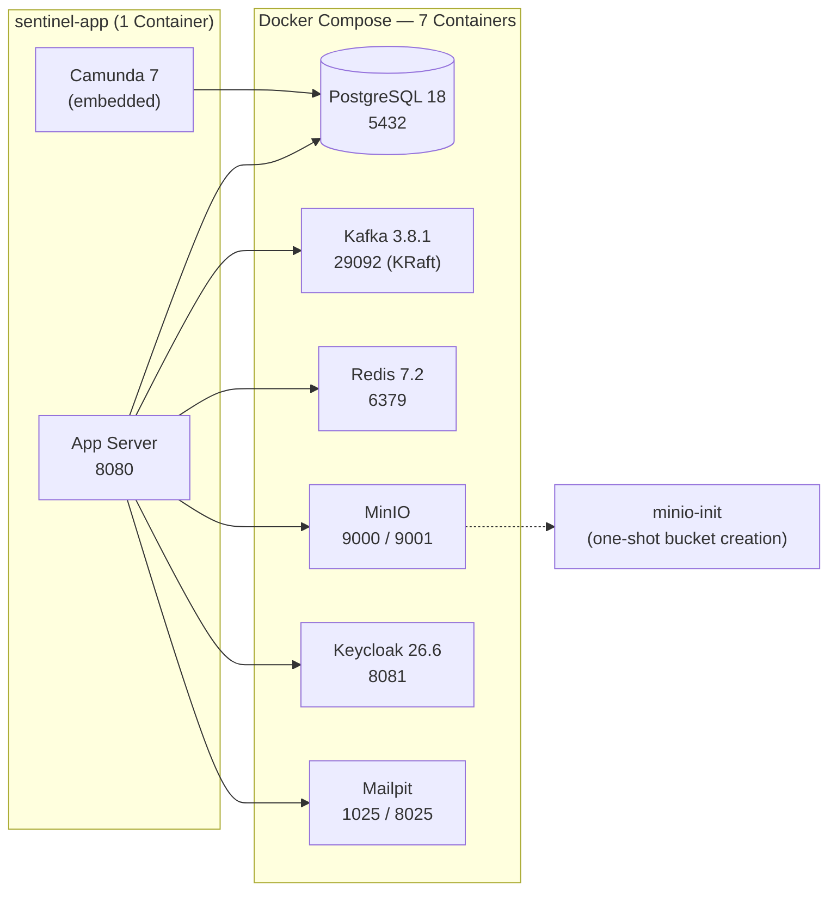

# Cloud Services Strategy

**The Sentinel Enforcement Platform has no cloud-specific services.** All infrastructure runs locally via Docker Compose containers. This is an intentional design choice that keeps the platform fully self-contained for local development, CI pipelines, and air-gapped deployments.

## Local Equivalents

The following table maps each infrastructure service to its cloud counterpart that was deliberately **not** adopted:

| Service | Local Implementation | Cloud Alternative (Not Used) | Rationale |
|---|---|---|---|
| **Database** | PostgreSQL 18 (Docker) | Amazon RDS / Aurora, Cloud SQL, Azure DB | Full control, no network latency, testcontainers parity |
| **Messaging** | Apache Kafka 3.8.1 KRaft mode (Docker) | Confluent Cloud, Amazon MSK, Redpanda Cloud | Single-broker KRaft avoids ZooKeeper overhead; no vendor lock-in |
| **Object Storage** | MinIO (Docker) | Amazon S3, Google Cloud Storage, Azure Blob Storage | S3-compatible API means migration path exists; presigned URL logic is identical |
| **Identity Provider** | Keycloak 26.6 (Docker) | Auth0, Amazon Cognito, Azure AD B2C, Okta | Self-hosted OIDC with importable realm; no per-user licensing costs |
| **Email** | Mailpit (Docker) | Amazon SES, SendGrid, Mailgun, SMTP relay | Capture & inspect emails locally via web UI; swap SMTP host for cloud provider |
| **Workflow Engine** | Embedded Camunda 7 (in-process) | Camunda Cloud / Zeebe, Temporal, AWS SWF | Shared datasource eliminates network hop; no separate engine to deploy |
| **In-Memory Store** | Redis 7.2 (Docker) | Amazon ElastiCache, Redis Cloud, Azure Cache for Redis | Minimal current usage; drop-in replacement when needed |

## Docker Compose Infrastructure

All 7 infrastructure containers are defined in `/docker-compose.yaml`:



**Container breakdown from `docker-compose.yaml`:**

| # | Service | Image | Healthcheck | Purpose |
|---|---|---|---|---|
| 1 | `sentinel-postgres` | `postgres:18.3-alpine` | `pg_isready` | Primary data store |
| 2 | `sentinel-kafka` | `confluentinc/cp-kafka:7.8.1` | `kafka-broker-api-versions` | Event bus (KRaft mode) |
| 3 | `sentinel-redis` | `redis:7.2.7-alpine` | `redis-cli ping` | In-memory store (minimal use) |
| 4 | `sentinel-minio` | `quay.io/minio/minio:RELEASE.2025-09-07T16-13-09Z` | `/minio/health/ready` | S3-compatible object storage |
| 5 | `sentinel-minio-init` | `quay.io/minio/mc:latest` | — (one-shot) | Create `sentinel-evidence` bucket |
| 6 | `sentinel-keycloak` | `quay.io/keycloak/keycloak:26.6` | TCP port 9000 | OIDC provider + realm import |
| 7 | `sentinel-mailpit` | `axllent/mailpit:latest` | Web UI 8025 | SMTP email capture |

The app container (`sentinel-app`) waits for all 7 to be healthy before starting (lines 143–155 of `docker-compose.yaml`).

## Configuration for Local Development

All configuration lives in `/.env.example` and is loaded via `AppConfiguration.fromEnvironment()` (`AppConfiguration.java` lines 39–76). Defaults are set for local-only addresses and ports:

| Config Key | Default Value | Notes |
|---|---|---|
| `DB_URL` | `jdbc:postgresql://localhost:5432/sentinel` | Points to local Docker PostgreSQL |
| `KAFKA_BOOTSTRAP_SERVERS` | `localhost:29092` | Points to local Docker Kafka |
| `MINIO_ENDPOINT` | `http://localhost:9000` | Points to local Docker MinIO |
| `KEYCLOAK_ISSUER` | `http://localhost:8081/realms/sentinel` | Points to local Docker Keycloak |
| `KEYCLOAK_JWKS_URL` | `http://localhost:8081/realms/sentinel/protocol/openid-connect/certs` | JWKS from local Keycloak |
| `MAILPIT_SMTP_HOST` | `localhost` | Points to local Docker Mailpit |
| `REDIS_HOST` | `localhost` | Points to local Docker Redis |

When running inside Docker Compose, hostnames change to Docker-internal names (e.g., `postgres`, `kafka`, `minio`, `keycloak`, `mailpit`, `redis`). The `app` service in `docker-compose.yaml` overrides these via environment variables (lines 156–185):

```yaml
environment:
  DB_URL: jdbc:postgresql://postgres:5432/${POSTGRES_DB:-sentinel}
  KAFKA_BOOTSTRAP_SERVERS: kafka:9092
  REDIS_HOST: redis
  MINIO_ENDPOINT: http://minio:9000
  MAILPIT_SMTP_HOST: mailpit
  KEYCLOAK_JWKS_URL: http://host.docker.internal:${KEYCLOAK_PORT:-8081}/realms/sentinel/protocol/openid-connect/certs
```

**Note:** `KEYCLOAK_JWKS_URL` uses `host.docker.internal` because the app container needs to reach the Keycloak JWKS endpoint via the Docker host's IP (Keycloak is not behind the same Docker network for JWKS — see `ApplicationRuntime.java` line 183 and `docker-compose.yaml` line 183).

## Benefits of the Local-First Approach

1. **Zero cloud costs** — all services run on local hardware or developer machines
2. **Offline development** — no internet connection required for full-stack development
3. **CI reproducibility** — same `docker-compose.yaml` used in CI (via Docker Compose or Testcontainers)
4. **No vendor lock-in** — each service has a standard protocol (JDBC, Kafka protocol, S3 API, OIDC, SMTP) so migration to cloud equivalents requires only config changes
5. **Air-gapped deployment** — can be deployed in environments without cloud access
6. **Fast iteration** — no network latency for database queries, no cold starts

## Migration Path to Cloud Services

Since all integration is through standard protocols and port interfaces, migrating to cloud services would require:

| Service | Change Required | Impact |
|---|---|---|
| **PostgreSQL → RDS** | Change `DB_URL` to RDS endpoint | Zero code changes |
| **Kafka → Confluent Cloud** | Change `KAFKA_BOOTSTRAP_SERVERS`, add SASL config | Config-only (kafka-clients adapter) |
| **MinIO → S3** | Change `MINIO_ENDPOINT`, update credentials, possibly switch to AWS SDK | Minor — `MinioEvidenceStorageAdapter` uses MinIO Java SDK, not AWS SDK |
| **Keycloak → Auth0/Cognito** | Provide a new `TokenVerifier` implementation | Adapter implementation swap |
| **Mailpit → SES/SendGrid** | Change SMTP host/port, add credentials | Config-only (Jakarta Mail adapter) |
| **Camunda → Zeebe** | Provide a new `CaseWorkflowPort` implementation | Adapter implementation swap |
| **Redis → ElastiCache** | Change `REDIS_HOST` | Config-only |

## Comparison with Cloud-Dependent Platforms

| Characteristic | Sentinel (local-first) | Typical Cloud Platform |
|---|---|---|
| Infrastructure required to run | Docker Desktop or Podman | Cloud account + credentials |
| `docker compose up` startup time | ~60–90 seconds | N/A (always-on services) |
| Testcontainers support | PostgreSQL + Kafka containers | Mocked/emulated services |
| Offline capability | Full | None |
| Monthly infra cost (dev) | $0 (local hardware) | Variable per service |
| Production deployment | Self-managed containers | Managed services |

**Source:** `/docker-compose.yaml`, `/.env.example`, `AppConfiguration.java`.
