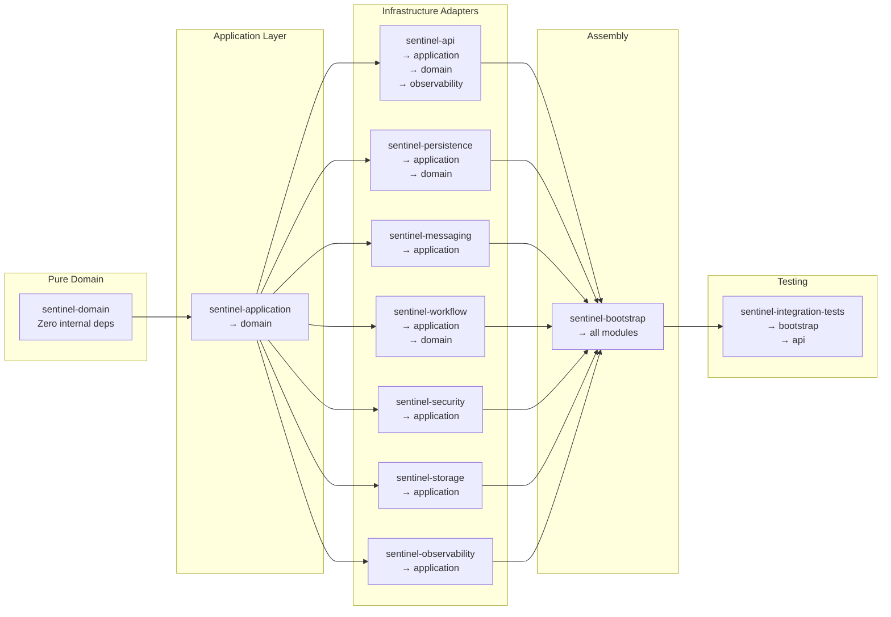

# Dependency Matrix

The Sentinel Enforcement Platform is a 10-module Maven project organized around hexagonal architecture principles. This page documents two dimensions of dependencies:

1. **Module-to-module** — which modules depend on other modules at compile time
2. **Module-to-infrastructure** — which modules require specific infrastructure services at runtime

## Module Dependency Overview



## Mermaid Matrix: Modules × Infrastructure

```mermaid
block-beta
    columns 8

    block:Header:1
        M["Module \\ Infrastructure"]
    end
    block:PG:1
        P["PG"]
    end
    block:KAFKA:1
        K["Kafka"]
    end
    block:KEYCLOAK:1
        KC["Keycloak"]
    end
    block:MINIO:1
        MIO["MinIO"]
    end
    block:REDIS:1
        R["Redis"]
    end
    block:MAILPIT:1
        MP["Mailpit"]
    end
    block:CAMUNDA:1
        C["Camunda"]
    end

    space

    block:domain_row:1
        D["sentinel-domain"]
    end
    block:domain_pg:1
        DP["-"]
    end
    block:domain_k:1
        DK["-"]
    end
    block:domain_kc:1
        DKC["-"]
    end
    block:domain_mio:1
        DM["-"]
    end
    block:domain_r:1
        DR["-"]
    end
    block:domain_mp:1
        DMP["-"]
    end
    block:domain_c:1
        DC["-"]
    end

    block:app_row:1
        A["sentinel-application"]
    end
    block:app_pg:1
        AP["-"]
    end
    block:app_k:1
        AK["-"]
    end
    block:app_kc:1
        AKC["-"]
    end
    block:app_mio:1
        AM["-"]
    end
    block:app_r:1
        AR["-"]
    end
    block:app_mp:1
        AMP["-"]
    end
    block:app_c:1
        AC["-"]
    end

    block:api_row:1
        API["sentinel-api"]
    end
    block:api_pg:1
        APIP["-"]
    end
    block:api_k:1
        APIK["-"]
    end
    block:api_kc:1
        APIKC["-"]
    end
    block:api_mio:1
        APIM["-"]
    end
    block:api_r:1
        APIR["-"]
    end
    block:api_mp:1
        APIMP["-"]
    end
    block:api_c:1
        APIC["-"]
    end

    block:pers_row:1
        PER["sentinel-persistence"]
    end
    block:pers_pg:1
        PERPG["X"]
    end
    block:pers_k:1
        PERK["-"]
    end
    block:pers_kc:1
        PERKC["-"]
    end
    block:pers_mio:1
        PERM["-"]
    end
    block:pers_r:1
        PERR["-"]
    end
    block:pers_mp:1
        PERMP["-"]
    end
    block:pers_c:1
        PERC["-"]
    end

    block:mess_row:1
        MSG["sentinel-messaging"]
    end
    block:mess_pg:1
        MSGPG["-"]
    end
    block:mess_k:1
        MSGK["X"]
    end
    block:mess_kc:1
        MSGKC["-"]
    end
    block:mess_mio:1
        MSGM["-"]
    end
    block:mess_r:1
        MSGR["-"]
    end
    block:mess_mp:1
        MSGMP["X"]
    end
    block:mess_c:1
        MSGC["-"]
    end

    block:wf_row:1
        WF["sentinel-workflow"]
    end
    block:wf_pg:1
        WFPG["X"]
    end
    block:wf_k:1
        WFK["-"]
    end
    block:wf_kc:1
        WFKC["-"]
    end
    block:wf_mio:1
        WFM["-"]
    end
    block:wf_r:1
        WFR["-"]
    end
    block:wf_mp:1
        WFMP["-"]
    end
    block:wf_c:1
        WFC["X"]
    end

    block:sec_row:1
        SEC["sentinel-security"]
    end
    block:sec_pg:1
        SECPG["-"]
    end
    block:sec_k:1
        SECK["-"]
    end
    block:sec_kc:1
        SECKC["X"]
    end
    block:sec_mio:1
        SECM["-"]
    end
    block:sec_r:1
        SECR["-"]
    end
    block:sec_mp:1
        SECMP["-"]
    end
    block:sec_c:1
        SECC["-"]
    end

    block:stor_row:1
        STO["sentinel-storage"]
    end
    block:stor_pg:1
        STOPG["-"]
    end
    block:stor_k:1
        STOK["-"]
    end
    block:stor_kc:1
        STOKC["-"]
    end
    block:stor_mio:1
        STOM["X"]
    end
    block:stor_r:1
        STOR["-"]
    end
    block:stor_mp:1
        STOMP["-"]
    end
    block:stor_c:1
        STOC["-"]
    end

    block:obs_row:1
        OBS["sentinel-observability"]
    end
    block:obs_pg:1
        OBSPG["-"]
    end
    block:obs_k:1
        OBSK["-"]
    end
    block:obs_kc:1
        OBSKC["-"]
    end
    block:obs_mio:1
        OBSM["-"]
    end
    block:obs_r:1
        OBSR["-"]
    end
    block:obs_mp:1
        OBSMP["-"]
    end
    block:obs_c:1
        OBSC["-"]
    end

    block:boot_row:1
        BOOT["sentinel-bootstrap"]
    end
    block:boot_pg:1
        BOOTPG["X"]
    end
    block:boot_k:1
        BOOTK["X"]
    end
    block:boot_kc:1
        BOOTKC["X"]
    end
    block:boot_mio:1
        BOOTM["X"]
    end
    block:boot_r:1
        BOOTR["X"]
    end
    block:boot_mp:1
        BOOTMP["X"]
    end
    block:boot_c:1
        BOOTC["X"]
    end
end
```

**Legend:** `X` = direct dependency | `-` = no dependency

## Per-Module Dependency Breakdown

### sentinel-domain
**Path:** `/sentinel-domain/pom.xml`

| Dependency | Type | Evidence |
|---|---|---|
| Internal Maven deps | **None** | No `<dependency>` on other sentinel modules (`pom.xml` line 14 — only JUnit 5 for testing) |
| Infrastructure | **None** | Pure domain — no JDBC, no Kafka, no framework annotations |

**Role:** Contains domain aggregates (Case, Report, Decision, Sanction, Appeal, Evidence, Recommendation), domain events, value objects, enums (CaseStatus, DecisionStatus, etc.), and repository interfaces. Has zero knowledge of any infrastructure.

---

### sentinel-application
**Path:** `/sentinel-application/pom.xml`

| Dependency | Type | Evidence |
|---|---|---|
| `sentinel-domain` | Maven compile | `pom.xml` lines 16–19 |
| Infrastructure | **None** (defines ports only) | No JDBC/Kafka/MinIO dependencies |

**Role:** Contains application services, command/query objects, and **port interfaces** (hexagonal architecture). Ports include `CaseRepository`, `EvidenceStoragePort`, `CaseWorkflowPort`, `EvidenceRepository`, `OutboxRepository`, `InboxRepository`, `NotificationRepository`, `AuthorizationService`, `TokenVerifier`, `HealthStatusService`, `ApplicationTransactionManager`, `WorkflowAdministrationPort`, `WorkflowReconciliationQueryPort`, etc. All infrastructure dependencies are expressed as Java interfaces — no concrete implementations here.

---

### sentinel-api
**Path:** `/sentinel-api/pom.xml`

| Dependency | Type | Evidence |
|---|---|---|
| `sentinel-application` | Maven compile | `pom.xml` lines 15–19 |
| `sentinel-domain` | Maven compile | `pom.xml` lines 21–24 |
| `sentinel-observability` | Maven compile | `pom.xml` lines 27–29 |
| Infrastructure | **None** | Depends on Jersey/JAX-RS, Jackson, MapStruct, Hibernate Validator |

**Role:** JAX-RS resource classes (`CaseResource`, `EvidenceResource`, `ReportResource`, etc.), DTOs generated from OpenAPI spec, MapStruct mappers, exception mappers, authentication filter (`BearerAuthenticationFilter`), and observability integration (`RequestMetricsFilter`).

---

### sentinel-persistence
**Path:** `/sentinel-persistence/pom.xml`

| Dependency | Type | Evidence |
|---|---|---|
| `sentinel-application` | Maven compile | `pom.xml` lines 15–19 |
| `sentinel-domain` | Maven compile | `pom.xml` lines 21–24 |
| `org.mybatis:mybatis:3.5.19` | Library | `pom.xml` line 27 |
| `org.liquibase:liquibase-core:4.31.1` | Library | `pom.xml` line 32 |
| `org.postgresql:postgresql:42.7.5` | Library | `pom.xml` line 37 |
| **Infrastructure:** PostgreSQL | **Runtime** | JDBC driver, MyBatis ORM, Liquibase migrations |

**Role:** Implements repository interfaces defined in `sentinel-application` (port → adapter pattern):
- `CaseRepositoryMyBatisAdapter`, `EvidenceRepositoryMyBatisAdapter`, `ReportRepositoryMyBatisAdapter`, `RecommendationRepositoryMyBatisAdapter`, `DecisionRepositoryMyBatisAdapter`, `SanctionRepositoryMyBatisAdapter`, `AppealRepositoryMyBatisAdapter`
- `OutboxRepositoryMyBatisAdapter`, `InboxRepositoryMyBatisAdapter`, `NotificationRepositoryMyBatisAdapter`
- `WorkflowInstanceMyBatisAdapter`, `WorkflowReconciliationMyBatisAdapter`
- `MyBatisTransactionManager` (implements `ApplicationTransactionManager`)

---

### sentinel-messaging
**Path:** `/sentinel-messaging/pom.xml`

| Dependency | Type | Evidence |
|---|---|---|
| `sentinel-application` | Maven compile | `pom.xml` lines 15–19 |
| `org.apache.kafka:kafka-clients:3.8.1` | Library | `pom.xml` line 22 |
| `com.sun.mail:jakarta.mail:2.0.1` | Library | `pom.xml` line 42 |
| **Infrastructure:** Apache Kafka | **Runtime** | Kafka producer/consumer |
| **Infrastructure:** Mailpit (SMTP) | **Runtime** | Jakarta Mail SMTP client |

**Role:** Implements async messaging runtime:
- `MessagingRuntime` — manages Kafka producer, outbox publisher thread, notification consumer thread
- Outbox publisher polls `outbox_event` table via `OutboxRepository`, publishes to Kafka topics
- Notification consumer polls Kafka, processes via `NotificationRepository`, sends email via Jakarta Mail SMTP → Mailpit

**Note:** Does **not** have `sentinel-domain` as a direct Maven dependency because it only depends on the port interfaces in `sentinel-application` (which itself depends on `sentinel-domain` transitively). The same applies for `sentinel-workflow`, `sentinel-security`, `sentinel-storage`, and `sentinel-observability`.

---

### sentinel-workflow
**Path:** `/sentinel-workflow/pom.xml`

| Dependency | Type | Evidence |
|---|---|---|
| `sentinel-application` | Maven compile | `pom.xml` lines 15–19 |
| `sentinel-domain` | Maven compile | `pom.xml` lines 21–24 |
| `org.camunda.bpm:camunda-engine:7.24.0` | Library | `pom.xml` line 27 |
| `org.camunda.bpm.model:camunda-bpmn-model:7.24.0` | Library | `pom.xml` line 32 |
| **Infrastructure:** Camunda 7 (embedded) | **Runtime** | Shares PostgreSQL via `HikariDataSource` |
| **Infrastructure:** PostgreSQL | **Runtime** | Camunda's schema stored alongside app tables |

**Role:** Implements `CaseWorkflowPort` and `WorkflowAdministrationPort`. `WorkflowModule.start()` creates a `ProcessEngineConfiguration` backed by the shared `HikariDataSource`. `WorkflowRuntime` wraps the engine lifecycle.

---

### sentinel-security
**Path:** `/sentinel-security/pom.xml`

| Dependency | Type | Evidence |
|---|---|---|
| `sentinel-application` | Maven compile | `pom.xml` lines 15–19 |
| `com.nimbusds:nimbus-jose-jwt:10.0.2` | Library | `pom.xml` line 22 |
| **Infrastructure:** Keycloak | **Runtime** | JWKS endpoint, OIDC token verification |

**Role:** Implements `TokenVerifier` via `KeycloakTokenVerifier` and `AuthorizationService` via `RoleBasedAuthorizationService`. `KeycloakSecurityConfiguration` holds issuer URI, audience, and JWKS URL.

---

### sentinel-storage
**Path:** `/sentinel-storage/pom.xml`

| Dependency | Type | Evidence |
|---|---|---|
| `sentinel-application` | Maven compile | `pom.xml` lines 15–19 |
| `io.minio:minio:8.5.17` | Library | `pom.xml` line 22 |
| **Infrastructure:** MinIO | **Runtime** | S3-compatible API |

**Role:** Implements `EvidenceStoragePort` via `MinioEvidenceStorageAdapter`. Handles presigned URL generation, bucket management, object streaming, and object metadata retrieval.

---

### sentinel-observability
**Path:** `/sentinel-observability/pom.xml`

| Dependency | Type | Evidence |
|---|---|---|
| `sentinel-application` | Maven compile | `pom.xml` lines 15–19 |
| Infrastructure | **None (health checks only)** | No external service driver libs |

**Role:** Implements `HealthStatusService` via `CompositeHealthStatusService` which aggregates:
- `DatabaseDependencyHealthCheck` — validates PostgreSQL connectivity via `HikariDataSource` (passed at wiring time)
- `SocketDependencyHealthCheck` — validates TCP connectivity to Kafka, Redis, Mailpit
- `WorkflowDependencyHealthCheck` — validates Camunda engine readiness

---

### sentinel-bootstrap
**Path:** `/sentinel-bootstrap/pom.xml`

| Dependency | Type | Evidence |
|---|---|---|
| `sentinel-api` | Maven compile | `pom.xml` lines 15–19 |
| `sentinel-application` | Maven compile | `pom.xml` lines 21–24 |
| `sentinel-persistence` | Maven compile | `pom.xml` lines 26–29 |
| `sentinel-messaging` | Maven compile | `pom.xml` lines 31–34 |
| `sentinel-storage` | Maven compile | `pom.xml` lines 36–39 |
| `sentinel-workflow` | Maven compile | `pom.xml` lines 41–44 |
| `sentinel-security` | Maven compile | `pom.xml` lines 46–49 |
| `sentinel-observability` | Maven compile | `pom.xml` lines 51–54 |
| `com.zaxxer:HikariCP:6.3.0` | Library | `pom.xml` line 66 |
| `org.glassfish.jersey.containers:jersey-container-grizzly2-http` | Library | `pom.xml` line 57 |
| `ch.qos.logback:logback-classic` + `logstash-logback-encoder` | Library | `pom.xml` lines 69–76 |
| **Infrastructure:** All | **Runtime** | Wires everything together |

**Role:** The assembly/entrypoint module. Contains:
- `ApplicationRuntime` — main entrypoint class that wires all modules, creates `HikariDataSource`, starts Grizzly HTTP server, starts `WorkflowRuntime`, starts `MessagingRuntime`
- `AppConfiguration` — typed configuration record that maps environment variables to Java types
- `LiquibaseMigrator` — runs Liquibase schema migrations
- `CamundaSchemaMigrator` — runs Camunda-specific schema migrations
- `ApplicationBinder` — HK2 dependency injection binder for JAX-RS

---

### sentinel-integration-tests
**Path:** `/sentinel-integration-tests/pom.xml`

| Dependency | Type | Evidence |
|---|---|---|
| `sentinel-bootstrap` | Maven test | `pom.xml` lines 15–19 |
| `sentinel-api` | Maven test | `pom.xml` lines 21–24 |
| `org.testcontainers:postgresql` | Test library | `pom.xml` line 64 |
| `org.testcontainers:kafka` | Test library | `pom.xml` line 60 |
| `io.karatelabs:karate-junit6` | Test framework | `pom.xml` line 42 |
| Infrastructure: **All** | **Test runtime** | Testcontainers-managed PostgreSQL + Kafka |

**Role:** Karate-based integration tests that spin up Testcontainers for PostgreSQL and Kafka, then exercise the full application stack via the HTTP API.

## Dependency Loading Order (Runtime Wiring)

The `ApplicationRuntime.start()` method (`ApplicationRuntime.java` lines 130–393) performs wiring in this order:

1. `createDataSource(configuration)` → `HikariDataSource`
2. `PersistenceModule.createSqlSessionFactory(dataSource)` → `SqlSessionFactory`
3. Instantiate all `*MyBatisAdapter` classes (repositories, transaction manager)
4. Instantiate `MinioEvidenceStorageAdapter`
5. Start `WorkflowModule.start(dataSource, ...)` → `WorkflowRuntime`
6. Create `KeycloakTokenVerifier` + `RoleBasedAuthorizationService`
7. Instantiate all `*ApplicationService` classes (wiring ports → adapters)
8. Create `CompositeHealthStatusService` with all health checks
9. Start `MessagingRuntime.start(configuration, transactionManager, ...)`
10. Build Jersey `ResourceConfig` with all `*Resource` classes, filters, mappers
11. Start Grizzly HTTP server

**Source:** All module `pom.xml` files in `/sentinel-*/pom.xml`, `ApplicationRuntime.java` at `/sentinel-bootstrap/src/main/java/com/sentinel/enforcement/bootstrap/ApplicationRuntime.java`.

## Source References

1. **Module POMs** — `/sentinel-domain/pom.xml`, `/sentinel-application/pom.xml`, `/sentinel-api/pom.xml`, `/sentinel-persistence/pom.xml`, `/sentinel-messaging/pom.xml`, `/sentinel-workflow/pom.xml`, `/sentinel-security/pom.xml`, `/sentinel-storage/pom.xml`, `/sentinel-observability/pom.xml`, `/sentinel-bootstrap/pom.xml`
2. **Assembly** — `sentinel-bootstrap/src/main/java/.../bootstrap/ApplicationRuntime.java`
