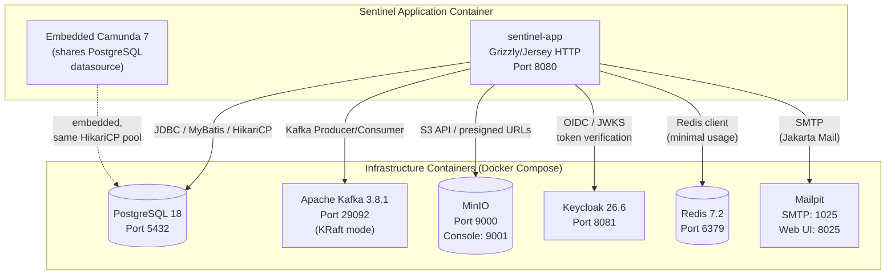

# External Infrastructure Services

The Sentinel Enforcement Platform is a modular monolith that depends on six external infrastructure services plus an embedded workflow engine. All services are defined in `/docker-compose.yaml` (7 containers for infra + 1 for the app). Configuration values are sourced from `/.env.example` and loaded at runtime via `AppConfiguration.java`.

## Service Overview



## Service Details

### PostgreSQL — Primary Data Store

| Attribute | Detail |
|---|---|
| **Image** | `postgres:18.3-alpine` |
| **Container name** | `sentinel-postgres` |
| **Hostname** | `postgres` |
| **Default database** | `sentinel` |
| **Default user/password** | `sentinel` / `sentinel` |
| **Exposed port** | `${POSTGRES_PORT:-5432}` |
| **Volume** | `sentinel-postgres-data` → `/var/lib/postgresql` |

**Purpose:** All persistent business data — reports, cases, decisions, sanctions, appeals, evidence records, outbox/inbox events, workflow instances, and reconciliation state.

**ORM / Connection Pooling:**
- **MyBatis 3.5.19** (`org.mybatis:mybatis`) — defined in `sentinel-persistence/pom.xml` (line 27)
- **HikariCP 6.3.0** (`com.zaxxer:HikariCP`) — defined in `sentinel-bootstrap/pom.xml` (line 66)
- PostgreSQL JDBC driver 42.7.5 (`org.postgresql:postgresql`) — in `sentinel-persistence/pom.xml` (line 37)

**HikariCP configuration** (from `ApplicationRuntime.java` lines 426–441):
```
jdbcUrl:      configuration.dbUrl()
username:     configuration.dbUsername()
password:     configuration.dbPassword()
maximumPoolSize:  configuration.dbMaxPoolSize()  (default 12)
minimumIdle:  min(2, maxPoolSize)
connectionTimeout:  10000ms
validationTimeout:  2000ms
initializationFailTimeout: 5000ms
leakDetectionThreshold: 30000ms
connectionInitSql:  "SET statement_timeout = '10s'"
connectTimeout:     5s
socketTimeout:      30s
poolName:           "sentinel-hikari"
```

**Configuration keys** (from `/.env.example`):
| Key | Default | Description |
|---|---|---|
| `DB_URL` | `jdbc:postgresql://localhost:5432/sentinel` | JDBC connection URL |
| `DB_USERNAME` | `sentinel` | Database user |
| `DB_PASSWORD` | `sentinel` | Database password |
| `DB_MAX_POOL_SIZE` | `12` | HikariCP maximum pool size |
| `POSTGRES_DB` | `sentinel` | Database name (Docker Compose only) |
| `POSTGRES_USER` | `sentinel` | Database user (Docker Compose only) |
| `POSTGRES_PASSWORD` | `sentinel` | Database password (Docker Compose only) |
| `POSTGRES_PORT` | `5432` | Host port mapping |

**Source:** `/docker-compose.yaml` lines 2–18, `/.env.example` lines 2–8, `AppConfiguration.java` lines 9–11, `ApplicationRuntime.java` lines 426–441.

### Apache Kafka — Event Bus

| Attribute | Detail |
|---|---|
| **Image** | `confluentinc/cp-kafka:7.8.1` |
| **Container name** | `sentinel-kafka` |
| **Hostname** | `kafka` |
| **Exposed port** | `${KAFKA_PORT:-29092}` |
| **Mode** | **KRaft** (no ZooKeeper — see `KAFKA_PROCESS_ROLES: broker,controller`) |

**Purpose:**
- Domain event publishing (outbox pattern → Kafka topics)
- Notification command delivery to the notification consumer
- Audit event integration

**KRaft-specific configuration** (from `docker-compose.yaml` lines 22–46):
```
CLUSTER_ID:                    MkU3OEVBNTcwNTJENDM2Qk
KAFKA_NODE_ID:                 1
KAFKA_PROCESS_ROLES:           broker,controller
KAFKA_LISTENERS:               PLAINTEXT://0.0.0.0:9092,PLAINTEXT_HOST://0.0.0.0:29092,CONTROLLER://0.0.0.0:9093
KAFKA_ADVERTISED_LISTENERS:    PLAINTEXT://kafka:9092,PLAINTEXT_HOST://localhost:${KAFKA_PORT:-29092}
KAFKA_CONTROLLER_QUORUM_VOTERS: 1@kafka:9093
```

**Configuration keys** (from `/.env.example`):
| Key | Default | Description |
|---|---|---|
| `KAFKA_BOOTSTRAP_SERVERS` | `localhost:29092` | Bootstrap server list |
| `KAFKA_PORT` | `29092` | Host port mapping |

**Client dependency:** `org.apache.kafka:kafka-clients:3.8.1` — declared in `sentinel-messaging/pom.xml` (line 22).

**Source:** `/docker-compose.yaml` lines 21–46, `/.env.example` lines 10–11, `AppConfiguration.java` line 13.

### Keycloak — Identity & Access Management (OIDC)

| Attribute | Detail |
|---|---|
| **Image** | `quay.io/keycloak/keycloak:26.6` |
| **Container name** | `sentinel-keycloak` |
| **Hostname** | `keycloak` |
| **Exposed port** | `${KEYCLOAK_PORT:-8081}:8080` |
| **Start command** | `start-dev --http-port=8080 --import-realm` |
| **Realm import** | `/deployment/keycloak/realm/sentinel-realm.json` |

**Purpose:**
- OpenID Connect (OIDC) provider
- JWT token issuance and verification
- Realm-based authentication with 9 roles
- Multi-axis authorization attributes (jurisdictions, assigned units, clearance classification)

**Keycloak Realm — `sentinel`**

The realm is imported at startup from `/deployment/keycloak/realm/sentinel-realm.json` and defines:

**9 Realm Roles:**
| Role | Description |
|---|---|
| `CASE_INTAKE_OFFICER` | Intake and file new reports |
| `TRIAGE_OFFICER` | Triage incoming reports |
| `INVESTIGATOR` | Investigate assigned cases |
| `CASE_REVIEWER` | Review and recommend decisions |
| `DECISION_MAKER` | Issue final decisions |
| `APPEAL_OFFICER` | Handle appeal processes |
| `SUPERVISOR` | Override and supervise |
| `AUDITOR` | Read-only audit access |
| `SYSTEM_ADMIN` | System administration |

**Client:** `sentinel-api` (public client, `directAccessGrantsEnabled`)

**Protocol mappers:**
- `audience-sentinel-api` — includes `sentinel-api` audience in access token
- `jurisdictions` — user attribute `jurisdictions` as multivalued claim
- `assigned_units` — user attribute `assigned_units` as multivalued claim
- `clearance_classification` — user attribute `clearance_classification` as string claim

**Configuration keys** (from `/.env.example`):
| Key | Default | Description |
|---|---|---|
| `KEYCLOAK_ISSUER` | `http://localhost:8081/realms/sentinel` | OIDC issuer URL |
| `KEYCLOAK_AUDIENCE` | `sentinel-api` | Expected JWT audience |
| `KEYCLOAK_JWKS_URL` | `http://localhost:8081/realms/sentinel/protocol/openid-connect/certs` | JWKS endpoint |
| `KEYCLOAK_PORT` | `8081` | Host port mapping |

**Client dependency:** `com.nimbusds:nimbus-jose-jwt:10.0.2` — declared in `sentinel-security/pom.xml` (line 22). Adapter: `KeycloakTokenVerifier` in `sentinel-security`.

**Source:** `/docker-compose.yaml` lines 99–121, `/.env.example` lines 34–37, `AppConfiguration.java` lines 33–35, `ApplicationRuntime.java` lines 177–183, `/deployment/keycloak/realm/sentinel-realm.json`.

### MinIO — Object Storage

| Attribute | Detail |
|---|---|
| **Image** | `quay.io/minio/minio:RELEASE.2025-09-07T16-13-09Z` |
| **Container name** | `sentinel-minio` |
| **Hostname** | `minio` |
| **API port** | `${MINIO_PORT:-9000}` |
| **Console port** | `${MINIO_CONSOLE_PORT:-9001}` |
| **Volume** | `sentinel-minio-data` → `/data` |

**Purpose:**
- S3-compatible object storage for evidence files (reports, case evidence)
- Presigned URL generation for secure upload/download without exposing credentials
- Bucket: `sentinel-evidence` (created by `minio-init` container)

**Init container:** `sentinel-minio-init` (`quay.io/minio/mc:latest`) runs `/deployment/minio/init/create-bucket.sh` to create the evidence bucket on first start.

**Configuration keys** (from `/.env.example`):
| Key | Default | Description |
|---|---|---|
| `MINIO_ENDPOINT` | `http://localhost:9000` | MinIO API endpoint |
| `MINIO_PUBLIC_ENDPOINT` | `http://localhost:9000` | Public-facing endpoint (for presigned URLs) |
| `MINIO_ACCESS_KEY` | `sentinel` | Access key |
| `MINIO_SECRET_KEY` | `sentinel-secret` | Secret key |
| `MINIO_EVIDENCE_BUCKET` | `sentinel-evidence` | Evidence bucket name |
| `MINIO_PORT` | `9000` | API port mapping |
| `MINIO_CONSOLE_PORT` | `9001` | Console port mapping |
| `EVIDENCE_UPLOAD_URL_TTL` | `PT15M` | Presigned upload URL validity |
| `EVIDENCE_DOWNLOAD_URL_TTL` | `PT10M` | Presigned download URL validity |

**Client dependency:** `io.minio:minio:8.5.17` — declared in `sentinel-storage/pom.xml` (line 22). Adapter: `MinioEvidenceStorageAdapter` in `sentinel-storage`.

**Source:** `/docker-compose.yaml` lines 62–97, `/.env.example` lines 25–33, `AppConfiguration.java` lines 26–32, `ApplicationRuntime.java` lines 159–165.

### Redis — In-Memory Data Store

| Attribute | Detail |
|---|---|
| **Image** | `redis:7.2.7-alpine` |
| **Container name** | `sentinel-redis` |
| **Hostname** | `redis` |
| **Exposed port** | `${REDIS_PORT:-6379}` |

**Purpose:** Configured and available as an in-memory data store. The current implementation's usage is minimal — Redis is declared in the health check (`SocketDependencyHealthCheck` in `ApplicationRuntime.java` lines 273–276) and configuration is wired, but no Redis client dependency is present in any module's `pom.xml`. It exists as an extension point for future caching or session storage.

**Configuration keys** (from `/.env.example`):
| Key | Default | Description |
|---|---|---|
| `REDIS_HOST` | `localhost` | Redis hostname |
| `REDIS_PORT` | `6379` | Redis port |

**Source:** `/docker-compose.yaml` lines 49–60, `/.env.example` lines 12–13, `AppConfiguration.java` lines 14–15.

### Mailpit — SMTP Email Server

| Attribute | Detail |
|---|---|
| **Image** | `axllent/mailpit:latest` |
| **Container name** | `sentinel-mailpit` |
| **Hostname** | `mailpit` |
| **SMTP port** | `${MAILPIT_SMTP_PORT:-1025}` |
| **Web UI port** | `${MAILPIT_WEB_PORT:-8025}` |

**Purpose:**
- SMTP server for email notification delivery
- Web UI at port 8025 for inspecting sent emails during development
- Used by the `sentinel-messaging` module's notification consumer to send email notifications

**Configuration keys** (from `/.env.example`):
| Key | Default | Description |
|---|---|---|
| `MAILPIT_SMTP_HOST` | `localhost` | SMTP server host |
| `MAILPIT_SMTP_PORT` | `1025` | SMTP server port |
| `MAILPIT_WEB_PORT` | `8025` | Web UI port |
| `NOTIFICATION_FROM_EMAIL` | `sentinel@local.test` | Sender email address |
| `NOTIFICATION_TO_EMAIL` | `ops@local.test` | Recipient email address |

**Client dependency:** `com.sun.mail:jakarta.mail:2.0.1` — declared in `sentinel-messaging/pom.xml` (line 42).

**Source:** `/docker-compose.yaml` lines 123–135, `/.env.example` lines 14–18, `AppConfiguration.java` lines 16–19.

### Embedded Camunda 7 — Workflow Engine

| Attribute | Detail |
|---|---|
| **Dependency** | `org.camunda.bpm:camunda-engine:7.24.0` |
| **Engine name** | Configured via `WORKFLOW_ENGINE_NAME` (default: `sentinel-workflow-engine`) |
| **Datasource** | Shares the same `HikariDataSource` as the application — no separate database |

**Purpose:**
- Embedded BPMN workflow engine for case lifecycle and appeal processes
- No external Camunda Runtime / Zeebe dependency — runs in-process
- Defines `CaseWorkflowPort` and `WorkflowAdministrationPort` ports implemented by the workflow module
- Database schema managed by `CamundaSchemaMigrator.migrate()` (called alongside Liquibase in `ApplicationRuntime.migrate()`)

**Configuration keys** (from `/.env.example`):
| Key | Default | Description |
|---|---|---|
| `WORKFLOW_ENGINE_NAME` | `sentinel-workflow-engine` | Camunda process engine name |
| `WORKFLOW_INVESTIGATION_ESCALATION_DURATION` | `PT30M` | Escalation timer duration |

**Client dependency:** `org.camunda.bpm:camunda-engine:7.24.0` + `org.camunda.bpm.model:camunda-bpmn-model:7.24.0` — declared in `sentinel-workflow/pom.xml` (lines 27–33).

**Source:** `/sentinel-workflow/pom.xml`, `/.env.example` lines 38–39, `AppConfiguration.java` lines 36–37, `ApplicationRuntime.java` lines 170–176.

## Docker Compose Service Mapping

| Container | Image | Internal Host:Port | Healthcheck |
|---|---|---|---|
| `sentinel-postgres` | `postgres:18.3-alpine` | `postgres:5432` | `pg_isready` |
| `sentinel-kafka` | `confluentinc/cp-kafka:7.8.1` | `kafka:9092` | `kafka-broker-api-versions` |
| `sentinel-redis` | `redis:7.2.7-alpine` | `redis:6379` | `redis-cli ping` |
| `sentinel-minio` | `quay.io/minio/minio:RELEASE.2025-09-07T16-13-09Z` | `minio:9000` | `/minio/health/ready` |
| `sentinel-minio-init` | `quay.io/minio/mc:latest` | — | — (one-shot init) |
| `sentinel-keycloak` | `quay.io/keycloak/keycloak:26.6` | `keycloak:8080` | TCP health on 9000 |
| `sentinel-mailpit` | `axllent/mailpit:latest` | `mailpit:1025` | Web UI on 8025 |
| `sentinel-app` | (built from Dockerfile) | `app:8080` | `/health` endpoint |

The app container (`sentinel-app`) declares `depends_on` with `condition: service_healthy` for all six services (`docker-compose.yaml` lines 143–155).

## Cross-Cutting Configuration

All configuration is loaded from environment variables via `AppConfiguration.fromEnvironment()` (see `AppConfiguration.java`). The record holds 30 fields spanning all services. The application will fail fast at startup if any required variable is missing (via the `required()` helper on line 78 of `AppConfiguration.java`).

## Source References

1. **Infrastructure** — `/docker-compose.yaml`
2. **Environment Template** — `/.env.example`
3. **Configuration** — `sentinel-bootstrap/src/main/java/.../bootstrap/AppConfiguration.java`
4. **Application Runtime** — `sentinel-bootstrap/src/main/java/.../bootstrap/ApplicationRuntime.java`
5. **Module Configs** — `sentinel-persistence/pom.xml`, `sentinel-messaging/pom.xml`, `sentinel-workflow/pom.xml`, `sentinel-storage/pom.xml`, `sentinel-security/pom.xml`
6. **Keycloak Realm** — `/deployment/keycloak/realm/sentinel-realm.json`
