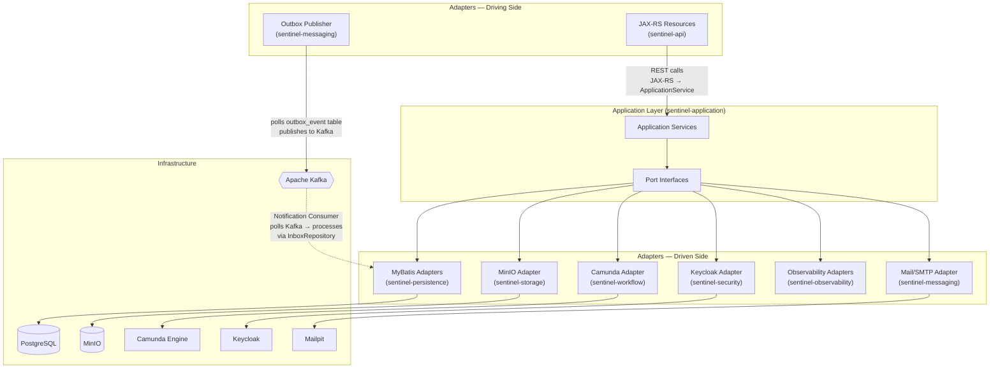
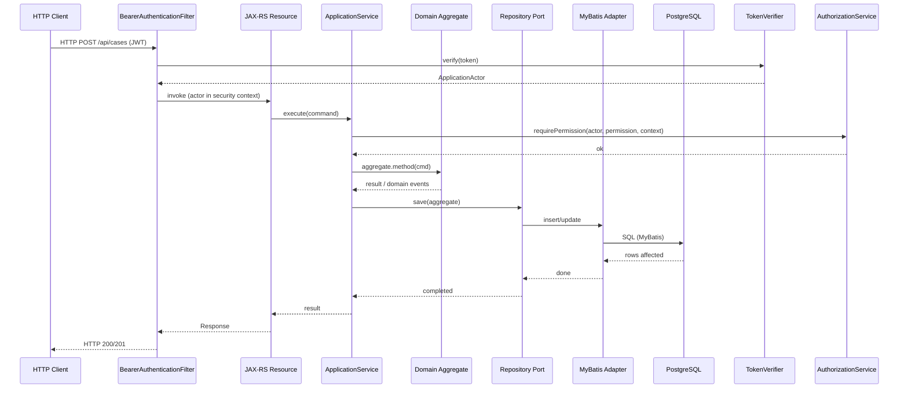
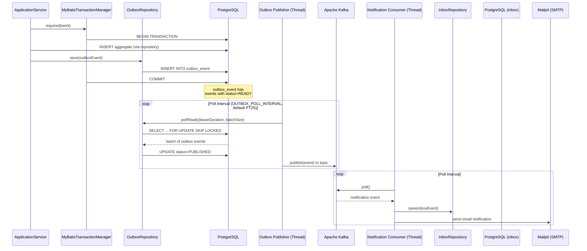

# Service-to-Service Integration

The Sentinel Enforcement Platform uses a **hexagonal (ports-and-adapters) architecture** enforced at the Java module level. The `sentinel-application` module defines **port interfaces** — pure Java contracts with no infrastructure annotations. Infrastructure modules (`sentinel-persistence`, `sentinel-storage`, `sentinel-security`, `sentinel-workflow`, `sentinel-messaging`, `sentinel-observability`) provide **adapter implementations** of those ports.

## Hexagonal Architecture Diagram



## Port / Adapter Catalog

Every port is a Java interface defined in `sentinel-application`. Each is implemented by exactly one adapter in an infrastructure module. Wiring is done explicitly in `ApplicationRuntime.java`.

### Repository Ports → sentinel-persistence (MyBatis)

| Port Interface | File | Adapter Implementation | Adapter File |
|---|---|---|---|
| `CaseRepository` | `sentinel-application/.../casefile/CaseRepository.java` | `CaseRepositoryMyBatisAdapter` | `sentinel-persistence/.../casefile/CaseRepositoryMyBatisAdapter.java` |
| `EvidenceRepository` | `sentinel-application/.../evidence/EvidenceRepository.java` | `EvidenceRepositoryMyBatisAdapter` | `sentinel-persistence/.../evidence/EvidenceRepositoryMyBatisAdapter.java` |
| `ReportRepository` | `sentinel-application/.../report/ReportRepository.java` | `ReportRepositoryMyBatisAdapter` | `sentinel-persistence/.../report/ReportRepositoryMyBatisAdapter.java` |
| `RecommendationRepository` | `sentinel-application/.../recommendation/RecommendationRepository.java` | `RecommendationRepositoryMyBatisAdapter` | `sentinel-persistence/.../recommendation/RecommendationRepositoryMyBatisAdapter.java` |
| `DecisionRepository` | `sentinel-application/.../decision/DecisionRepository.java` | `DecisionRepositoryMyBatisAdapter` | `sentinel-persistence/.../decision/DecisionRepositoryMyBatisAdapter.java` |
| `SanctionRepository` | `sentinel-application/.../sanction/SanctionRepository.java` | `SanctionRepositoryMyBatisAdapter` | `sentinel-persistence/.../decision/SanctionRepositoryMyBatisAdapter.java` |
| `AppealRepository` | `sentinel-application/.../appeal/AppealRepository.java` | `AppealRepositoryMyBatisAdapter` | `sentinel-persistence/.../appeal/AppealRepositoryMyBatisAdapter.java` |
| `MaintenanceOperationRepository` | `sentinel-application/.../operations/MaintenanceOperationRepository.java` | `MaintenanceOperationRepositoryMyBatisAdapter` | `sentinel-persistence/.../operations/MaintenanceOperationRepositoryMyBatisAdapter.java` |

### Messaging Repository Ports → sentinel-persistence (MyBatis)

| Port Interface | File | Adapter Implementation | Adapter File |
|---|---|---|---|
| `OutboxRepository` | `sentinel-application/.../messaging/OutboxRepository.java` | `OutboxRepositoryMyBatisAdapter` | `sentinel-persistence/.../messaging/OutboxRepositoryMyBatisAdapter.java` |
| `InboxRepository` | `sentinel-application/.../messaging/InboxRepository.java` | `InboxRepositoryMyBatisAdapter` | `sentinel-persistence/.../messaging/InboxRepositoryMyBatisAdapter.java` |
| `NotificationRepository` | `sentinel-application/.../messaging/NotificationRepository.java` | `NotificationRepositoryMyBatisAdapter` | `sentinel-persistence/.../messaging/NotificationRepositoryMyBatisAdapter.java` |

### Infrastructure Ports → Various Modules

| Port Interface | File | Adapter Implementation | Adapter Module | Infrastructure |
|---|---|---|---|---|
| `EvidenceStoragePort` | `sentinel-application/.../evidence/EvidenceStoragePort.java` | `MinioEvidenceStorageAdapter` | `sentinel-storage` | MinIO |
| `CaseWorkflowPort` | `sentinel-application/.../workflow/CaseWorkflowPort.java` | `WorkflowRuntime.caseWorkflowPort()` | `sentinel-workflow` | Camunda 7 |
| `WorkflowAdministrationPort` | `sentinel-application/.../workflow/WorkflowAdministrationPort.java` | `WorkflowRuntime.workflowAdministrationPort()` | `sentinel-workflow` | Camunda 7 |
| `WorkflowReconciliationQueryPort` | `sentinel-application/.../workflow/WorkflowReconciliationQueryPort.java` | `WorkflowReconciliationMyBatisAdapter` | `sentinel-persistence` | PostgreSQL |
| `AuthorizationService` | `sentinel-application/.../security/AuthorizationService.java` | `RoleBasedAuthorizationService` | `sentinel-security` | (in-memory role logic) |
| `TokenVerifier` | `sentinel-application/.../security/TokenVerifier.java` | `KeycloakTokenVerifier` | `sentinel-security` | Keycloak |
| `HealthStatusService` | `sentinel-application/.../health/HealthStatusService.java` | `CompositeHealthStatusService` | `sentinel-observability` | (aggregates checks) |
| `ApplicationTransactionManager` | `sentinel-application/.../messaging/ApplicationTransactionManager.java` | `MyBatisTransactionManager` | `sentinel-persistence` | PostgreSQL / MyBatis |
| `WorkflowInstanceStore` | `sentinel-application/.../workflow/WorkflowInstanceStore.java` | `WorkflowInstanceMyBatisAdapter` | `sentinel-persistence` | PostgreSQL |

## Communication Patterns

### Synchronous: JAX-RS Resource → ApplicationService → Domain Aggregate → Repository

All REST API calls follow a synchronous request-response pattern. The flow is:



**Detailed example from `ApplicationRuntime.java` (lines 198–212):**
```
CaseApplicationService caseApplicationService =
    new CaseApplicationService(
        authorizationService,          // AuthorizationService port
        transactionManager,             // ApplicationTransactionManager port
        caseRepository,                 // CaseRepository port (→ MyBatis)
        reportRepository,               // ReportRepository port (→ MyBatis)
        outboxRepository,               // OutboxRepository port (→ MyBatis/PostgreSQL)
        new PhaseSevenCaseProgressionGuard(...),  // domain guard logic
        workflowRuntime.caseWorkflowPort(),        // CaseWorkflowPort (→ Camunda)
        configuration.workflowInvestigationEscalationDuration(),
        clock);
```

### Asynchronous: Transactional Outbox Pattern

Domain events requiring async processing follow the **Transactional Outbox** pattern to guarantee at-least-once delivery without distributed transactions.



**Key characteristics:**
- The outbox event is written **within the same database transaction** as the aggregate change
- `OutboxRepository.pollReady()` uses `SELECT ... FOR UPDATE SKIP LOCKED` for safe concurrent polling
- `OutboxPublisher` runs on a dedicated thread managed by `MessagingRuntime`
- `NotificationConsumer` runs on a separate thread, polls Kafka, processes via inbox
- Topics are defined in `MessagingTopics.java` (`sentinel-application/.../messaging/MessagingTopics.java`)

**Configuration** (from `.env.example`):
| Variable | Default | Description |
|---|---|---|
| `OUTBOX_POLL_INTERVAL` | `PT2S` | Polling interval for outbox publisher |
| `OUTBOX_LEASE_DURATION` | `PT30S` | Lease duration for outbox batch lock |
| `OUTBOX_BATCH_SIZE` | `20` | Max events per poll batch |
| `NOTIFICATION_CONSUMER_GROUP_ID` | `sentinel-notification-consumer` | Kafka consumer group |
| `NOTIFICATION_MAX_RETRIES` | `3` | Max notification send retries |

### Synchronous: All REST API Calls

All HTTP request-response interactions are synchronous. There are no:
- Async HTTP endpoints (no SSE, no WebSocket, no long-polling)
- Deferred response types (no `@Suspended` AsyncResponse usage in JAX-RS)
- Callback endpoints

The `sentinel-api` module defines JAX-RS resources that:
1. Accept JWT Bearer token via `BearerAuthenticationFilter`
2. Deserialize request body (JSON via Jackson)
3. Call application service methods synchronously
4. Return response DTOs (mapped via MapStruct)

**Registered JAX-RS resources** (from `ApplicationRuntime.java` lines 351–362):
- `AppealResource` — appeal lifecycle endpoints
- `CaseResource` — case CRUD, search, status transitions
- `CaseDecisionResource` — decisions scoped to a case
- `CaseEvidenceResource` — evidence scoped to a case
- `CaseRecommendationResource` — recommendations scoped to a case
- `DecisionResource` — decision search and cross-case operations
- `EvidenceResource` — evidence upload/download sessions
- `MaintenanceOperationResource` — operational/maintenance commands
- `RecommendationResource` — recommendation search
- `ReportResource` — report intake and triage
- `TaskResource` — workflow task claiming/completion
- `WorkflowReconciliationResource` — workflow reconciliation operations
- `HealthResource` — health check endpoint

## Wiring Summary (from `ApplicationRuntime.java`)

The `ApplicationRuntime.start()` method at lines 130–393 is the central wiring hub. Key wiring patterns:

```
// Port → Adapter wiring (all explicit, no DI framework scanning)
CaseRepository caseRepository = new CaseRepositoryMyBatisAdapter(sqlSessionFactory);
EvidenceStoragePort evidenceStorage = new MinioEvidenceStorageAdapter(...);
TokenVerifier tokenVerifier = new KeycloakTokenVerifier(keycloakConfig, clock);

// Ports injected into Application Services
CaseApplicationService caseApplicationService = new CaseApplicationService(
    authorizationService, transactionManager, caseRepository, ...,
    workflowRuntime.caseWorkflowPort(),  // CaseWorkflowPort from Camunda
    ...);

// JAX-RS resources registered in ApplicationBinder
// Filters, exception mappers, and metrics filters registered as singletons
```

**Source:** All files under `sentinel-application/src/main/java/` for port interfaces; `ApplicationRuntime.java` for wiring; each module's adapter implementations.
