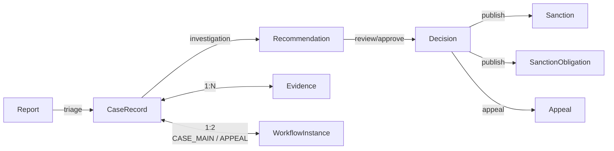
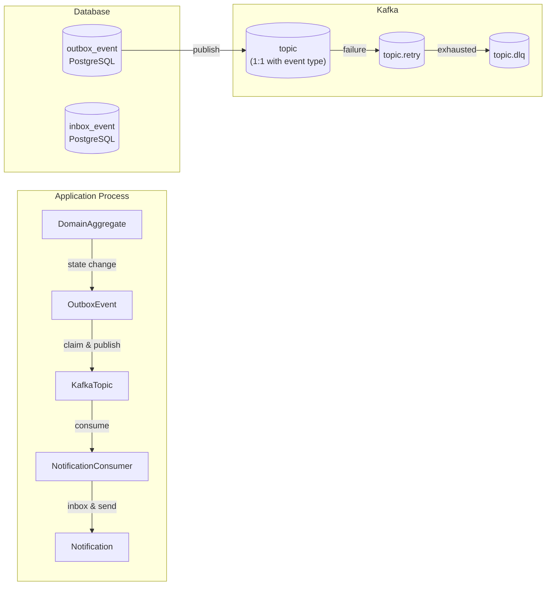
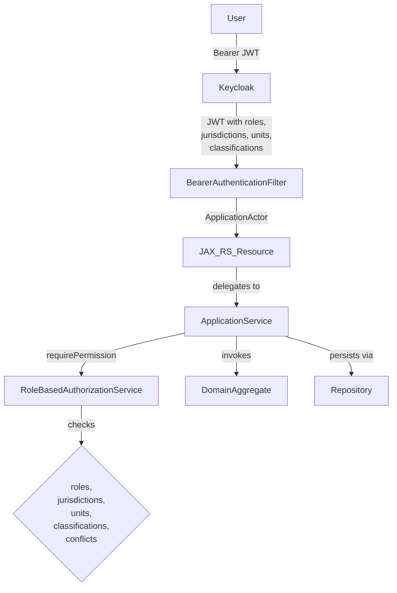
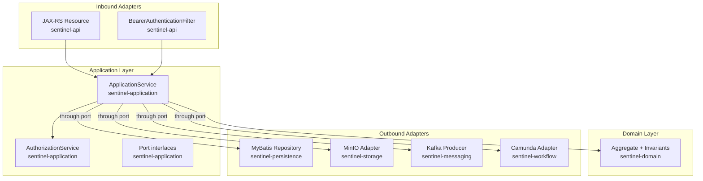

# Domain and Architectural Relationships

This page documents the key relationships between domain concepts, architectural components, and infrastructure. Use it as a reference map when navigating the codebase.

## Domain Concept Lifecycle

### Relationship Details

| From | To | Relationship | Semantics |
|---|---|---|---|
| `Report` | `CaseRecord` | triage | A triaged report creates a case. Source: `Report.triage()` at `/sentinel-domain/.../domain/report/Report.java`, `CaseApplicationService.createCase()` at `/sentinel-application/.../application/casefile/CaseApplicationService.java` |
| `CaseRecord` | `Recommendation` | investigation | An investigated case yields a recommendation. Source: `RecommendationApplicationService` at `/sentinel-application/.../application/recommendation/RecommendationApplicationService.java` |
| `Recommendation` | `Decision` | review/approve | A reviewed recommendation leads to a decision. Source: `DecisionApplicationService` at `/sentinel-application/.../application/decision/DecisionApplicationService.java` |
| `Decision` | `Sanction` | publish | Publishing a decision creates sanctions (if violation proven). Source: `PublishDecisionCommand` at `/sentinel-application/.../application/decision/PublishDecisionCommand.java` |
| `Decision` | `SanctionObligation` | publish | Publishing creates sanction obligations with due dates. |
| `Decision` | `Appeal` | appeal | Respondents can appeal a published decision. Source: `AppealApplicationService` at `/sentinel-application/.../application/appeal/AppealApplicationService.java` |
| `CaseRecord` | `Evidence` | 1-to-many | A case can have many evidence objects. Source: `Evidence.caseId()` at `/sentinel-domain/.../domain/evidence/Evidence.java` |
| `CaseRecord` | `WorkflowInstance` | 1-to-2 | Each case has exactly two workflow instances: `CASE_MAIN` and `APPEAL`. Source: `WorkflowInstanceCorrelation` at `/sentinel-application/.../application/workflow/WorkflowInstanceCorrelation.java` |

## Event Propagation Chain (Transactional Outbox)

### Relationship Details

| From | To | Relationship | Notes |
|---|---|---|---|
| Domain change | `OutboxEvent` | 1-to-1 per transaction | Written in same DB transaction as aggregate change. Source: `EvidenceApplicationService.finalizeEvidenceVersion()` lines 250–259 enqueues events after aggregate update. |
| `OutboxEvent` table | Kafka topic | 1-to-1 | Each `outbox_event.topic()` maps to a specific Kafka topic. Topics defined in `MessagingTopics.java` at `/sentinel-application/.../application/messaging/MessagingTopics.java`. |
| Kafka topic | `NotificationConsumer` | 1-to-N | Consumer subscribes to all domain lifecycle and integration topics. |
| Inbox event | `Notification` | 1-to-1 | Inbox ensures idempotent notification processing. Source: `/docs/adr/ADR-005-inbox-idempotency.md`. |

## Authorization Architecture

### Relationship Details

| From | To | Relationship |
|---|---|---|
| `ApplicationActor` | Keycloak | Authenticates via JWT bearer token verified by `KeycloakTokenVerifier` at `/sentinel-security/.../security/KeycloakTokenVerifier.java` |
| `ApplicationActor` | `RoleBasedAuthorizationService` | Authorized by multi-axis check at `/sentinel-security/.../security/RoleBasedAuthorizationService.java`: role, jurisdiction, unit, case classification, conflict-of-interest, and direct assignment |
| `BearerAuthenticationFilter` | JAX-RS resource | Sets `ApplicationActor` as request property. Source: `/sentinel-api/.../api/security/BearerAuthenticationFilter.java` |

## Layered Architecture Call Chain

## Topic-to-Event Mapping

Each Kafka topic in `MessagingTopics.java` (`/sentinel-application/.../application/messaging/MessagingTopics.java`) maps 1-to-1 to a domain event type:

| Topic (Kafka) | Event Type (outbox_event) | Producing Aggregate |
|---|---|---|
| `case.lifecycle.v1` | Case events (created, transitioned, etc.) | `CaseRecord` |
| `case.assignment.v1` | Assignment events | `CaseAssignment` |
| `evidence.lifecycle.v1` | Evidence events | `Evidence` |
| `decision.lifecycle.v1` | Decision events | `Decision` |
| `sanction.lifecycle.v1` | Sanction events | `Sanction` |
| `appeal.lifecycle.v1` | Appeal events | `Appeal` |
| `notification.command.v1` | Command to send notification | Outbox publisher |
| `notification.result.v1` | Notification delivery result | Consumer |
| `audit.integration.v1` | Audit event for external integration | Domain operations |

## Relationship Table

| Subject | Relationship | Object | Evidence |
|---|---|---|---|
| Report | triaged into → | CaseRecord | `Report.triage()` creates `CaseRecord` |
| CaseRecord | has → | Evidence | `evidence.case_id` → `case_record(id)` |
| CaseRecord | has → | Recommendation | `recommendation.case_id` → `case_record(id)` (1:1) |
| CaseRecord | has → | Decision | `decision.case_id` → `case_record(id)` (1:1) |
| CaseRecord | has → | Sanction | `sanction.case_id` → `case_record(id)` |
| CaseRecord | has → | Appeal | `appeal.case_id` → `case_record(id)` |
| CaseRecord | triggers → | WorkflowInstance | `WorkflowModule` starts process on case creation |
| CaseRecord | audits → | AuditEvent | `audit_event.case_id` → `case_record(id)` |
| CaseRecord | transitions via → | CaseStatusHistory | `case_status_history.case_id` → `case_record(id)` |
| Recommendation | approved by → | RecommendationReview | `recommendation_review.recommendation_id` → `recommendation(id)` |
| Decision | versioned by → | DecisionVersion | `decision_version.decision_id` → `decision(id)` |
| Decision | prescribes → | Sanction | `sanction.decision_id` → `decision(id)` (1:1) |
| Sanction | tracks → | SanctionObligation | `sanction_obligation.sanction_id` → `sanction(id)` (1:1) |
| Appeal | decided by → | AppealDecision | `appeal_decision.appeal_id` → `appeal(id)` (1:1) |
| Domain Aggregate | publishes → | OutboxEvent | Transactional outbox within same DB transaction |
| OutboxEvent → Kafka | consumed by → | InboxEvent | Kafka consumer deduplicates via `eventId` |
| Kafka Topic | routed to → | Notification | `KafkaNotificationConsumer` routes to `NotificationCommandHandler`/`NotificationEventHandler` |
| HTTP Request | filtered by → | BearerAuthenticationFilter | JWT extraction → `ApplicationActor` |
| ApplicationActor | authorized by → | AuthorizationService | 6-axis permission check |
| AuthorizationService | delegates to → | RoleBasedAuthorizationService | Role, jurisdiction, classification, unit, conflict, assignment checks |

## Source References

| File | Maps |
|---|---|
| `/sentinel-domain/src/main/java/com/sentinel/enforcement/domain/casefile/CaseRecord.java` | CaseRecord ↔ Report, Evidence, WorkflowInstance |
| `/sentinel-domain/src/main/java/com/sentinel/enforcement/domain/evidence/Evidence.java` | Evidence ↔ CaseRecord |
| `/sentinel-domain/src/main/java/com/sentinel/enforcement/domain/decision/Decision.java` | Decision ↔ Recommendation, Sanction, SanctionObligation |
| `/sentinel-domain/src/main/java/com/sentinel/enforcement/domain/appeal/Appeal.java` | Appeal ↔ Decision |
| `/sentinel-application/src/main/java/com/sentinel/enforcement/application/messaging/MessagingTopics.java` | Topic ↔ event type mapping |
| `/sentinel-application/src/main/java/com/sentinel/enforcement/application/security/AuthorizationService.java` | Actor ↔ authorization port |
| `/sentinel-security/src/main/java/com/sentinel/enforcement/security/RoleBasedAuthorizationService.java` | Authorization rules |
| `/sentinel-workflow/src/main/java/com/sentinel/enforcement/workflow/WorkflowModule.java` | WorkflowInstance ↔ CaseRecord correlation |
