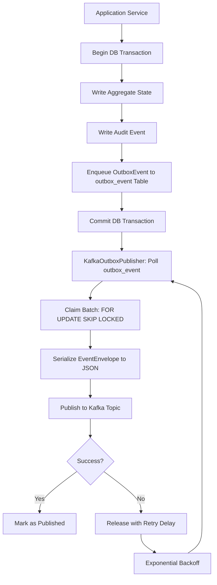
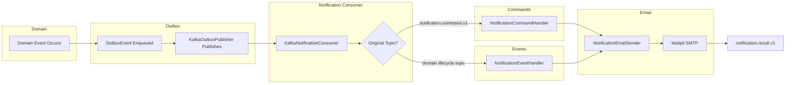
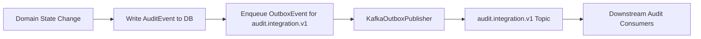

# Sentinel Event Catalog and Messaging Architecture

The messaging layer uses **Apache Kafka** as the event backbone, with a **transactional outbox pattern** for reliable publishing and an **inbox pattern** for idempotent consumption. The `sentinel-messaging` module provides the runtime infrastructure, while `sentinel-application` defines the event contracts.

**Source Module:** `sentinel-messaging/src/main/java/com/sentinel/enforcement/messaging/`
**Source Module:** `sentinel-application/src/main/java/com/sentinel/enforcement/application/messaging/`

---

## 1. Kafka Topic List

**Source:** `sentinel-application/src/main/java/com/sentinel/enforcement/application/messaging/MessagingTopics.java`

### Domain Lifecycle Topics

| Topic | Key | Event Types | Description |
|---|---|---|---|
| `case.lifecycle.v1` | `caseId` | `CaseCreated`, `CaseTransitioned` | Case lifecycle state changes |
| `case.assignment.v1` | `caseId` | `CaseAssigned` | Case assignment events |
| `evidence.lifecycle.v1` | `evidenceId` | `EvidenceCreated`, `EvidenceVersionFinalized` | Evidence lifecycle events |
| `decision.lifecycle.v1` | `decisionId` | `DecisionCreated`, `DecisionApproved`, `DecisionPublished` | Decision lifecycle events |
| `sanction.lifecycle.v1` | `sanctionId` | `SanctionCreated`, `SanctionCancelled`, `SanctionObligationStatusChanged` | Sanction lifecycle events |
| `appeal.lifecycle.v1` | `appealId` | `AppealCreated`, `AppealDecided` | Appeal lifecycle events |

### Integration Topics

| Topic | Key | Event Types | Description |
|---|---|---|---|
| `notification.command.v1` | `caseId` | `SendNotification` | Commands to send notifications |
| `notification.result.v1` | `notificationId` | `NotificationSent`, `NotificationFailed` | Results of notification delivery |
| `audit.integration.v1` | `eventId` | `AuditEventRecorded` | Audit events for downstream integration |

### Topic Groupings

```java
public static List<String> domainLifecycleTopics() {
    return List.of(
        CASE_LIFECYCLE,        // "case.lifecycle.v1"
        CASE_ASSIGNMENT,       // "case.assignment.v1"
        EVIDENCE_LIFECYCLE,    // "evidence.lifecycle.v1"
        DECISION_LIFECYCLE,    // "decision.lifecycle.v1"
        SANCTION_LIFECYCLE,    // "sanction.lifecycle.v1"
        APPEAL_LIFECYCLE       // "appeal.lifecycle.v1"
    );
}

public static List<String> notificationProjectionTopics() {
    // Same domain lifecycle topics, consumed to produce notifications
}

public static List<String> integrationTopics() {
    return List.of(
        NOTIFICATION_COMMAND,  // "notification.command.v1"
        NOTIFICATION_RESULT,   // "notification.result.v1"
        AUDIT_INTEGRATION      // "audit.integration.v1"
    );
}
```

### Retry and Dead-Letter Topics

For every subscribed topic `{topic}`, the system creates:

| Topic Pattern | Purpose |
|---|---|
| `{topic}.retry` | Re-delivery after transient failure (exponential backoff) |
| `{topic}.dlq` | Dead-letter queue after max retries exceeded |

**Example:** `case.lifecycle.v1.retry`, `case.lifecycle.v1.dlq`

**Source:** `KafkaNotificationConsumer.handleFailure()` lines 91–95

```java
String destinationTopic =
    currentAttempt >= maxRetries ? originalTopic + ".dlq" : originalTopic + ".retry";
```

---

## 2. Transactional Outbox Pattern



The outbox pattern ensures **at-least-once** delivery: the domain state change and the event are written in the same database transaction, so either both succeed or both fail.

**Source:** `sentinel-messaging/src/main/java/com/sentinel/enforcement/messaging/KafkaOutboxPublisher.java`

### 2.1 Outbox Event Record

**Source:** `sentinel-application/src/main/java/com/sentinel/enforcement/application/messaging/OutboxEvent.java`

```java
public record OutboxEvent(
    UUID eventId,
    String topic,           // Target Kafka topic
    String messageKey,      // Partition key (usually aggregate ID)
    EventEnvelope envelope, // The event payload
    String status,          // e.g., "PENDING", "PUBLISHED"
    Instant availableAt,    // Earliest time for claiming (for retry delay)
    String leaseOwner,      // Publisher instance claiming this event
    Instant leaseExpiresAt, // Leased until this time
    int publishAttempts,    // Incremented on each attempt
    String lastError,       // Last error message (truncated to 500 chars)
    Instant publishedAt,
    Instant createdAt,
    String createdBy,
    Instant updatedAt,
    String updatedBy,
    long version
) { }
```

### 2.2 Outbox Repository (Claim & Publish)

**Source:** `sentinel-application/src/main/java/com/sentinel/enforcement/application/messaging/OutboxRepository.java`

```java
public interface OutboxRepository {
    void enqueue(OutboxEvent outboxEvent);

    List<OutboxEvent> claimPending(
        String leaseOwner, Instant now, Duration leaseDuration, int batchSize, String updatedBy);

    void markPublished(UUID eventId, Instant publishedAt, String updatedBy);

    void releaseForRetry(
        UUID eventId, Instant now, Instant nextAttemptAt, String lastError, String updatedBy);

    long countPending();
}
```

### 2.3 Claim Behavior

- Uses **`FOR UPDATE SKIP LOCKED`** to atomically claim pending events without blocking other publisher instances
- Leases events for a configurable `leaseDuration` — prevents duplicate processing if a publisher crashes
- Claims only events where `availableAt <= now` (supports scheduled retries)

### 2.4 Retry Backoff

```java
private Duration retryDelay(int attemptNumber) {
    long seconds = Math.min(60L, 1L << Math.min(attemptNumber, 6));
    return Duration.ofSeconds(seconds);
}
```

Backoff schedule:
| Attempt | Delay |
|---|---|
| 1 | 2 seconds |
| 2 | 4 seconds |
| 3 | 8 seconds |
| 4 | 16 seconds |
| 5 | 32 seconds |
| 6+ | 60 seconds (capped) |

---

## 3. Inbox Table (Idempotent Consumption)

**Source:** `sentinel-application/src/main/java/com/sentinel/enforcement/application/messaging/InboxEvent.java`

```java
public record InboxEvent(
    UUID id,
    String consumerName,    // Distinct consumer identity
    UUID eventId,           // Deduplication key (from EventEnvelope.eventId)
    String topic,           // Source topic
    Instant createdAt,
    String createdBy,
    Instant processedAt,
    String resultReference,
    long version
) { }
```

### 3.1 Inbox Repository

**Source:** `sentinel-application/src/main/java/com/sentinel/enforcement/application/messaging/InboxRepository.java`

```java
public interface InboxRepository {
    /** Returns false if the event was already processed (idempotency) */
    boolean beginProcessing(InboxEvent inboxEvent);

    void completeProcessing(
        String consumerName, UUID eventId, Instant processedAt,
        String resultReference, String updatedBy);
}
```

### 3.2 Deduplication

The `beginProcessing()` method uses the `(consumerName, eventId)` pair as a unique key:

- **First insert succeeds** — event is new, processing proceeds
- **Duplicate insert fails** — event was already processed, processing is skipped

This ensures **exactly-once processing semantics** for consumers even with at-least-once Kafka delivery.

### 3.3 Notification Record

**Source:** `sentinel-application/src/main/java/com/sentinel/enforcement/application/messaging/NotificationRecord.java`

```java
public record NotificationRecord(
    UUID id,
    String consumerName,
    UUID eventId,
    UUID caseId,
    String notificationType,  // e.g., "EMAIL"
    String title,
    String body,
    String status,            // e.g., "PENDING", "SENT", "FAILED"
    Instant createdAt,
    String createdBy,
    Instant updatedAt,
    String updatedBy,
    long version
) { }
```

---

## 4. EventEnvelope Schema

**Source:** `sentinel-application/src/main/java/com/sentinel/enforcement/application/messaging/EventEnvelope.java`

Every event published to Kafka uses this schema:

```java
public record EventEnvelope(
    UUID eventId,                   // Unique event identifier (for deduplication)
    String eventType,               // e.g., "CaseCreated", "EvidenceVersionFinalized"
    int eventVersion,               // Schema version number
    String aggregateType,           // e.g., "Case", "Evidence", "Decision"
    UUID aggregateId,               // The aggregate root ID
    Instant occurredAt,             // When the event occurred
    String correlationId,           // End-to-end correlation across services
    String causationId,             // ID of the event that caused this one
    EventActor actor,               // Who performed the action
    Map<String, Object> payload     // Event-specific data
) { }
```

### EventActor

**Source:** `sentinel-application/src/main/java/com/sentinel/enforcement/application/messaging/EventActor.java`

```java
public record EventActor(
    String userId,
    String username,
    Set<String> roles
) { }
```

### JSON Serialization

The `EventEnvelopeJsonCodec` serializes/deserializes envelopes to/from JSON for Kafka transport.

**Source:** `sentinel-messaging/src/main/java/com/sentinel/enforcement/messaging/EventEnvelopeJsonCodec.java`

---

## 5. Kafka Headers for Retry/DLQ

**Source:** `sentinel-messaging/src/main/java/com/sentinel/enforcement/messaging/KafkaNotificationConsumer.java` (lines 27–29)

```java
private static final String RETRY_ATTEMPT_HEADER = "x-retry-attempt";
private static final String ORIGINAL_TOPIC_HEADER = "x-original-topic";
private static final String ERROR_HEADER = "x-error";
```

When a message is routed to a retry or DLQ topic, these Kafka headers are attached:

| Header | Description |
|---|---|
| `x-retry-attempt` | The retry attempt number (integer) |
| `x-original-topic` | The original topic the message was consumed from |
| `x-error` | The error message that caused the failure |

---

## 6. Notification Flow



### Flow Steps

1. **Domain change** occurs in an application service (e.g., case created, evidence finalized)
2. **Outbox** event is enqueued in the same DB transaction as the state change
3. **KafkaOutboxPublisher** claims and publishes the event to the appropriate topic
4. **KafkaNotificationConsumer** polls subscribed topics and deserializes the `EventEnvelope`
5. Based on `x-original-topic`:
   - **`notification.command.v1`** → Delegated to `NotificationCommandHandler` — creates a `NotificationRecord` and sends email via `NotificationEmailSender`
   - **Domain lifecycle topic** → Delegated to `NotificationEventHandler` — creates a `NotificationRecord` from the domain event and sends email
6. **Email sending** — `NotificationEmailSender` sends via Mailpit (SMTP) and updates the notification status
7. **Result** — After sending, a `notification.result.v1` event is published with the outcome (`NotificationSent` or `NotificationFailed`)

**Source:** `sentinel-messaging/src/main/java/com/sentinel/enforcement/messaging/KafkaNotificationConsumer.java`
**Source:** `sentinel-messaging/src/main/java/com/sentinel/enforcement/messaging/NotificationCommandHandler.java`
**Source:** `sentinel-messaging/src/main/java/com/sentinel/enforcement/messaging/NotificationEventHandler.java`
**Source:** `sentinel-messaging/src/main/java/com/sentinel/enforcement/messaging/NotificationEmailSender.java`

---

## 7. Audit Integration



The dual-publishing pattern ensures audit events are:
1. **Persisted in the database** within the same transaction as the state change (strong consistency)
2. **Published to Kafka** for downstream consumers (eventual consistency + integration)

**Source:** `MessagingEventFactory.auditIntegrated()` — creates the outbox event for `audit.integration.v1`

Example usage in `EvidenceApplicationService.finalizeEvidenceVersion()`:
```java
transactionManager.required(() -> {
    evidenceRepository.finalizeUpload(activatedEvidence, evidenceVersion, finalizedSession);
    caseRepository.appendAuditEvent(finalizedAuditEvent);
    outboxRepository.enqueue(MessagingEventFactory.auditIntegrated(finalizedAuditEvent, now));
    outboxRepository.enqueue(
        MessagingEventFactory.evidenceVersionFinalized(
            actor, activatedEvidence, evidenceVersion, command.correlationId(), now));
    return null;
});
```

**Source:** `sentinel-application/src/main/java/com/sentinel/enforcement/application/evidence/EvidenceApplicationService.java` (lines 250–259)

---

## 8. Messaging Runtime

The `MessagingRuntime` manages the lifecycle of messaging components:

**Source:** `sentinel-messaging/src/main/java/com/sentinel/enforcement/messaging/MessagingRuntime.java`
**Source:** `sentinel-messaging/src/main/java/com/sentinel/enforcement/messaging/MessagingRuntimeConfiguration.java`

It starts:
- **KafkaOutboxPublisher** (background thread, polls `outbox_event` table periodically)
- **KafkaNotificationConsumer** (background thread, polls Kafka continuously)

Both run until the application shuts down.

---

## 9. Event Catalog Summary

| Topic Category | Topic Name | Producer | Consumer | Schema |
|---|---|---|---|---|
| Lifecycle | `case.lifecycle.v1` | CaseApplicationService | KafkaNotificationConsumer | EventEnvelope |
| Lifecycle | `case.assignment.v1` | CaseApplicationService | KafkaNotificationConsumer | EventEnvelope |
| Lifecycle | `evidence.lifecycle.v1` | EvidenceApplicationService | KafkaNotificationConsumer | EventEnvelope |
| Lifecycle | `decision.lifecycle.v1` | DecisionApplicationService | KafkaNotificationConsumer | EventEnvelope |
| Lifecycle | `sanction.lifecycle.v1` | Sanction lifecycle | KafkaNotificationConsumer | EventEnvelope |
| Lifecycle | `appeal.lifecycle.v1` | AppealApplicationService | KafkaNotificationConsumer | EventEnvelope |
| Integration | `notification.command.v1` | NotificationEventHandler | NotificationCommandHandler | EventEnvelope |
| Integration | `notification.result.v1` | NotificationEmailSender | — | EventEnvelope |
| Integration | `audit.integration.v1` | All ApplicationServices | External audit consumers | EventEnvelope |
| Retry | `*.retry` | KafkaNotificationConsumer | KafkaNotificationConsumer | EventEnvelope + headers |
| DLQ | `*.dlq` | KafkaNotificationConsumer | Manual investigation | EventEnvelope + headers |

## Source References

1. **Messaging Module** — `sentinel-messaging/src/main/java/.../messaging/KafkaOutboxPublisher.java`, `.../KafkaNotificationConsumer.java`, `.../NotificationCommandHandler.java`, `.../NotificationEventHandler.java`, `.../NotificationEmailSender.java`, `.../MessagingRuntime.java`, `.../MessagingRuntimeConfiguration.java`, `.../EventEnvelopeJsonCodec.java`
2. **Application Contracts** — `sentinel-application/src/main/java/.../application/messaging/MessagingTopics.java`, `.../OutboxEvent.java`, `.../OutboxRepository.java`, `.../InboxEvent.java`, `.../InboxRepository.java`, `.../NotificationRecord.java`, `.../EventEnvelope.java`, `.../EventActor.java`, `.../MessagingEventFactory.java`
3. **Application Services** — `sentinel-application/src/main/java/.../application/evidence/EvidenceApplicationService.java`
