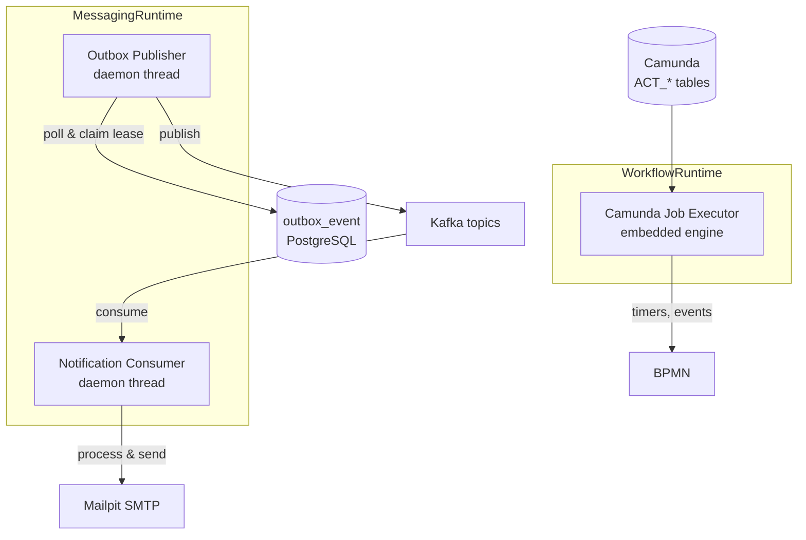

# Job Catalog — Background Processing

The Sentinel Enforcement Platform has **three persistent background jobs**, all managed within the application process as daemon threads. There are **no scheduled batch jobs** (no cron, no Quartz, no ShedLock), **no ETL pipelines**, and **no bulk processing pipelines**.

## Job Summary



All background threads are managed within the application process (not separate workers or external job runners).

## Job 1: Outbox Publisher

**Runtime**: `MessagingRuntime` (`/sentinel-messaging/src/main/java/com/sentinel/enforcement/messaging/MessagingRuntime.java`)
**Class**: `KafkaOutboxPublisher` (`/sentinel-messaging/src/main/java/com/sentinel/enforcement/messaging/KafkaOutboxPublisher.java`)
**Thread**: `sentinel-outbox-publisher-{instanceId}` (daemon thread, line 102–118)

### Behavior

1. **Poll loop** runs with interval controlled by `OUTBOX_POLL_INTERVAL` (default `PT2S`).
2. **Claims lease** on pending outbox rows via `outboxRepository.claimPending()` which executes `SELECT ... FOR UPDATE SKIP LOCKED` in PostgreSQL.
3. **Publishes** each claimed event to its configured Kafka topic (`outboxEvent.topic()` → `outboxEvent.envelope()` serialized as JSON).
4. On success: marks row as `PUBLISHED` via `outboxRepository.markPublished()`.
5. On failure: releases for retry via `outboxRepository.releaseForRetry()` with exponential backoff (1s, 2s, 4s, up to 60s max, line 81).
6. Publishes up to `OUTBOX_BATCH_SIZE` events per poll cycle (default 20).

### Configuration

| Parameter | Env var | Default |
|---|---|---|
| Poll interval | `OUTBOX_POLL_INTERVAL` | `PT2S` |
| Lease duration | `OUTBOX_LEASE_DURATION` | `PT30S` |
| Batch size | `OUTBOX_BATCH_SIZE` | `20` |
| Lease owner | `APP_INSTANCE_ID` | Auto UUID |

### Error Handling

- Publish failures log at `WARN` and schedule retry via `available_at`.
- Topic provisioning is best-effort on failure (`ensureTopicsExistForRetry()`, line 85–91).

## Job 2: Notification Consumer

**Runtime**: `MessagingRuntime` (`/sentinel-messaging/src/main/java/com/sentinel/enforcement/messaging/MessagingRuntime.java`)
**Class**: `KafkaNotificationConsumer` (`/sentinel-messaging/src/main/java/com/sentinel/enforcement/messaging/KafkaNotificationConsumer.java`)
**Thread**: `sentinel-notification-consumer-{instanceId}` (daemon thread, line 119–123)

### Behavior

1. **Subscribes** to all domain lifecycle topics (`case.lifecycle.v1`, `evidence.lifecycle.v1`, etc.) and integration topics (`notification.command.v1`, etc.). Source: `MessagingTopics.java` at `/sentinel-application/src/main/java/com/sentinel/enforcement/application/messaging/MessagingTopics.java` lines 18–40.
2. **Polls** Kafka with 500ms timeout (`POLL_TIMEOUT`, line 26).
3. **Routes** records based on original topic:
   - `notification.command.v1` → `NotificationCommandHandler.handle()` (sends email via Mailpit SMTP).
   - All other topics → `NotificationEventHandler.handle()` (processes via inbox for idempotent delivery).
4. **Commits** offset synchronously per-record (`commitSync`, line 134–138).

### Error Handling — Retry and Dead-Letter

```
Kafka Topic ──► processRecord()
                    │
                    ├── success → commit offset
                    │
                    └── failure → handleFailure()
                                    │
                           ┌────────┴────────┐
                           │                 │
                    attempt < maxRetries  attempt >= maxRetries
                           │                 │
                           ▼                 ▼
                    {topic}.retry        {topic}.dlq
                    (retry attempt      (dead letter queue)
                     incremented)
```

Source: `KafkaNotificationConsumer.handleFailure()` lines 91–131.

- Retry topics (`.retry`) receive the original message with `x-retry-attempt`, `x-original-topic`, and `x-error` headers.
- After `NOTIFICATION_MAX_RETRIES` (default 3) the event goes to the DLQ (`.dlq`).
- For `notification.command.v1` DLQ events, `NotificationCommandHandler.markPermanentFailure()` is called (line 114–117).

## Job 3: Camunda Job Executor

**Runtime**: `WorkflowRuntime` (`/sentinel-workflow/src/main/java/com/sentinel/enforcement/workflow/WorkflowRuntime.java`)
**Activation**: `StandaloneProcessEngineConfiguration.setJobExecutorActivate(true)` in `WorkflowModule.java` line 40.

### Behavior

The embedded Camunda engine (version 7.24.0, `/pom.xml` line 35) manages its own job executor thread pool for:

- **BPMN timer events** — e.g., investigation escalation timer (`WORKFLOW_INVESTIGATION_ESCALATION_DURATION`).
- **Boundary events** — interrupting and non-interrupting boundary events on BPMN tasks.
- **Escalation timers** — timeout-based case escalation logic.

The job executor is an **embedded thread pool** within the Camunda `ProcessEngine`. It reads from Camunda's `ACT_*` tables (the same PostgreSQL schema). The executor is activated on startup and polls the `ACT_RU_JOB` table for due jobs.

### Java Delegates

Registered via expression manager in `WorkflowModule.java` (lines 42–47):

| Delegate | Bean name | File |
|---|---|---|
| Pre-triage routing | `preTriageRoutingDelegate` | `/sentinel-workflow/src/main/java/com/sentinel/enforcement/workflow/PreTriageRoutingDelegate.java` |
| Investigation escalation | `investigationEscalationDelegate` | `/sentinel-workflow/src/main/java/com/sentinel/enforcement/workflow/InvestigationEscalationDelegate.java` |
| Mock workflow service | `mockWorkflowServiceDelegate` | `/sentinel-workflow/src/main/java/com/sentinel/enforcement/workflow/MockWorkflowServiceDelegate.java` |

## What Does NOT Exist

The following job types are **not present** in the codebase:

- ❌ No scheduled batch jobs (cron, Quartz, ShedLock)
- ❌ No ETL or bulk processing pipelines
- ❌ No separate worker processes or external job runners
- ❌ No `@Scheduled`, `@Scheduler`, or cron expressions
- ❌ No `java.util.Timer` or `ScheduledExecutorService` (beyond Camunda's managed executor)

## Source Files

| File | Role |
|---|---|
| `/sentinel-messaging/src/main/java/com/sentinel/enforcement/messaging/MessagingRuntime.java` | Manages outbox publisher + notification consumer daemon threads |
| `/sentinel-messaging/src/main/java/com/sentinel/enforcement/messaging/KafkaOutboxPublisher.java` | Outbox poll-publish loop with lease and retry |
| `/sentinel-messaging/src/main/java/com/sentinel/enforcement/messaging/KafkaNotificationConsumer.java` | Kafka consumer with retry/DLQ routing |
| `/sentinel-messaging/src/main/java/com/sentinel/enforcement/messaging/NotificationCommandHandler.java` | Handles notification.command.v1 — sends email via Mailpit |
| `/sentinel-messaging/src/main/java/com/sentinel/enforcement/messaging/NotificationEventHandler.java` | Handles domain lifecycle events — inbox-based processing |
| `/sentinel-workflow/src/main/java/com/sentinel/enforcement/workflow/WorkflowRuntime.java` | Wraps Camunda process engine |
| `/sentinel-workflow/src/main/java/com/sentinel/enforcement/workflow/WorkflowModule.java` | Configures and starts Camunda with job executor |
| `/sentinel-application/src/main/java/com/sentinel/enforcement/application/messaging/MessagingTopics.java` | Defines all Kafka topics and provisioning lists |
