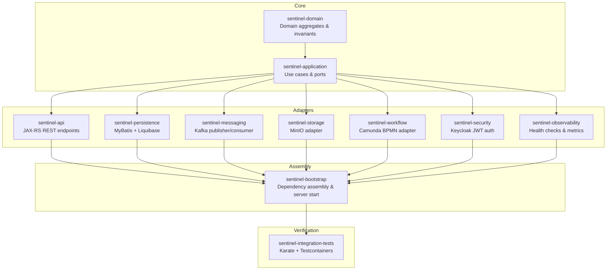

# Sentinel Enforcement Platform — Quickstart

The Sentinel Enforcement Platform is an enterprise-grade Java 21 application for regulatory enforcement and complex case management. It provides a full lifecycle from report intake through triage, investigation, recommendation, decision, sanction, and appeal — backed by an event-driven messaging layer, embedded Camunda BPMN workflows, and MinIO-based evidence storage. All API access is secured via Keycloak JWT authentication with multi-axis authorization (role, jurisdiction, unit, classification, and conflict-of-interest).

## What the Platform Does

- **Regulatory Enforcement** — Intake reports, triage submissions, and manage case progression through structured status transitions
- **Case Management** — Create, assign, search, and audit cases with full status history and cursor-based pagination
- **Evidence Handling** — Upload, version, and download evidence objects via MinIO presigned URLs with SHA-256 checksum verification
- **Recommendation & Decision Workflow** — Reviewers submit recommendations; decision-makers approve, publish, and attach sanction obligations
- **Appeal Workflow** — Respondents appeal published decisions; appeal panels decide outcomes (granted/denied) with supervisor override support
- **Operational Tooling** — Recalculate overdue sanction obligations, reconcile workflow state, and monitor application health

## Technology Stack

| Category | Technology |
|---|---|
| Language | Java 21 |
| HTTP Server / REST | Grizzly HTTP server + Jersey JAX-RS (3.1.9) |
| ORM / Data Access | MyBatis 3.5.19 with HikariCP 6.3.0 connection pool |
| Database Migrations | Liquibase 4.31.1 |
| Database | PostgreSQL (via PostgreSQL JDBC 42.7.5) |
| Messaging | Apache Kafka 3.8.1 |
| Workflow Engine | Embedded Camunda BPM 7.24.0 |
| Object Storage | MinIO (8.5.17 SDK) |
| Authentication / Authorization | Keycloak (JWT via Nimbus JOSE + JWT 10.0.2) |
| Validation | Hibernate Validator 9.0.0 (Jakarta EE) |
| JSON | Jackson 2.18.2 + OpenAPI Generator |
| Mapping | MapStruct 1.6.3 |
| Testing | JUnit 5.11.4, Testcontainers 1.20.5, Karate 2.1.1 |
| Build | Maven 3.9+ (multi-module) |
| Code Quality | Spotless (Google Java Format), Maven Dependency Analyzer |

## Quick Setup

```bash
# 1. Restore Maven dependencies
make bootstrap

# 2. Start infrastructure (PostgreSQL, Kafka, Redis, MinIO, Keycloak, Mailpit)
make up

# 3. Run schema migrations and start the application
make migrate

# 4. (Optional) Re-run idempotent seed helpers (MinIO bucket init)
make seed

# 5. Verify the application is running
make smoke-test
```

## Make Targets

### Testing

| Target | Description |
|---|---|
| `make test` | Run all unit and integration tests (`mvn verify`) |
| `make unit-test` | Run unit tests only (`mvn test`) |
| `make integration-test` | Run integration tests with Testcontainers (`sentinel-integration-tests` module) |
| `make workflow-test` | Run workflow-focused unit tests and the `WorkflowTaskApiIT` integration test |
| `make messaging-test` | Run messaging-focused integration test (`MessagingReliabilityIT`) |
| `make e2e-test` | Run the full end-to-end integration test slice |
| `make karate-smoke` | Run Karate smoke suite against the running application |
| `make karate-regression` | Run Karate regression suite against the running application |
| `make karate-full` | Run Karate full suite against the running application |
| `make verify` | Run `mvn verify` with all checks |

### Build & Code Quality

| Target | Description |
|---|---|
| `make compile` | Compile all modules (skip tests) |
| `make package` | Build distributable artifacts (skip tests) |
| `make format` | Apply Spotless/Google Java Format and POM sorting |
| `make lint` | Check formatting with Spotless |
| `make dependency-check` | Analyze dependency usage with Maven |
| `make openapi-validate` | Validate `docs/api/openapi.yaml` |
| `make openapi-generate` | Generate API sources from OpenAPI spec |

### Infrastructure

| Target | Description |
|---|---|
| `make up` | Start PostgreSQL, Kafka, Redis, MinIO, Keycloak, Mailpit containers |
| `make down` | Stop all compose services |
| `make restart` | Restart compose services |
| `make reset` | Stop and remove all compose volumes |
| `make ps` | Show compose service status |
| `make logs` | Tail compose logs |
| `make app-logs` | Tail application logs |

### Database

| Target | Description |
|---|---|
| `make migrate` | Run application + Camunda schema migration, then start app |
| `make rollback` | Roll back latest Liquibase changesets (override with `ROLLBACK_COUNT=n`) |
| `make db-status` | Show PostgreSQL container status |
| `make db-shell` | Open `psql` shell inside Postgres container |
| `make db-reset` | Reset PostgreSQL data by recreating the container |

### Operations

| Target | Description |
|---|---|
| `make seed` | Re-run idempotent bootstrap helpers (MinIO bucket init) |
| `make smoke-test` | Call `GET /health` endpoint |
| `make minio-init` | Ensure the MinIO evidence bucket exists |
| `make keycloak-import` | Start Keycloak (with import) |
| `make kafka-topics` | List Kafka topics |
| `make kafka-consume` | Tail the `case.lifecycle.v1` topic |
| `make kafka-produce` | Produce a sample notification command message |
| `make bpmn-validate` | Validate the embedded Camunda BPMN model |
| `make bpmn-deploy` | Explain embedded BPMN deployment behavior |
| `make docker-build` | Build application image via Docker Compose |
| `make docker-push-local` | Build and tag image in local Docker daemon |

## Module Dependency Diagram

The platform is a **modular monolith** with 11 Maven modules arranged in layered hexagonal architecture:



## Wiki Section Links

| Section | Path | Description |
|---|---|---|
| **Architecture Overview** | [/openwiki/architecture/overview.md](./architecture/overview.md) | Modular monolith, hexagonal architecture, ADRs, module responsibilities |
| **Domain Behavior** | [/openwiki/domain/behavior.md](./domain/behavior.md) | All 7 aggregates, state machines, transitions, domain exceptions |
| **API Endpoint Catalog** | [/openwiki/interfaces/endpoint-catalog.md](./interfaces/endpoint-catalog.md) | Full REST API grouped by resource, auth requirements, error envelope |
| **Business Data** | [/openwiki/business/business-data.md](./business/business-data.md) | Key business entities: reports, cases, decisions, sanctions, appeals |
| **Business Flows** | [/openwiki/business/business-flows.md](./business/business-flows.md) | End-to-end flows: intake → triage → investigation → decision → appeal |
| **Rules & Validation** | [/openwiki/business/rules-and-validation.md](./business/rules-and-validation.md) | Domain invariants, state machines, validation rules |
| **Runtime Configuration** | [/openwiki/configuration/runtime-configuration.md](./configuration/runtime-configuration.md) | Environment variables, defaults, config structure |
| **Database Structure** | [/openwiki/data/database-structure.md](./data/database-structure.md) | Entity relationships, table schemas, indexes |
| **Database Programmability** | [/openwiki/data/database-programmability.md](./data/database-programmability.md) | Functions, triggers, migration framework |
| **Data Consistency** | [/openwiki/data/consistency.md](./data/consistency.md) | Optimistic locking, transactional outbox, constraints |
| **Development Change Guide** | [/openwiki/development/change-guide.md](./development/change-guide.md) | How to add/modify features safely |
| **File Handling & Formats** | [/openwiki/files/file-handling-and-formats.md](./files/file-handling-and-formats.md) | Evidence file handling, MinIO presigned URLs |
| **Integrations: External Services** | [/openwiki/integrations/external-services.md](./integrations/external-services.md) | PostgreSQL, Kafka, Keycloak, MinIO, Redis, Mailpit |
| **Integrations: Dependency Matrix** | [/openwiki/integrations/dependency-matrix.md](./integrations/dependency-matrix.md) | Module-to-infrastructure dependency map |
| **Integrations: Service-to-Service** | [/openwiki/integrations/service-to-service.md](./integrations/service-to-service.md) | Inter-module communication patterns |
| **Integrations: Cloud Services** | [/openwiki/integrations/cloud-services.md](./integrations/cloud-services.md) | Local equivalents (no cloud-specific dependencies) |
| **Interface Contracts** | [/openwiki/interfaces/contracts.md](./interfaces/contracts.md) | OpenAPI contract-first, DTO generation, MapStruct mapping |
| **Knowledge: Relationships** | [/openwiki/knowledge/relationships.md](./knowledge/relationships.md) | Concept map and cross-cutting relationships |
| **Messaging: Event Catalog** | [/openwiki/messaging/event-catalog.md](./messaging/event-catalog.md) | Kafka topics, event schemas, outbox/inbox patterns |
| **Processing: Job Catalog** | [/openwiki/processing/job-catalog.md](./processing/job-catalog.md) | Background jobs (outbox publisher, notification consumer) |
| **Reliability: Security & Operations** | [/openwiki/reliability/security-operations.md](./reliability/security-operations.md) | Disaster recovery, runbooks, operational procedures |
| **Runtime: Concurrency** | [/openwiki/runtime/concurrency-and-asynchronous-processing.md](./runtime/concurrency-and-asynchronous-processing.md) | Threading model, background threads, async processing |
| **Runtime: Context Propagation** | [/openwiki/runtime/context-propagation.md](./runtime/context-propagation.md) | Correlation ID, actor context, transaction propagation |
| **Runtime: Request Flows** | [/openwiki/runtime/traffic-and-request-flows.md](./runtime/traffic-and-request-flows.md) | HTTP request lifecycle, authentication filter chain |
| **Security: Authentication & Authorization** | [/openwiki/security/authentication-and-authorization.md](./security/authentication-and-authorization.md) | JWT, Keycloak, multi-axis authorization |
| **Security: Cryptography** | [/openwiki/security/cryptography.md](./security/cryptography.md) | No custom cryptography, SHA-256 for evidence verification |

## Backlog — Not Yet Fully Documented

The following areas exist in the codebase but lack dedicated documentation pages:

- **Sanction Obligation Tracking** — The domain `SanctionObligation` aggregate with states ACTIVE → OVERDUE → SATISFIED → CANCELLED and the periodic recalculation (`MaintenanceOperationApplicationService.recalculateOverdueSanctionObligations`) is not yet written up
- **PhaseSevenCaseProgressionGuard** — Domain guard that enforces case progression rules across recommendation/decision/appeal/sanction states (source: `sentinel-application/src/main/java/.../PhaseSevenCaseProgressionGuard.java`)
- **Workflow BPMN Process Models** — The BPMN XML definitions embedded in `sentinel-workflow` are not yet catalogued
- **Detailed Audit Trail Schema** — The `AuditEvent` record (18 fields) and persistence layer are not separately documented
- **Error Exception Mapper Catalog** — Each `*ExceptionMapper` class registered in `ApplicationRuntime` maps a domain exception to an HTTP status; not yet enumerated as a reference
- **Messaging Reliability Patterns** — Outbox leasing, dead-letter routing, and retry semantics are covered in the code (`MessagingRuntime`, `KafkaOutboxPublisher`) but not fully documented
- **Docker Compose Topology** — The `docker-compose.yaml` service definitions, network topology, and volume mounts are not yet documented
- **Integration Test Architecture** — The Karate feature files, Testcontainers configuration, and test fixture setup are not catalogued
- **Command/Query Separation** — The application service command and query DTOs (e.g., `SubmitRecommendationCommand`, `ListCasesQuery`) are not enumerated
