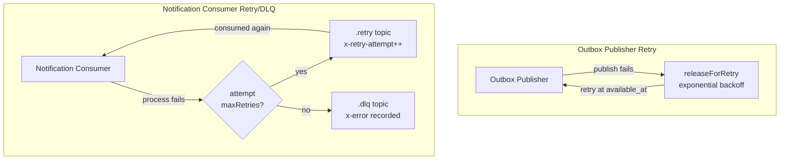

# Security Operations

## Application-Level Authentication and Authorization

The platform implements API security at the JAX-RS filter level:

| Scenario | HTTP Status | Mechanism | Source |
|---|---|---|---|
| Missing/invalid token | **401 Unauthorized** | `BearerAuthenticationFilter` throws `UnauthenticatedException` | `/sentinel-api/.../api/security/BearerAuthenticationFilter.java` lines 33–36 |
| Expired token | **401 Unauthorized** | `KeycloakTokenVerifier.validateClaims()` checks expiration | `/sentinel-security/.../security/KeycloakTokenVerifier.java` lines 84–88 |
| Wrong issuer/audience | **401 Unauthorized** | `validateClaims()` compares issuer and audience | `/sentinel-security/.../security/KeycloakTokenVerifier.java` lines 76–82 |
| Insufficient permissions | **403 Forbidden** | `RoleBasedAuthorizationService.requirePermission()` throws `AuthorizationDeniedException` | `/sentinel-security/.../security/RoleBasedAuthorizationService.java` lines 16–64 |
| Jurisdiction mismatch | **403 Forbidden** | Checked via `actor.hasJurisdiction()` | `RoleBasedAuthorizationService.java` lines 30–34 |
| Conflict of interest | **403 Forbidden** | Checked via `actor.isConflictedWith()` | `RoleBasedAuthorizationService.java` lines 44–52 |
| Case classification mismatch | **403 Forbidden** | Checked via `actor.hasCaseClassification()` | `RoleBasedAuthorizationService.java` lines 36–42 |

**Exception mappers** translate domain and application exceptions to HTTP responses. Sources in `/sentinel-api/.../api/error/`:
- `UnauthenticatedExceptionMapper.java` → 401
- `AuthorizationDeniedExceptionMapper.java` → 403
- `NotFoundExceptionMapper.java` → 404
- Various `*ConflictExceptionMapper.java` → 409

The `/health` endpoint is **public** (no authentication required). Source: `BearerAuthenticationFilter.isPublicEndpoint()` at line 43–46.

## Multi-Instance Safety

The platform is designed to run multiple instances safely. Two mechanisms provide concurrency safety:

### 1. Outbox Lease Locking

The outbox publisher uses `SELECT ... FOR UPDATE SKIP LOCKED` to claim pending events atomically. This prevents multiple instances from processing the same outbox row.

```sql
-- Claim pending events with lease (conceptual SQL)
SELECT event_id, topic, envelope
FROM outbox_event
WHERE status = 'PENDING'
  AND (lease_expires_at IS NULL OR lease_expires_at <= now())
  AND (available_at IS NULL OR available_at <= now())
ORDER BY available_at, occurred_at
LIMIT :batchSize
FOR UPDATE SKIP LOCKED;
```

Source: `OutboxRepositoryMyBatisAdapter.claimPending()` at `/sentinel-persistence/.../persistence/messaging/OutboxRepositoryMyBatisAdapter.java` lines 42–57. The `OUTBOX_LEASE_DURATION` env var (default `PT30S`) controls how long an instance holds the lease. If an instance crashes, the lease expires and another instance picks up the row.

### 2. Optimistic Locking (Version)

All domain aggregates use optimistic locking via a `version` field:

| Aggregate | Version field | Example |
|---|---|---|
| `Report` | `version` (long) | `Report.triage()` checks `expectedVersion != version` at `/sentinel-domain/.../domain/report/Report.java` line 39 |
| `CaseRecord` | `version` (long) | `CaseRecord.assignTo()` increments version |
| `Evidence` | `version` (long) | `Evidence.activate()` sets `version + 1` at `/sentinel-domain/.../domain/evidence/Evidence.java` line 74 |
| `Decision` | `version` (long) | All state transitions increment version |
| `Recommendation` | `version` (long) | All state transitions increment version |

The `MyBatisRepositorySupport` base class at `/sentinel-persistence/.../persistence/MyBatisRepositorySupport.java` provides `executeWrite()` which maps optimistic lock failures to `PersistenceExceptionClassifier`.

## Retry and Dead-Letter Mechanics



### Outbox Publisher Retry

- On publish failure, `KafkaOutboxPublisher.releaseForRetry()` sets `available_at` with exponential backoff: 1s, 2s, 4s, 8s, 16s, 32s, capped at 60s.
- Source: `/sentinel-messaging/.../messaging/KafkaOutboxPublisher.java` lines 59–78, retry delay line 81.

### Notification Consumer Retry and DLQ

- On processing failure, `KafkaNotificationConsumer.handleFailure()` checks retry attempt count.
- If `currentAttempt < maxRetries` (default 3): message is produced to `{topic}.retry` with headers `x-retry-attempt`, `x-original-topic`, `x-error`.
- If `currentAttempt >= maxRetries`: message is produced to `{topic}.dlq`.
- Source: `/sentinel-messaging/.../messaging/KafkaNotificationConsumer.java` lines 91–131.

## Recovery Runbooks

The following runbooks are documented in `/docs/runbooks/`:

| Runbook | Path | When to use |
|---|---|---|
| Outbox Stuck | `/docs/runbooks/outbox-stuck.md` | `outbox_event` rows remain `PENDING` longer than expected; notifications stop appearing |
| Dead-Letter Events | `/docs/runbooks/dead-letter-events.md` | Events appear in `*.dlq` topics; notification side-effects not forming |
| Kafka Backlog | `/docs/runbooks/kafka-backlog.md` | Topic or retry topic grows continuously; notifications delayed despite `PUBLISHED` outbox |
| Domain-Workflow Mismatch Reconciliation | `/docs/runbooks/domain-workflow-mismatch-reconciliation.md` | `case_record` status and Camunda runtime are out of sync |
| MinIO Evidence Storage | `/docs/runbooks/minio-evidence-storage.md` | Evidence upload/finalize/download failures |
| Camunda Schema Migration | `/docs/runbooks/camunda-embedded-schema-migration.md` | Fresh environment or missing Camunda `ACT_*` tables |

### Runbook Quick Reference

| Runbook | Key SQL/Command | Source |
|---|---|---|
| Outbox Stuck | `SELECT ... FROM outbox_event WHERE status = 'PENDING'` | `outbox-stuck.md` line 18 |
| Dead-Letter Events | `kafka-console-consumer ... --topic case.lifecycle.v1.dlq` | `dead-letter-events.md` line 17 |
| Kafka Backlog | `make kafka-topics`, check consumer lag | `kafka-backlog.md` line 10 |
| Domain-Workflow Mismatch | `GET /api/v1/workflow-reconciliation` endpoint | `domain-workflow-mismatch-reconciliation.md` line 13 |
| MinIO Evidence | `make minio-init`, verify `MINIO_*` config alignment | `minio-evidence-storage.md` lines 14–27 |
| Camunda Schema Migration | `make migrate` (Liquibase → Camunda SQL → app start) | `camunda-embedded-schema-migration.md` line 10 |

## Scope Limitations

The following security controls are **not implemented** as part of the current platform scope:

- ❌ No rate limiting (no token bucket, no leaky bucket, no request throttling)
- ❌ No IP allowlisting or denylisting
- ❌ No Web Application Firewall (WAF) integration
- ❌ No request size limits on the HTTP server (Grizzly/Jersey default)
- ❌ No API key or mTLS authentication (JWT bearer only)

These gaps are acknowledged stack-scope limitations and should be addressed by infrastructure-level controls (API gateway, WAF, network policies) in production deployments.

## Source Files

| File | Role |
|---|---|
| `/sentinel-api/src/main/java/com/sentinel/enforcement/api/security/BearerAuthenticationFilter.java` | JAX-RS filter extracting Bearer token, setting `ApplicationActor` |
| `/sentinel-security/src/main/java/com/sentinel/enforcement/security/KeycloakTokenVerifier.java` | JWT verification: issuer, audience, expiry, nbf |
| `/sentinel-security/src/main/java/com/sentinel/enforcement/security/RoleBasedAuthorizationService.java` | Multi-axis authorization: role, jurisdiction, unit, classification, conflict |
| `/sentinel-persistence/src/main/java/com/sentinel/enforcement/persistence/messaging/OutboxRepositoryMyBatisAdapter.java` | Outbox lease locking with `FOR UPDATE SKIP LOCKED` |
| `/sentinel-messaging/src/main/java/com/sentinel/enforcement/messaging/KafkaOutboxPublisher.java` | Outbox publish with exponential backoff retry |
| `/sentinel-messaging/src/main/java/com/sentinel/enforcement/messaging/KafkaNotificationConsumer.java` | Kafka consumer with `.retry`/`.dlq` routing |
| `/docs/runbooks/outbox-stuck.md` | Outbox recovery procedure |
| `/docs/runbooks/dead-letter-events.md` | DLQ event recovery procedure |
| `/docs/runbooks/kafka-backlog.md` | Kafka backlog recovery procedure |
| `/docs/runbooks/domain-workflow-mismatch-reconciliation.md` | Domain-workflow reconciliation procedure |
| `/docs/runbooks/minio-evidence-storage.md` | MinIO evidence storage operation procedure |
| `/docs/runbooks/camunda-embedded-schema-migration.md` | Camunda schema migration procedure |
