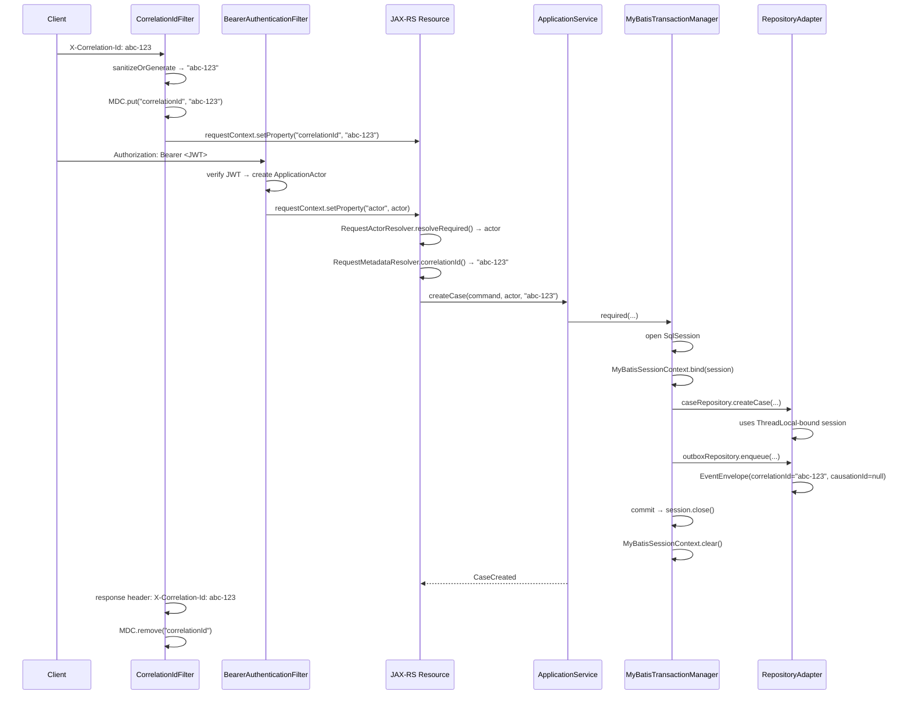
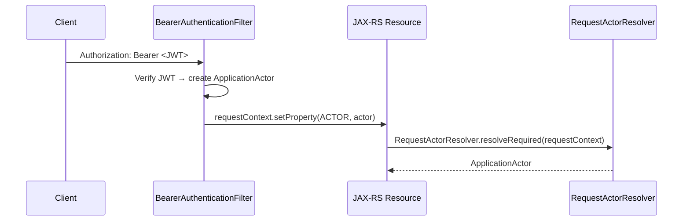

# Context Propagation

## Context Inventory

The Sentinel Enforcement Platform propagates the following context types:

| Context | Created At | Stored As | Propagation Mechanism | Boundary | Consumer | Cleanup | Failure or Leak Risk | Evidence |
|---|---|---|---|---|---|---|---|---|
| Correlation ID | `CorrelationIdFilter` (JAX-RS request filter, priority `AUTHENTICATION - 10`) | SLF4J `MDC["correlationId"]` + `ContainerRequestContext` property | JAX-RS request/response filter; manually passed as method parameter to application services | HTTP request → response outbound; event envelope field for async boundaries | Logback appender (log output), `ErrorResponseFactory` (error responses), `EventEnvelope` (event causality) | `CorrelationIdFilter` response filter calls `MDC.remove()` | **Known**: MDC is **not** propagated to messaging threads (outbox publisher, Kafka consumer). Logs from those threads lack context. | `CorrelationContext.java`, `CorrelationIdFilter.java` |
| Authenticated Actor | `BearerAuthenticationFilter` (priority `AUTHENTICATION`) | `ContainerRequestContext` property (`ACTOR_REQUEST_PROPERTY`) | `RequestActorResolver.resolveRequired()` extracts from request context | HTTP request boundary only | `ApplicationService` methods (passed as method parameter) | Request-scoped — garbage collected with request context | Request context cleared by Jersey after response; no leak risk. Actor cannot be accessed outside HTTP thread. | `BearerAuthenticationFilter.java`, `RequestActorResolver.java` |
| Database Session (SqlSession) | `MyBatisTransactionManager.required()` on first DB access | `ThreadLocal<SqlSession>` via `MyBatisSessionContext` | ThreadLocal binding — inner calls reuse existing session | Single request thread; **does not** cross async boundaries | All `MyBatisRepositorySupport` subclasses (all repository adapters) | `MyBatisTransactionManager` clears ThreadLocal after commit/rollback | **Known**: If `required()` throws before cleanup, session may leak. The `try-finally` pattern in `MyBatisTransactionManager.required()` guards against this. | `MyBatisSessionContext.java`, `MyBatisTransactionManager.java` |
| Event Causality Chain | Application service layer | `EventEnvelope.correlationId` + `EventEnvelope.causationId` | Passed as constructor/parameter through command → domain → event → outbox → Kafka → inbox chain | Across all event processing boundaries (HTTP → DB → Kafka → consumer) | `OutboxRepository`, `InboxRepository`, `KafkaNotificationHandler` | No cleanup — fields are immutable data | Causation ID chain breaks if causal event is missing or not passed correctly. No validation that causationId points to a valid event. | `EventEnvelope.java`, `MessagingEventFactory.java` |
| Request Metadata (source IP) | `RequestMetadataResolver` | Method parameter | Resolved from `ContainerRequestContext` and passed to application service | HTTP request boundary | Application services, audit event creation | Request-scoped | None observed | `RequestMetadataResolver.java` |

## Creation and Ownership

- **Correlation ID**: Created by `CorrelationContext.sanitizeOrGenerate()`. If the `X-Correlation-Id` header is present and matches `^[A-Za-z0-9\-]{1,100}$`, it is used as-is. Otherwise, `UUID.randomUUID()` generates a new ID. The owning filter is `CorrelationIdFilter` in `sentinel-api`.
- **Authenticated Actor**: Created by `BearerAuthenticationFilter` after JWT verification via `KeycloakTokenVerifier`. The actor (`ApplicationActor`) carries userId, roles, jurisdiction, assigned unit, classification clearance, and direct assignment. Owned by `sentinel-api`.
- **Database Session**: Created by `MyBatisTransactionManager.required()` which opens a new `SqlSession` if none is bound to the current thread. Owned by `MyBatisSessionContext` in `sentinel-persistence`.
- **Event Causality**: The `correlationId` is obtained from `RequestMetadataResolver` and passed through commands. `causationId` is set to the `eventId` of the event that triggered the current operation. Owned by `sentinel-application`.

## Request and Thread Context

Context propagation is strictly single-threaded and request-scoped. There is **no context transfer** across thread boundaries.



**Source:** `CorrelationIdFilter.java`, `BearerAuthenticationFilter.java`, `MyBatisTransactionManager.java`

## Trace Correlation and Logging Context

CorrelationContext — SLF4J MDC Correlation ID

The `CorrelationContext` class (in `sentinel-observability`) manages a `correlationId` key in SLF4J's `MDC` (Mapped Diagnostic Context):

```java
// CorrelationContext.java
public final class CorrelationContext {
  public static final String MDC_KEY = "correlationId";
  private static final Pattern SAFE_VALUE = Pattern.compile("^[A-Za-z0-9\\-]{1,100}$");

  private CorrelationContext() {}

  public static String sanitizeOrGenerate(String candidate) {
    if (candidate != null && SAFE_VALUE.matcher(candidate).matches()) {
      return candidate;
    }
    return UUID.randomUUID().toString();
  }

  public static void bind(String correlationId) {
    MDC.put(MDC_KEY, correlationId);
  }

  public static void clear() {
    MDC.remove(MDC_KEY);
  }
}
```

**Validation rules:**
- Incoming correlation IDs are sanitized against the regex `^[A-Za-z0-9\-]{1,100}$`
- Invalid or missing IDs generate a new `UUID.randomUUID().toString()`
- This prevents injection of malicious characters into log output

## Security and Tenant Context

- **Authentication context**: The `ApplicationActor` is stored as a `ContainerRequestContext` property by `BearerAuthenticationFilter`. It is extracted via `RequestActorResolver.resolveRequired()`.
- **Authorization context**: The `CaseAuthorizationScope` and `AuthorizationService` (in `sentinel-application`) determine whether the actor can perform operations. See [security/authorization.md](/openwiki/security/authorization.md).
- **Tenant/Jurisdiction context**: The actor carries `jurisdictionCode` and `assignedUnitId`. The application services pass these as method parameters, not as ambient context. There is no tenant context propagation — each request explicitly provides jurisdiction.
- **Classification clearance**: The actor carries a `classification` level. This is compared against case classification in `AuthorizationService`.

There is **no** `SecurityContextHolder`, `Principal` propagation, or ambient security context beyond the request-scoped property.

**Source:** `BearerAuthenticationFilter.java`, `RequestActorResolver.java`, `AuthorizationService.java`

## Transaction and Persistence Context

The `MyBatisTransactionManager` implements the `ApplicationTransactionManager` interface:

```java
// MyBatisTransactionManager.java
public <T> T required(TransactionOptions options, Supplier<T> work) {
    SqlSession existing = MyBatisSessionContext.currentSession();
    if (existing != null) {
        // Participate in existing transaction
        return work.get();
    }
    // Open new session, bind to ThreadLocal, execute, commit/rollback, unbind
    SqlSession session = sqlSessionFactory.openSession(
        options.isolationLevel().getLevel());
    try {
        MyBatisSessionContext.bind(session);
        T result = work.get();
        session.commit();
        return result;
    } catch (Exception e) {
        session.rollback();
        throw e;
    } finally {
        MyBatisSessionContext.clear();
        session.close();
    }
}
```

- **Isolation levels**: `READ_COMMITTED`, `REPEATABLE_READ`, `SERIALIZABLE` — mapped to MyBatis `TransactionIsolationLevel`
- **Propagation**: `REQUIRED` semantics — joins existing transaction or creates new one
- **Cleanup**: `try-finally` ensures `MyBatisSessionContext.clear()` always runs
- **Failure mode**: Exception triggers rollback, then exception is rethrown
- **Limitation**: ThreadLocal-bound — does not propagate across async boundaries. The outbox publisher and Kafka consumer each get their own independent sessions.

**Source:** `MyBatisTransactionManager.java`, `MyBatisSessionContext.java`, `MyBatisRepositorySupport.java`

## CorrelationIdFilter — JAX-RS Request/Response Filter

The `CorrelationIdFilter` (in `sentinel-api`) is a JAX-RS `ContainerRequestFilter` and `ContainerResponseFilter` registered at priority `AUTHENTICATION - 10` — it runs **before** the authentication filter.

```java
// CorrelationIdFilter.java
@Provider
@Priority(Priorities.AUTHENTICATION - 10)
public final class CorrelationIdFilter implements ContainerRequestFilter, ContainerResponseFilter {
  public static final String HEADER_NAME = "X-Correlation-Id";
  public static final String REQUEST_PROPERTY = "correlationId";

  @Override
  public void filter(ContainerRequestContext requestContext) {
    String inbound = requestContext.getHeaderString(HEADER_NAME);
    String correlationId = CorrelationContext.sanitizeOrGenerate(inbound);
    requestContext.setProperty(REQUEST_PROPERTY, correlationId);
    CorrelationContext.bind(correlationId);
  }

  @Override
  public void filter(ContainerRequestContext requestContext,
                     ContainerResponseContext responseContext) {
    Object correlationId = requestContext.getProperty(REQUEST_PROPERTY);
    if (correlationId != null) {
      responseContext.getHeaders().putSingle(HEADER_NAME, correlationId.toString());
    }
    CorrelationContext.clear();
  }
}
```

**Lifecycle:**
1. **Request filter:** Reads `X-Correlation-Id` header → sanitizes → stores as request property → binds to MDC
2. **Response filter:** Echoes the correlation ID back in the `X-Correlation-Id` response header → clears MDC

The correlation ID is also propagated to error responses via `ErrorResponseFactory.correlationId()`:

```java
// ErrorResponseFactory.java — lines 30-40
public static String correlationId(ContainerRequestContext requestContext) {
  if (requestContext == null) { return "unknown"; }
  Object correlationId = requestContext.getProperty(CorrelationIdFilter.REQUEST_PROPERTY);
  return correlationId == null ? "unknown" : correlationId.toString();
}
```

## RequestActorResolver — Authenticated Actor Propagation

The `RequestActorResolver` (in `sentinel-api`) resolves the authenticated `ApplicationActor` from request context properties set by the `BearerAuthenticationFilter`:

```java
// RequestActorResolver.java
public final class RequestActorResolver {
  public static ApplicationActor resolveRequired(ContainerRequestContext requestContext) {
    Object actor = requestContext.getProperty(BearerAuthenticationFilter.ACTOR_REQUEST_PROPERTY);
    if (actor instanceof ApplicationActor applicationActor) {
      return applicationActor;
    }
    throw new UnauthenticatedException("Authenticated actor is missing from request context.");
  }
}
```

The actor is stored as a request-scoped property by `BearerAuthenticationFilter` after JWT verification (see [Authentication and Authorization](/openwiki/security/authentication-and-authorization.md)):

```java
// BearerAuthenticationFilter.java (context)
requestContext.setProperty(ACTOR_REQUEST_PROPERTY, actor);
```

Actor retrieval flow per endpoint:



## MyBatisSessionContext — ThreadLocal Transaction Propagation

The `MyBatisSessionContext` (in `sentinel-persistence`) binds a MyBatis `SqlSession` to the current thread using a `ThreadLocal`. This allows multiple repositories called within the same service method to share the same database session and transaction:

```java
// MyBatisSessionContext.java
final class MyBatisSessionContext {
  private static final ThreadLocal<SqlSession> CURRENT_SESSION = new ThreadLocal<>();

  static SqlSession currentSession() { return CURRENT_SESSION.get(); }
  static void bind(SqlSession session) { CURRENT_SESSION.set(session); }
  static void clear() { CURRENT_SESSION.remove(); }
}
```

**Propagation pattern:**
- `MyBatisTransactionManager.required()` opens a session (if none exists), binds it to the `ThreadLocal`, executes work, commits/rolls back, then clears the `ThreadLocal`
- If a session already exists (e.g., nested service call), the inner call participates in the existing transaction without opening a new session
- This ensures all repositories (`CaseRepositoryMyBatisAdapter`, `OutboxRepositoryMyBatisAdapter`, etc.) within a single request thread share one database transaction

## EventEnvelope — Event Causality Chains

The `EventEnvelope` record carries two fields for event causality tracing:

```java
// EventEnvelope.java (sentinel-application)
public record EventEnvelope(
    UUID eventId,
    String eventType,
    int eventVersion,
    String aggregateType,
    UUID aggregateId,
    Instant occurredAt,
    String correlationId,    // propagated from the HTTP request
    String causationId,      // eventId of the event that caused this event
    EventActor actor,
    Map<String, Object> payload
) {}
```

- **`correlationId`** — The original correlation ID from the HTTP request that initiated the chain. This is obtained via `RequestMetadataResolver.correlationId(requestContext)` and passed into domain commands.
- **`causationId`** — The `eventId` of the event that caused this event to be emitted. This creates a parent-child chain across events.

**Outbox persistence includes these fields** (see `OutboxEventData.java`):

```java
// OutboxEventData.java (context from OutboxRepositoryMyBatisAdapter)
outboxEvent.envelope().correlationId(),  // stored as correlation_id column
outboxEvent.envelope().causationId(),    // stored as causation_id column
```

This enables reconstructing event causality chains:
```
HTTP Request (correlationId=A)
  └── CaseCreated (eventId=1, correlationId=A, causationId=null)
       └── CaseAssigned (eventId=2, correlationId=A, causationId=1)
            └── InvestigationStarted (eventId=3, correlationId=A, causationId=2)
```

## Deadlines Cancellation and Locale

**Not Observed.** The Sentinel codebase has no:
- Request deadline or timeout context (no `Duration`/`Instant` deadline parameter on services)
- Cancellation token patterns
- Locale context propagation (no `Locale` or `TimeZone` in request processing)
- Response language negotiation

Cancellation is limited to:
- JVM shutdown hook (which interrupts daemon threads)
- Kafka consumer group rebalance (redelivers uncommitted messages)
- Outbox lease expiry (reclaims orphaned events)

## Process and Messaging Boundaries

### HTTP → Kafka (Outbox)
The correlation ID and actor are captured in the `EventEnvelope` and stored in the `outbox_event` table as `correlation_id` and `actor_type`/`actor_id` columns. When the outbox publisher thread picks up the event, it reads these fields from the database. **MDC is not propagated** — the outbox publisher thread has no SLF4J MDC context.

### Kafka → Inbox → Handler
The `KafkaNotificationConsumer` thread receives the Kafka record containing the `EventEnvelope` (with correlationId). The consumer thread sets the MDC correlation ID from the envelope for its own processing logs, then processes through the inbox. If inbox processing generates new outbound events, the correlationId is preserved in the new EventEnvelope.

### HTTP → Workflow (Camunda)
The correlation ID is passed through application services into the `CaseWorkflowAdapter` when starting or signalling workflow instances. Camunda's process instance stores the `business_key` but does **not** natively carry the application's correlation ID in its runtime state. Correlation is maintained by the `workflow_instance` table joining `case_id` ↔ `process_instance_id`.

**Source:** `EventEnvelope.java`, `CaseWorkflowAdapter.java`, `WorkflowInstanceData.java`

## Cleanup and Leakage Risks

| Context Type | Cleanup Mechanism | Leak Risk | Mitigation |
|---|---|---|---|
| SLF4J MDC correlationId | `CorrelationIdFilter.filter(response)` calls `CorrelationContext.clear()` | Low — always runs per request in JAX-RS response filter | Response filter chain is guaranteed by Jersey container |
| ThreadLocal SqlSession | `MyBatisTransactionManager.required()` `finally` block calls `MyBatisSessionContext.clear()` | Low — `try-finally` ensures cleanup | If `work.get()` throws, rollback + clear still runs |
| Request-scoped properties | JAX-RS container cleans up after request completes | None — container-managed | Container guarantees cleanup |
| Messaging threads MDC | **No cleanup** — MDC is never set on messaging threads | Not a leak (MDC not set), but logs lack context | Consider adding MDC initialization on messaging threads from EventEnvelope correlationId |
| Cross-thread session leak | N/A — ThreadLocal does not propagate to async threads | Low — design choice, not a leak | MyBatisSessionContext is thread-confined |

## Context Propagation Matrix

| Context | Created At | Stored As | Propagation Mechanism | Boundary | Consumer | Cleanup | Failure or Leak Risk | Evidence |
|---|---|---|---|---|---|---|---|---|
| Correlation ID | `CorrelationIdFilter` (priority `AUTHENTICATION - 10`) | SLF4J `MDC["correlationId"]`, request property | JAX-RS filter chain, method parameter | HTTP request/response | Logback, `ErrorResponseFactory`, `EventEnvelope` | `CorrelationContext.clear()` in response filter | MDC not propagated to messaging threads | `CorrelationContext.java`, `CorrelationIdFilter.java` |
| Authenticated Actor | `BearerAuthenticationFilter` (priority `AUTHENTICATION`) | Request property `ACTOR_REQUEST_PROPERTY` | `RequestActorResolver.resolveRequired()` | HTTP request only | `ApplicationService` parameters | Request-scoped GC | None — container-managed scope | `BearerAuthenticationFilter.java`, `RequestActorResolver.java` |
| Database Session (SqlSession) | `MyBatisTransactionManager.required()` | `ThreadLocal<SqlSession>` | ThreadLocal binding | Single request thread | All repository adapters | `MyBatisSessionContext.clear()` in `finally` block | Low — guarded by `try-finally` | `MyBatisSessionContext.java`, `MyBatisTransactionManager.java` |
| Event Causality (correlationId) | Application service layer | `EventEnvelope.correlationId` | Event envelope field | HTTP → DB → Kafka → consumer | Outbox, inbox, notification handlers | Immutable — no cleanup needed | Causation chain break if event not passed correctly | `EventEnvelope.java`, `OutboxEventData.java` |
| Event Causality (causationId) | Application service layer | `EventEnvelope.causationId` | Event envelope field | Event-to-event chain | Downstream event processors | Immutable — no cleanup needed | Missing validation that causationId references valid event | `EventEnvelope.java`, `MessagingEventFactory.java` |
| Request Metadata (source IP) | `RequestMetadataResolver` | Method parameter | Resolved from `ContainerRequestContext` | HTTP request only | Audit event creation | Request-scoped | None observed | `RequestMetadataResolver.java` |

## Source References

1. **Context Classes** — `CorrelationContext.java`, `MyBatisSessionContext.java`, `RequestMetadataResolver.java`, `RequestActorResolver.java`
2. **Filters** — `CorrelationIdFilter.java`, `BearerAuthenticationFilter.java`
3. **Transaction Manager** — `MyBatisTransactionManager.java`, `MyBatisRepositorySupport.java`
4. **Event Envelope** — `EventEnvelope.java`, `OutboxEventData.java`, `MessagingEventFactory.java`
5. **Error Handling** — `ErrorResponseFactory.java`
6. **Workflow** — `CaseWorkflowAdapter.java`, `WorkflowInstanceData.java`
7. **Authorization** — `AuthorizationService.java`

## Knowledge Gaps

1. **Messaging thread MDC not initialized** — The outbox publisher and Kafka consumer threads do not set MDC context. Adding MDC initialization from `EventEnvelope.correlationId` on the consumer thread would improve log correlation. Verified: no MDC calls in `KafkaOutboxPublisher` or `KafkaNotificationConsumer`.
2. **No distributed tracing** — OpenTelemetry, Jaeger, or Zipkin are not integrated. Correlation across service boundaries relies entirely on manual header/field propagation.
3. **Camunda workflow lacks application correlation ID** — The Camunda process engine does not store the application's correlationId; correlation is maintained only via the `workflow_instance` bridge table. Runtime Camunda logs lack the application correlation ID.
4. **No cancellation/deadline context** — Request deadlines and cancellation tokens are not propagated. Long-running operations (e.g., evidence upload) cannot be cancelled with context awareness.
5. **No locale/timezone context** — There is no locale propagation for user-facing error messages or date formatting.

## Source References

| File | Module | Role |
|---|---|---|
| `CorrelationContext.java` | `sentinel-observability` | SLF4J MDC correlation ID binding |
| `CorrelationIdFilter.java` | `sentinel-api` | JAX-RS filter for MDC init/cleanup |
| `RequestActorResolver.java` | `sentinel-api` | Resolve authenticated actor from request |
| `RequestMetadataResolver.java` | `sentinel-api` | Resolve correlation ID and source IP |
| `BearerAuthenticationFilter.java` | `sentinel-api` | JWT verification → actor in context |
| `MyBatisSessionContext.java` | `sentinel-persistence` | ThreadLocal SQL session binding |
| `MyBatisTransactionManager.java` | `sentinel-persistence` | Transaction lifecycle management |
| `EventEnvelope.java` | `sentinel-application` | Event with correlationId + causationId |
| `ErrorResponseFactory.java` | `sentinel-api` | Correlation ID in error responses |
| `ApplicationRuntime.java` | `sentinel-bootstrap` | Shutdown hook and lifecycle |
| `MessagingRuntime.java` | `sentinel-messaging` | Messaging thread lifecycle |
| `CaseWorkflowAdapter.java` | `sentinel-workflow` | Camunda workflow integration |
