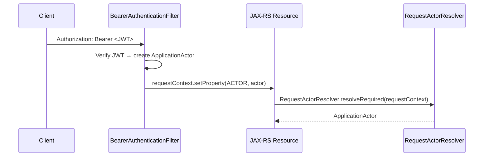

# Context Propagation

## Overview

Context propagation in the Sentinel Enforcement Platform is built on three mechanisms:

1. **SLF4J MDC** — correlation ID propagation for observability (logging, error responses)
2. **ThreadLocal** — transaction propagation across repository calls within a single thread
3. **Request-scoped properties** — authenticated actor propagation via `ContainerRequestContext` properties

There is **no distributed tracing** (OpenTelemetry is not integrated). Correlation IDs are propagated manually via headers and event envelope fields.

## CorrelationContext — SLF4J MDC Correlation ID

The `CorrelationContext` class (in `sentinel-observability`) manages a `correlationId` key in SLF4J's `MDC` (Mapped Diagnostic Context):

```java
// CorrelationContext.java
public final class CorrelationContext {
  public static final String MDC_KEY = "correlationId";
  private static final Pattern SAFE_VALUE = Pattern.compile("^[A-Za-z0-9\\-]{1,100}$");

  private CorrelationContext() {}

  public static String sanitizeOrGenerate(String candidate) {
    if (candidate != null && SAFE_VALUE.matcher(candidate).matches()) {
      return candidate;
    }
    return UUID.randomUUID().toString();
  }

  public static void bind(String correlationId) {
    MDC.put(MDC_KEY, correlationId);
  }

  public static void clear() {
    MDC.remove(MDC_KEY);
  }
}
```

**Validation rules:**
- Incoming correlation IDs are sanitized against the regex `^[A-Za-z0-9\-]{1,100}$`
- Invalid or missing IDs generate a new `UUID.randomUUID().toString()`
- This prevents injection of malicious characters into log output

## CorrelationIdFilter — JAX-RS Request/Response Filter

The `CorrelationIdFilter` (in `sentinel-api`) is a JAX-RS `ContainerRequestFilter` and `ContainerResponseFilter` registered at priority `AUTHENTICATION - 10` — it runs **before** the authentication filter.

```java
// CorrelationIdFilter.java
@Provider
@Priority(Priorities.AUTHENTICATION - 10)
public final class CorrelationIdFilter implements ContainerRequestFilter, ContainerResponseFilter {
  public static final String HEADER_NAME = "X-Correlation-Id";
  public static final String REQUEST_PROPERTY = "correlationId";

  @Override
  public void filter(ContainerRequestContext requestContext) {
    String inbound = requestContext.getHeaderString(HEADER_NAME);
    String correlationId = CorrelationContext.sanitizeOrGenerate(inbound);
    requestContext.setProperty(REQUEST_PROPERTY, correlationId);
    CorrelationContext.bind(correlationId);
  }

  @Override
  public void filter(ContainerRequestContext requestContext,
                     ContainerResponseContext responseContext) {
    Object correlationId = requestContext.getProperty(REQUEST_PROPERTY);
    if (correlationId != null) {
      responseContext.getHeaders().putSingle(HEADER_NAME, correlationId.toString());
    }
    CorrelationContext.clear();
  }
}
```

**Lifecycle:**
1. **Request filter:** Reads `X-Correlation-Id` header → sanitizes → stores as request property → binds to MDC
2. **Response filter:** Echoes the correlation ID back in the `X-Correlation-Id` response header → clears MDC

The correlation ID is also propagated to error responses via `ErrorResponseFactory.correlationId()`:

```java
// ErrorResponseFactory.java — lines 30-40
public static String correlationId(ContainerRequestContext requestContext) {
  if (requestContext == null) { return "unknown"; }
  Object correlationId = requestContext.getProperty(CorrelationIdFilter.REQUEST_PROPERTY);
  return correlationId == null ? "unknown" : correlationId.toString();
}
```

## RequestActorResolver — Authenticated Actor Propagation

The `RequestActorResolver` (in `sentinel-api`) resolves the authenticated `ApplicationActor` from request context properties set by the `BearerAuthenticationFilter`:

```java
// RequestActorResolver.java
public final class RequestActorResolver {
  public static ApplicationActor resolveRequired(ContainerRequestContext requestContext) {
    Object actor = requestContext.getProperty(BearerAuthenticationFilter.ACTOR_REQUEST_PROPERTY);
    if (actor instanceof ApplicationActor applicationActor) {
      return applicationActor;
    }
    throw new UnauthenticatedException("Authenticated actor is missing from request context.");
  }
}
```

The actor is stored as a request-scoped property by `BearerAuthenticationFilter` after JWT verification (see [Authentication and Authorization](/openwiki/security/authentication-and-authorization.md)):

```java
// BearerAuthenticationFilter.java (context)
requestContext.setProperty(ACTOR_REQUEST_PROPERTY, actor);
```

Actor retrieval flow per endpoint:



## MyBatisSessionContext — ThreadLocal Transaction Propagation

The `MyBatisSessionContext` (in `sentinel-persistence`) binds a MyBatis `SqlSession` to the current thread using a `ThreadLocal`. This allows multiple repositories called within the same service method to share the same database session and transaction:

```java
// MyBatisSessionContext.java
final class MyBatisSessionContext {
  private static final ThreadLocal<SqlSession> CURRENT_SESSION = new ThreadLocal<>();

  static SqlSession currentSession() { return CURRENT_SESSION.get(); }
  static void bind(SqlSession session) { CURRENT_SESSION.set(session); }
  static void clear() { CURRENT_SESSION.remove(); }
}
```

**Propagation pattern:**
- `MyBatisTransactionManager.required()` opens a session (if none exists), binds it to the `ThreadLocal`, executes work, commits/rolls back, then clears the `ThreadLocal`
- If a session already exists (e.g., nested service call), the inner call participates in the existing transaction without opening a new session
- This ensures all repositories (`CaseRepositoryMyBatisAdapter`, `OutboxRepositoryMyBatisAdapter`, etc.) within a single request thread share one database transaction

## EventEnvelope — Event Causality Chains

The `EventEnvelope` record carries two fields for event causality tracing:

```java
// EventEnvelope.java (sentinel-application)
public record EventEnvelope(
    UUID eventId,
    String eventType,
    int eventVersion,
    String aggregateType,
    UUID aggregateId,
    Instant occurredAt,
    String correlationId,    // propagated from the HTTP request
    String causationId,      // eventId of the event that caused this event
    EventActor actor,
    Map<String, Object> payload
) {}
```

- **`correlationId`** — The original correlation ID from the HTTP request that initiated the chain. This is obtained via `RequestMetadataResolver.correlationId(requestContext)` and passed into domain commands.
- **`causationId`** — The `eventId` of the event that caused this event to be emitted. This creates a parent-child chain across events.

**Outbox persistence includes these fields** (see `OutboxEventData.java`):

```java
// OutboxEventData.java (context from OutboxRepositoryMyBatisAdapter)
outboxEvent.envelope().correlationId(),  // stored as correlation_id column
outboxEvent.envelope().causationId(),    // stored as causation_id column
```

This enables reconstructing event causality chains:
```
HTTP Request (correlationId=A)
  └── CaseCreated (eventId=1, correlationId=A, causationId=null)
       └── CaseAssigned (eventId=2, correlationId=A, causationId=1)
            └── InvestigationStarted (eventId=3, correlationId=A, causationId=2)
```

## Context Propagation Summary

```
┌─────────────────────────────────────────────────────────────────┐
│                        HTTP Request                              │
│  Headers: Authorization: Bearer <JWT>, X-Correlation-Id: <id>   │
└──────────────────┬──────────────────────────────────────────────┘
                   │
                   ▼
┌─────────────────────────────────────────────────────────────────┐
│  CorrelationIdFilter (Priority: AUTHENTICATION - 10)             │
│  • Reads X-Correlation-Id header                                 │
│  • sanitizeCorrelationId() → UUID if invalid                     │
│  • Sets MDC[correlationId]                                       │
│  • Stores in requestContext property                             │
└──────────────────┬──────────────────────────────────────────────┘
                   │
                   ▼
┌─────────────────────────────────────────────────────────────────┐
│  BearerAuthenticationFilter (Priority: AUTHENTICATION)           │
│  • Extracts Bearer token                                         │
│  • KeycloakTokenVerifier.verify() → ApplicationActor            │
│  • Stores actor in requestContext property                       │
└──────────────────┬──────────────────────────────────────────────┘
                   │
                   ▼
┌─────────────────────────────────────────────────────────────────┐
│  JAX-RS Resource Method (e.g., CaseResource.createCase())        │
│  • RequestActorResolver.resolveRequired() → ApplicationActor    │
│  • RequestMetadataResolver.correlationId() → correlationId      │
│  • Calls ApplicationService with actor + correlationId           │
└──────────────────┬──────────────────────────────────────────────┘
                   │
                   ▼
┌─────────────────────────────────────────────────────────────────┐
│  ApplicationService                                              │
│  • MyBatisTransactionManager.required()                           │
│    └── MyBatisSessionContext.bind(session)                        │
│    └── CaseRepository.createCase(...)                             │
│    └── OutboxRepository.enqueue(...)                              │
│         └── EventEnvelope(correlationId, causationId, ...)       │
│    └── MyBatisSessionContext.clear()                              │
└──────────────────┬──────────────────────────────────────────────┘
                   │
                   ▼
┌─────────────────────────────────────────────────────────────────┐
│  CorrelationIdFilter (Response)                                  │
│  • Echoes X-Correlation-Id in response header                    │
│  • Clears MDC[correlationId]                                     │
└─────────────────────────────────────────────────────────────────┘
```

## Source Files

| File | Module | Role |
|---|---|---|
| `CorrelationContext.java` | `sentinel-observability` | SLF4J MDC correlation ID binding |
| `CorrelationIdFilter.java` | `sentinel-api` | JAX-RS filter for MDC init/cleanup |
| `RequestActorResolver.java` | `sentinel-api` | Resolve authenticated actor from request |
| `RequestMetadataResolver.java` | `sentinel-api` | Resolve correlation ID and source IP |
| `MyBatisSessionContext.java` | `sentinel-persistence` | ThreadLocal SQL session binding |
| `MyBatisTransactionManager.java` | `sentinel-persistence` | Transaction lifecycle management |
| `EventEnvelope.java` | `sentinel-application` | Event with correlationId + causationId |
| `BearerAuthenticationFilter.java` | `sentinel-api` | JWT verification → actor in context |
| `ErrorResponseFactory.java` | `sentinel-api` | Correlation ID in error responses |
