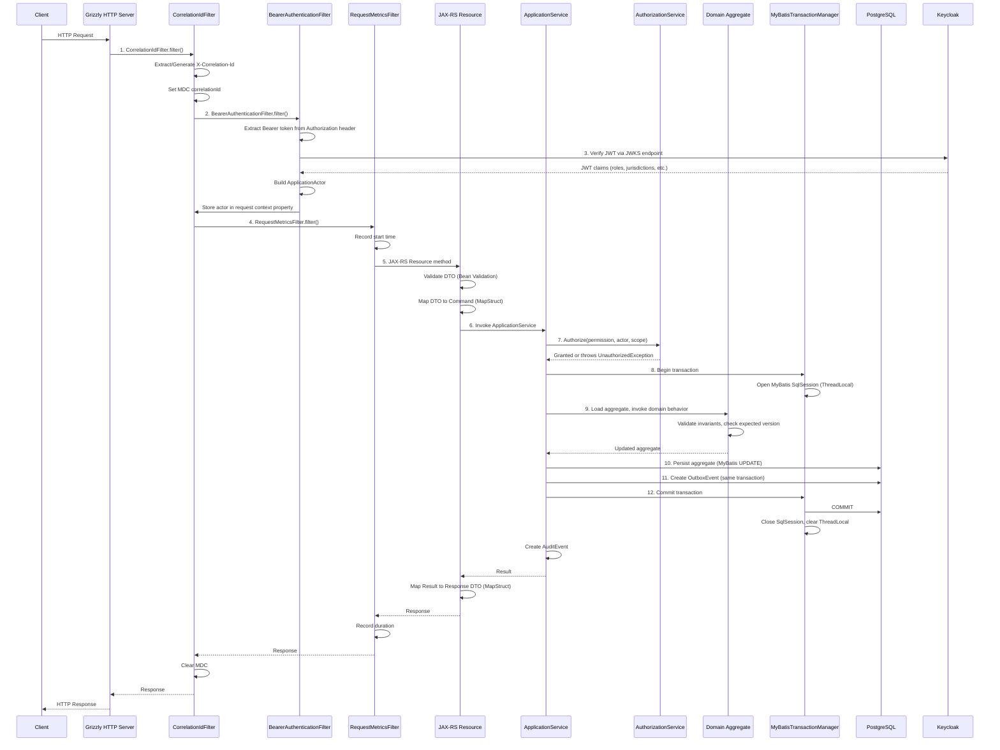
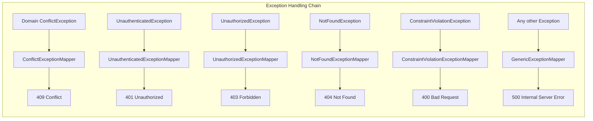

# Request Flows

This document traces a typical HTTP request through the Sentinel Enforcement Platform, from network reception to response emission.

## Request Lifecycle Stages

## Stage Details

### Stage 1: Grizzly HTTP Server

`ApplicationRuntime.start()` creates a `GrizzlyHttpServerFactory` listening on `0.0.0.0:{httpPort}` (default 8080). The `ResourceConfig` registers all JAX-RS resources, filters, exception mappers, and the HK2 `ApplicationBinder`.

**Source:** `sentinel-bootstrap/src/main/java/.../bootstrap/ApplicationRuntime.java` (lines 305-369)

### Stage 2: CorrelationIdFilter (JAX-RS ContainerRequestFilter)

- Extracts `X-Correlation-Id` from the request header or generates a new UUID.
- Stores correlation ID in SLF4J MDC for structured logging correlation.
- Registers a `ContainerResponseFilter` to clear MDC after the response.

**Source:** `sentinel-observability/src/main/java/.../observability/CorrelationIdFilter.java`

### Stage 3: BearerAuthenticationFilter (JAX-RS ContainerRequestFilter)

- Skips `GET /health` (the only public endpoint).
- Extracts the Bearer token from the `Authorization` header.
- Delegates to `KeycloakTokenVerifier` for JWT validation (issuer, audience, expiry, signature via JWKS).
- Extracts custom claims: `jurisdictions`, `assigned_units`, `case_classifications`, `conflicted_actor_ids`, plus standard claims (sub, name, email, roles/groups).
- Builds an `ApplicationActor` and stores it in `ContainerRequestContext` property `ApplicationActor.KEY`.
- On failure, throws `UnauthenticatedException` → mapped to 401 by `UnauthenticatedExceptionMapper`.

**Source:** `sentinel-api/src/main/java/.../security/BearerAuthenticationFilter.java`, `sentinel-security/src/main/java/.../security/KeycloakTokenVerifier.java`

### Stage 4: RequestMetricsFilter

- Records request start time.
- After response, records duration and publishes metrics.

**Source:** `sentinel-observability/src/main/java/.../observability/RequestMetricsFilter.java`

### Stage 5: JAX-RS Resource

- Receives the HTTP request body as an OpenAPI-generated DTO.
- Bean Validation (`jakarta.validation`) automatically validates constraint annotations on DTO fields.
- MapStruct mapper (`Api*Mapper`) converts the DTO to a domain/application command object.
- Delegates to the appropriate `ApplicationService` method.

**Source:** Resource classes in `sentinel-api/src/main/java/.../api/`

### Stage 6: ApplicationService

- Orchestrates authorization, domain logic, and persistence.
- Calls `AuthorizationService.authorize()` with the required `Permission` and `ApplicationActor`.
- If the command is a state transition, calls `PhaseSevenCaseProgressionGuard` to validate cross-aggregate constraints.

### Stage 7: Authorization

Multi-axis check performed by `RoleBasedAuthorizationService`:
1. Admin bypass (SYSTEM_ADMIN role)
2. Role-Permission mapping
3. Jurisdiction match
4. Classification clearance
5. Conflict-of-interest detection
6. Assigned unit scope
7. Direct assignment check (for INVESTIGATOR role only)

**Source:** `sentinel-application/src/main/java/.../application/security/AuthorizationService.java`, `sentinel-security/src/main/java/.../security/RoleBasedAuthorizationService.java`

### Stage 8: Transaction Management

`MyBatisTransactionManager` opens a MyBatis `SqlSession` stored in `MyBatisSessionContext` ThreadLocal. The session is committed on success or rolled back on exception, then always closed and removed from ThreadLocal.

### Stage 9: Domain Logic

The aggregate root's domain method validates invariants, checks the expected version, performs state transitions, and returns the updated aggregate. No side effects occur outside the aggregate.

### Stage 10-11: Persistence + Outbox

Both the aggregate update and the outbox event INSERT occur in the same database transaction, ensuring atomicity.

### Stage 12: Response

The response DTO is built from the result via MapStruct, serialized to JSON by Jackson, and returned. The `CorrelationIdFilter` response filter clears MDC.

## Error Flow

All exception mappers produce an RFC 7807 Problem Details JSON response.

**Source:** `sentinel-api/src/main/java/.../api/error/ErrorResponseFactory.java`, all `*ExceptionMapper` classes in the same package.

## Source References

- `sentinel-bootstrap/src/main/java/.../bootstrap/ApplicationRuntime.java` — Grizzly server startup, filter/resource registration
- `sentinel-api/src/main/java/.../security/BearerAuthenticationFilter.java` — JWT extraction and actor setup
- `sentinel-security/src/main/java/.../security/KeycloakTokenVerifier.java` — JWT verification
- `sentinel-observability/src/main/java/.../observability/CorrelationIdFilter.java` — Correlation ID management
- `sentinel-observability/src/main/java/.../observability/RequestMetricsFilter.java` — Request timing
- `sentinel-application/src/main/java/.../application/security/AuthorizationService.java` — Authorization interface
- `sentinel-security/src/main/java/.../security/RoleBasedAuthorizationService.java` — Authorization implementation
- `sentinel-persistence/src/main/java/.../persistence/MyBatisTransactionManager.java` — Transaction lifecycle
- `sentinel-persistence/src/main/java/.../persistence/MyBatisSessionContext.java` — ThreadLocal session holder
- `sentinel-api/src/main/java/.../api/error/ErrorResponseFactory.java` — Error envelope generation
- `/openwiki/runtime/context-propagation.md` — Context propagation details
- `/openwiki/runtime/traffic-flows.md` — External traffic patterns
- `/openwiki/security/authentication.md` — JWT authentication
- `/openwiki/security/authorization.md` — Role-based authorization
