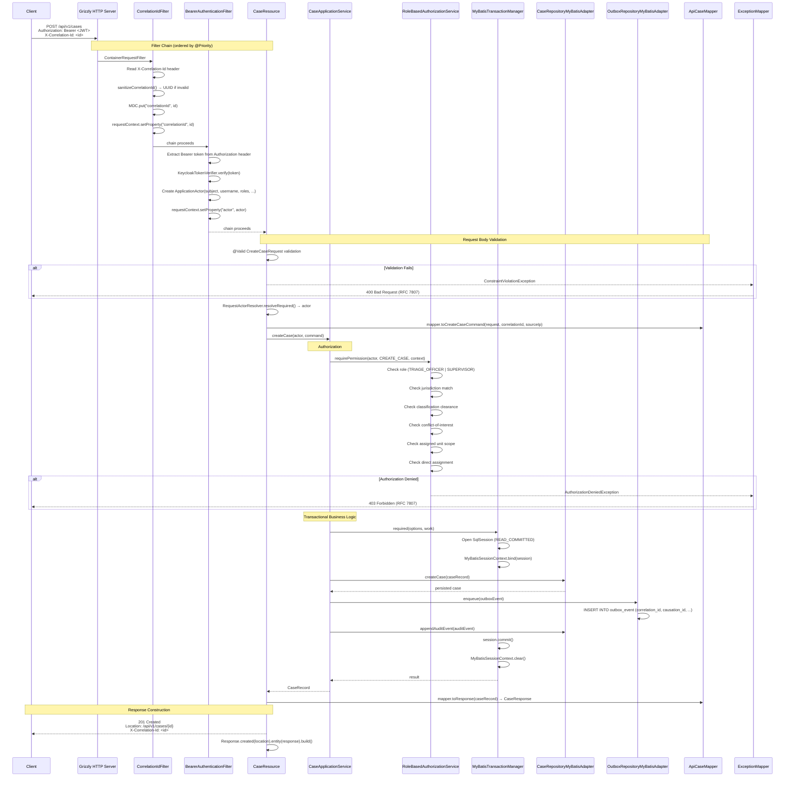

# Traffic and Request Flows

## Overview

Every HTTP request to the Sentinel Enforcement Platform passes through a deterministic pipeline of JAX-RS filters and exception mappers before reaching the resource method. This document traces the full lifecycle of a `POST /api/v1/cases` request from network arrival to response.

## Complete Request Lifecycle

### Step 1 — Request Arrives at Grizzly HTTP Server

The application starts an HTTP server via `GrizzlyHttpServerFactory.createHttpServer()` in `ApplicationRuntime.java` (line 366). Grizzly (NIO transport) receives the TCP connection and hands it to Jersey's request processing pipeline.

```java
// ApplicationRuntime.java — lines 365-369
HttpServer server =
    GrizzlyHttpServerFactory.createHttpServer(
        URI.create("http://0.0.0.0:" + configuration.httpPort() + "/"),
        resourceConfig,
        false);
server.start();
```

- **Host:** `0.0.0.0` (all interfaces)
- **Port:** Configurable via `configuration.httpPort()`
- **Transport:** Grizzly NIO, but request processing is synchronous (one thread per request)

### Step 2 — CorrelationIdFilter (Priority: AUTHENTICATION - 10)

The `CorrelationIdFilter` runs first, before authentication. It reads the `X-Correlation-Id` request header, sanitizes it, and binds it to SLF4J MDC.

```java
// CorrelationIdFilter.java — lines 19-25
@Override
public void filter(ContainerRequestContext requestContext) {
  String inbound = requestContext.getHeaderString(HEADER_NAME);
  String correlationId = CorrelationContext.sanitizeOrGenerate(inbound);
  requestContext.setProperty(REQUEST_PROPERTY, correlationId);
  CorrelationContext.bind(correlationId);
}
```

- If the header is missing or fails the `^[A-Za-z0-9\-]{1,100}$` validation, a new `UUID.randomUUID()` is generated
- The correlation ID is stored both in the request context property and the MDC

### Step 3 — BearerAuthenticationFilter (Priority: AUTHENTICATION)

The `BearerAuthenticationFilter` extracts and verifies the Bearer JWT token. The `/health` endpoint is exempted.

```java
// BearerAuthenticationFilter.java — lines 28-41
@Override
public void filter(ContainerRequestContext requestContext) {
  if (isPublicEndpoint(requestContext)) { return; }
  String authorizationHeader = requestContext.getHeaderString(HttpHeaders.AUTHORIZATION);
  if (authorizationHeader == null || !authorizationHeader.startsWith("Bearer ")) {
    throw new UnauthenticatedException("Bearer access token is required.");
  }
  String token = authorizationHeader.substring("Bearer ".length()).trim();
  ApplicationActor actor = tokenVerifier.verify(token);
  requestContext.setProperty(ACTOR_REQUEST_PROPERTY, actor);
}
```

- JWT verification uses `KeycloakTokenVerifier` (Nimbus JOSE + `RemoteJWKSet` for RS256)
- Failure throws `UnauthenticatedException` → mapped to `401 Unauthorized` by `UnauthenticatedExceptionMapper`
- On success, the `ApplicationActor` is stored as a request-scoped property

### Step 4 — RequestMetricsFilter (Optional)

The `RequestMetricsFilter` records request timing metrics using `InMemoryMetricsRecorder`. It runs at the default Jersey filter priority.

### Step 5 — JAX-RS Resource Method Called (e.g., CaseResource.createCase())

The request is dispatched to the matching resource method. For `POST /api/v1/cases`, this is `CaseResource.createCase()`:

```java
// CaseResource.java — lines 51-69
@POST
public Response createCase(
    @Valid CreateCaseRequest request,
    @Context UriInfo uriInfo,
    @Context ContainerRequestContext requestContext) {
  ApplicationActor actor = RequestActorResolver.resolveRequired(requestContext);
  CaseResponse response =
      mapper.toResponse(
          caseApplicationService.createCase(
              actor,
              mapper.toCreateCaseCommand(
                  request,
                  RequestMetadataResolver.correlationId(requestContext),
                  RequestMetadataResolver.sourceIp(requestContext))));
  return Response.created(
          uriInfo.getAbsolutePathBuilder().path(response.getId().toString()).build())
      .entity(response)
      .build();
}
```

### Step 6 — Request Body Validation via @Valid

The `@Valid` annotation on the `CreateCaseRequest` parameter triggers Bean Validation (JSR-380) before the method body executes. If validation fails, a `ConstraintViolationException` is thrown and handled by `ConstraintViolationExceptionMapper`, returning `400 Bad Request` with RFC 7807 problem details.

### Step 7 — Resource Calls ApplicationService

The resource constructs a `CreateCaseCommand` (with correlation ID and source IP from `RequestMetadataResolver`) and delegates to `CaseApplicationService.createCase()`.

### Step 8 — ApplicationService Calls AuthorizationService.requirePermission()

```java
// CaseApplicationService.java (conceptual flow)
public CaseRecord createCase(ApplicationActor actor, CreateCaseCommand command) {
  authorizationService.requirePermission(actor, Permission.CREATE_CASE,
      new AuthorizationContext(..., CaseAuthorizationScope.RESTRICTED_TO_ASSIGNED_UNITS_WHEN_PRESENT));
  // ... business logic follows
}
```

- `RoleBasedAuthorizationService.requirePermission()` executes **six authorization axes** (see [Authentication and Authorization](/openwiki/security/authentication-and-authorization.md))
- Failure throws `AuthorizationDeniedException` → mapped to `403 Forbidden` by `AuthorizationDeniedExceptionMapper`

### Step 9 — Business Logic: Domain Aggregate + Persistence + Outbox

The service executes the core business logic within a transaction:

1. Creates the domain `CaseRecord` aggregate
2. Persists via `CaseRepositoryMyBatisAdapter`
3. Enqueues an outbox event via `OutboxRepositoryMyBatisAdapter` (stored in `outbox_event` table)
4. Appends audit events via `caseRepository.appendAuditEvent()`

All within a single `MyBatisTransactionManager.required()` block.

### Step 10 — Transaction Committed

`MyBatisTransactionManager.required()` commits the transaction (via `session.commit()`) and clears the `ThreadLocal<SqlSession>` binding. On failure, it rolls back (`session.rollback()`).

### Step 11 — MapStruct Mapper Converts Response

The `ApiCaseMapper` (MapStruct-generated) converts the domain `CaseRecord` to a `CaseResponse` DTO:

```java
CaseResponse response = mapper.toResponse(caseApplicationService.createCase(...));
```

### Step 12 — Error Handling via Exception Mappers

If any exception propagates out of the resource method, the matching exception mapper converts it to an RFC 7807 Problem JSON response:

| Exception | Mapper | HTTP Status |
|---|---|---|
| `ConstraintViolationException` | `ConstraintViolationExceptionMapper` | 400 |
| `UnauthenticatedException` | `UnauthenticatedExceptionMapper` | 401 |
| `AuthorizationDeniedException` | `AuthorizationDeniedExceptionMapper` | 403 |
| `CaseNotFoundException` | `CaseNotFoundExceptionMapper` | 404 |
| `EvidenceConflictException` | `EvidenceConflictExceptionMapper` | 409 |
| `GenericExceptionMapper` | Any unhandled exception | 500 |

All error responses include the correlation ID:

```json
{
  "type": "https://sentinel.local/errors/case-not-found",
  "title": "Not Found",
  "status": 404,
  "code": "CASE_NOT_FOUND",
  "detail": "Case 123e4567-e89b-12d3-a456-426614174000 was not found.",
  "instance": "/api/v1/cases/123e4567-e89b-12d3-a456-426614174000",
  "correlationId": "abc-123-def-456"
}
```

## Mermaid Sequence Diagram — Full HTTP Request Lifecycle



## Filter and Resource Registration

All filters, resources, and exception mappers are registered in `ApplicationRuntime.java` via `ResourceConfig` (lines 305-363):

```java
ResourceConfig resourceConfig =
    new ResourceConfig()
        .register(new ApplicationBinder(...))
        .register(new RequestMetricsFilter(metricsRecorder))
        .register(JacksonFeature.class)
        .register(ObjectMapperContextResolver.class)
        .register(CorrelationIdFilter.class)           // Priority: AUTHENTICATION - 10
        .register(BearerAuthenticationFilter.class)     // Priority: AUTHENTICATION
        .register(ConstraintViolationExceptionMapper.class)
        .register(BadRequestExceptionMapper.class)
        .register(UnauthenticatedExceptionMapper.class)
        .register(AuthorizationDeniedExceptionMapper.class)
        // ... 20+ additional exception mappers ...
        .register(CaseResource.class)
        .register(ReportResource.class)
        // ... additional resource classes ...
        .property(ServerProperties.WADL_FEATURE_DISABLE, true);
```

## Filter Execution Order

JAX-RS filters execute in ascending `@Priority` order:

| Priority | Filter | Purpose |
|---|---|---|
| `AUTHENTICATION - 10` (4990) | `CorrelationIdFilter` | MDC correlation ID setup |
| `AUTHENTICATION` (5000) | `BearerAuthenticationFilter` | JWT authentication |
| Default (5001+) | `RequestMetricsFilter` | Request timing metrics |

## Source Files

| File | Module | Role |
|---|---|---|
| `ApplicationRuntime.java` | `sentinel-bootstrap` | Server startup, filter/resource registration |
| `CorrelationIdFilter.java` | `sentinel-api` | Correlation ID injection into MDC |
| `BearerAuthenticationFilter.java` | `sentinel-api` | JWT Bearer token authentication |
| `CaseResource.java` | `sentinel-api` | `POST /api/v1/cases` and other case endpoints |
| `ErrorResponseFactory.java` | `sentinel-api` | RFC 7807 Problem JSON response factory |
| `ConstraintViolationExceptionMapper.java` | `sentinel-api` | Bean validation error → 400 |
| `UnauthenticatedExceptionMapper.java` | `sentinel-api` | Auth failure → 401 |
| `AuthorizationDeniedExceptionMapper.java` | `sentinel-api` | Permission denied → 403 |
| `GenericExceptionMapper.java` | `sentinel-api` | Unhandled exceptions → 500 |
