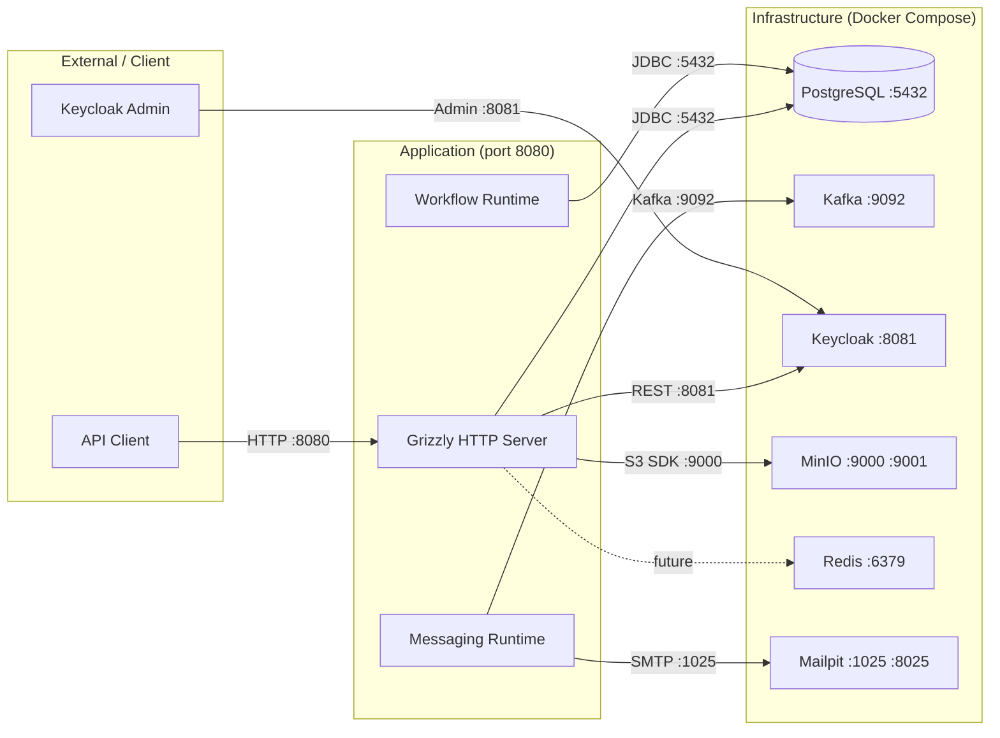

# Traffic Flows

This document describes how external traffic reaches and leaves the Sentinel Enforcement Platform.

## Network Topology

**Only `GET /health` is publicly accessible.** All other endpoints require a Bearer JWT token.

**Source:** `docker-compose.yaml`, `sentinel-bootstrap/src/main/java/.../bootstrap/ApplicationRuntime.java`

## HTTP Request Traffic

### Inbound HTTP

Requests arrive on port 8080 (configurable via `HTTP_PORT`). The Grizzly HTTP server accepts connections and delegates to the Jersey JAX-RS layer. See [Request Flows](./request-flows.md) for the full request lifecycle.

### Public Endpoint

| Method | Path | Purpose |
|---|---|---|
| GET | `/health` | Composite health check (database, Kafka, Redis, Mailpit, workflow). No authentication required. |

**Source:** `sentinel-api/src/main/java/.../api/health/HealthResource.java`, `sentinel-observability/src/main/java/.../observability/CompositeHealthStatusService.java`

### Authenticated Endpoints

All other API endpoints require a Bearer JWT token. See [Endpoint Catalog](../interfaces/endpoint-catalog.md) for the complete inventory.

## Kafka Event Traffic

The platform maintains 9 Kafka topics across three groups:

### Domain Lifecycle Topics

| Topic | Producer | Consumer | Payload |
|---|---|---|---|
| `case.lifecycle.v1` | `CaseApplicationService` (via outbox) | None (future use) | CaseCreated, CaseAssigned, CaseTransitioned, etc. |
| `case.assignment.v1` | `CaseApplicationService` (via outbox) | None (future use) | CaseAssignmentCreated, CaseAssignmentReleased |
| `evidence.lifecycle.v1` | `EvidenceApplicationService` (via outbox) | None (future use) | EvidenceFinalized, etc. |
| `decision.lifecycle.v1` | `DecisionApplicationService` (via outbox) | None (future use) | DecisionPublished events |
| `sanction.lifecycle.v1` | `DecisionApplicationService` (via outbox) | None (future use) | SanctionObligationCreated |
| `appeal.lifecycle.v1` | `AppealApplicationService` (via outbox) | None (future use) | AppealCreated, AppealDecided |

### Integration Topics

| Topic | Producer | Consumer | Payload |
|---|---|---|---|
| `notification.command.v1` | Application services (via outbox) | `KafkaNotificationConsumer` | Notification dispatch commands |
| `notification.result.v1` | `NotificationEmailSender` | None (future use) | Notification delivery results |
| `audit.integration.v1` | Application services (via outbox) | None (future use) | Audit events for external systems |

### Retry and Dead-Letter

Each topic has automatically created retry (`.retry`) and dead-letter (`.dlq`) topics. See [Event Catalog](../messaging/event-catalog.md) for details.

## Health Check Traffic

The `GET /health` endpoint performs periodic checks against all infrastructure services:

| Check | Implementation | Failure Impact |
|---|---|---|
| PostgreSQL | `SELECT 1` via JDBC | Service unavailable |
| Kafka | `AdminClient.listTopics()` | Messaging unavailable |
| Redis | `PING` via Jedis | Cache unavailable (not currently used) |
| Mailpit | SMTP connection test | Email sending unavailable |
| Workflow | `WorkflowReadinessProbe.processEngine.isActive()` | Task processing unavailable |

## Database Traffic (PostgreSQL :5432)

- **Connection pool:** HikariCP (max pool size: 20, configurable via `DATA_SOURCE_MAX_POOL_SIZE`)
- **Schema:** Application tables under default schema + Camunda internal tables (ACT_*)
- **Access:** Only the Sentinel application JVM connects directly to PostgreSQL
- **No external database access:** No reporting tools, direct queries, or external ETL connections

## Certificate and TLS

- **Inter-service communication:** No TLS between containers. Docker Compose services communicate over plain TCP.
- **JWT signing:** Keycloak uses RS256; no client certificate authentication.
- **MinIO:** Presigned URLs use HTTPS if the application is served over HTTPS; Docker Compose uses HTTP.

## Outbound SMTP Traffic

Outbound notification emails are sent via SMTP to Mailpit (port 1025). Mailpit captures all emails for inspection via its web UI (port 8025). In production, the SMTP host would be configured to point to a real email service via `SMTP_HOST`, `SMTP_PORT`, `SMTP_USERNAME`, `SMTP_PASSWORD`.

## Knowledge Gaps

- The platform has not been tested behind a reverse proxy (e.g., nginx, HAProxy) or load balancer.
- No TLS termination is configured at the application level.
- Network policies for multi-instance deployment are undefined.

## Source References

- `/docker-compose.yaml` — Service definitions, ports, networks
- `/.env.example` — Environment variable configuration
- `sentinel-bootstrap/src/main/java/.../bootstrap/AppConfiguration.java` — Runtime settings (ports, hosts)
- `sentinel-bootstrap/src/main/java/.../bootstrap/ApplicationRuntime.java` — Server startup configuration
- `sentinel-observability/src/main/java/.../observability/CompositeHealthStatusService.java` — Health check composition
- `sentinel-application/src/main/java/.../application/messaging/MessagingTopics.java` — Topic definitions
- `sentinel-messaging/src/main/java/.../messaging/KafkaOutboxPublisher.java` — Outbound Kafka publisher
- `sentinel-messaging/src/main/java/.../messaging/KafkaNotificationConsumer.java` — Inbound Kafka consumer
- `sentinel-messaging/src/main/java/.../messaging/NotificationEmailSender.java` — SMTP email sending
- `/openwiki/runtime/request-flows.md` — Internal request lifecycle
- `/openwiki/messaging/event-catalog.md` — Event and topic details
- `/openwiki/integrations/external-services.md` — Infrastructure service details
