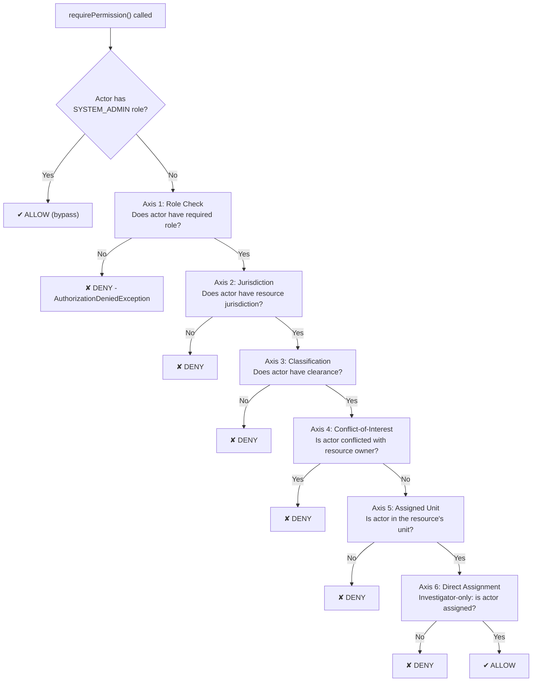

# Authentication and Authorization

## Overview

The Sentinel Enforcement Platform uses a **Bearer JWT** authentication model backed by **Keycloak** as the identity provider, with a **multi-axis role-based authorization** system that evaluates six distinct dimensions before granting access to any resource.

## Architecture

```
┌──────────────┐     ┌──────────────────┐     ┌──────────────────────┐
│   Client     │────►│   Grizzly/Jersey  │────►│  BearerAuthFilter    │
│   (Bearer    │     │   (JAX-RS)        │     │                      │
│    JWT)      │     │                   │     │  isPublicEndpoint?   │
└──────────────┘     └──────────────────┘     │  Extract Bearer      │
                                              │  Verify JWT          │
                                              └──────────┬───────────┘
                                                         │ ApplicationActor
                                                         ▼
┌──────────────────────────────────────────────────────────────────┐
│                    RoleBasedAuthorizationService                   │
│                                                                  │
│  Axis 1:  Role check           (requiredRoles for Permission)    │
│  Axis 2:  Jurisdiction match   (actor has resource jurisdiction) │
│  Axis 3:  Classification       (actor clearance ≥ resource)      │
│  Axis 4:  Conflict-of-interest (actor not in conflicted set)     │
│  Axis 5:  Assigned unit scope  (actor assigned to unit)          │
│  Axis 6:  Direct assignment    (investigator → assigned case)    │
│                                                                  │
│  SYSTEM_ADMIN → bypass all axes                                  │
└──────────────────────────────────────────────────────────────────┘
```

## Authentication — Bearer JWT

### Token Verification

All endpoints except `/health` require a valid Bearer JWT token. Verification is performed by `KeycloakTokenVerifier` (in `sentinel-security`):

```java
// KeycloakTokenVerifier.java — lines 52-73
@Override
public ApplicationActor verify(String bearerToken) {
  try {
    JWTClaimsSet claims = jwtProcessor.process(bearerToken, null);
    validateClaims(claims);
    return new ApplicationActor(
        requiredClaim(claims.getSubject(), "sub"),
        requiredClaim(claims.getStringClaim(CLAIM_PREFERRED_USERNAME), CLAIM_PREFERRED_USERNAME),
        extractRoles(claims),
        extractStringSet(claims, CLAIM_JURISDICTIONS),
        extractStringSet(claims, CLAIM_ASSIGNED_UNITS),
        extractCaseClassifications(claims),
        extractStringSet(claims, CLAIM_CONFLICTED_ACTOR_IDS));
  } catch (UnauthenticatedException exception) {
    throw exception;
  } catch (Exception exception) {
    throw new UnauthenticatedException("Access token is invalid.", exception);
  }
}
```

- **Library:** Nimbus JOSE + JWT
- **Algorithm:** RS256 (RSA family, determined by `JWSAlgorithmFamilyJWSKeySelector`)
- **Key source:** `RemoteJWKSet` — fetches public keys from Keycloak's JWKS endpoint
- **Validation performed:** issuer, audience, expiration (`exp`), not-before (`nbf`)

```java
// KeycloakTokenVerifier.java — lines 156-168
private static JWTProcessor<SecurityContext> createJwtProcessor(
    KeycloakSecurityConfiguration configuration) {
  URL jwksUrl = configuration.jwksUri().toURL();
  JWKSource<SecurityContext> jwkSource = new RemoteJWKSet<>(jwksUrl);
  DefaultJWTProcessor<SecurityContext> processor = new DefaultJWTProcessor<>();
  processor.setJWSKeySelector(
      new JWSAlgorithmFamilyJWSKeySelector<>(JWSAlgorithm.Family.RSA, jwkSource));
  return processor;
}
```

### Public Endpoint

Only one endpoint is public:

```java
// BearerAuthenticationFilter.java — lines 43-46
private boolean isPublicEndpoint(ContainerRequestContext requestContext) {
  String path = requestContext.getUriInfo().getPath(false);
  return "health".equals(path);
}
```

All other requests without a valid Bearer token receive a `401 UnauthenticatedException` mapped to `401 Unauthorized`.

## Authorization — Six-Axis Model

The `RoleBasedAuthorizationService` (in `sentinel-security`) implements a six-axis authorization model through the `requirePermission()` method:

```java
// RoleBasedAuthorizationService.java — lines 16-65
@Override
public void requirePermission(
    ApplicationActor actor, Permission permission, AuthorizationContext authorizationContext) {
  // Axis 0: SYSTEM_ADMIN bypass
  if (actor.hasRole(SYSTEM_ADMIN_ROLE)) { return; }

  // Axis 1: Role check
  if (requiredRoles(permission).stream().noneMatch(actor::hasRole)) {
    throw new AuthorizationDeniedException(...);
  }

  // Axis 2: Jurisdiction match
  if (jurisdictionCode != null && !actor.hasJurisdiction(jurisdictionCode)) {
    throw new AuthorizationDeniedException(...);
  }

  // Axis 3: Classification clearance
  if (authorizationContext.caseClassification() != null
      && !actor.hasCaseClassification(authorizationContext.caseClassification())) {
    throw new AuthorizationDeniedException(...);
  }

  // Axis 4: Conflict-of-interest
  if (authorizationContext.resourceOwnerId() != null
      && actor.isConflictedWith(authorizationContext.resourceOwnerId())) {
    throw new AuthorizationDeniedException(...);
  }

  // Axis 5: Assigned unit scope
  enforceAssignedUnitScope(actor, authorizationContext);

  // Axis 6: Direct assignment (investigator-only)
  if (requiresDirectAssignment(actor, permission)
      && !Objects.equals(actor.username(), authorizationContext.assigneeUserId())) {
    throw new AuthorizationDeniedException(...);
  }
}
```

### Axis 1 — Role Check

Each `Permission` maps to a set of required roles. The actor must have at least one of these roles:

| Permission | Required Roles |
|---|---|
| `CREATE_REPORT` | `CASE_INTAKE_OFFICER` |
| `READ_REPORT` | `CASE_INTAKE_OFFICER`, `TRIAGE_OFFICER`, `AUDITOR` |
| `TRIAGE_REPORT` | `TRIAGE_OFFICER`, `SUPERVISOR` |
| `CREATE_CASE` | `TRIAGE_OFFICER`, `SUPERVISOR` |
| `READ_CASE`, `LIST_CASES` | `TRIAGE_OFFICER`, `INVESTIGATOR`, `CASE_REVIEWER`, `DECISION_MAKER`, `APPEAL_OFFICER`, `SUPERVISOR`, `AUDITOR` |
| `CREATE_EVIDENCE_UPLOAD_SESSION`, `FINALIZE_EVIDENCE`, `READ_EVIDENCE`, `CREATE_EVIDENCE_DOWNLOAD_SESSION` | `TRIAGE_OFFICER`, `INVESTIGATOR`, `CASE_REVIEWER`, `DECISION_MAKER`, `APPEAL_OFFICER`, `SUPERVISOR`, `AUDITOR` |
| `CREATE_RECOMMENDATION`, `SUBMIT_RECOMMENDATION` | `INVESTIGATOR`, `SUPERVISOR` |
| `REVIEW_RECOMMENDATION` | `CASE_REVIEWER`, `SUPERVISOR` |
| `CREATE_DECISION`, `APPROVE_DECISION`, `PUBLISH_DECISION` | `DECISION_MAKER`, `SUPERVISOR` |
| `CREATE_APPEAL`, `DECIDE_APPEAL` | `APPEAL_OFFICER`, `SUPERVISOR` |
| `ASSIGN_CASE` | `TRIAGE_OFFICER`, `SUPERVISOR` |
| `TRANSITION_CASE` | `TRIAGE_OFFICER`, `INVESTIGATOR`, `CASE_REVIEWER`, `DECISION_MAKER`, `APPEAL_OFFICER`, `SUPERVISOR` |
| `READ_CASE_AUDIT` | `SUPERVISOR`, `AUDITOR` |
| `LIST_TASKS`, `CLAIM_TASK`, `COMPLETE_TASK` | `TRIAGE_OFFICER`, `INVESTIGATOR`, `CASE_REVIEWER`, `DECISION_MAKER`, `APPEAL_OFFICER`, `SUPERVISOR` |
| `RECONCILE_WORKFLOW` | `SUPERVISOR` |
| `MANAGE_CASE_RELATIONSHIPS` | `TRIAGE_OFFICER`, `SUPERVISOR` |
| `RUN_MAINTENANCE_OPERATION` | `SUPERVISOR` |

### Axis 2 — Jurisdiction Match

The actor must have the resource's jurisdiction code in their `jurisdictions` claim. Jurisdictions are extracted from the JWT `jurisdictions` custom claim.

### Axis 3 — Classification Clearance

The actor's `case_classifications` claim (from the JWT) is compared against the resource's `CaseClassification`. If the actor's set does not contain the resource's classification, access is denied. If the claim is absent from the JWT, the actor defaults to `EnumSet.allOf(CaseClassification.class)` (full clearance).

### Axis 4 — Conflict-of-Interest

If the resource has a `resourceOwnerId` and that ID appears in the actor's `conflicted_actor_ids` claim, access is denied. This prevents investigators from accessing cases involving parties they are conflicted with.

### Axis 5 — Assigned Unit Scope

The `enforceAssignedUnitScope()` method checks:

```java
// RoleBasedAuthorizationService.java — lines 146-165
private void enforceAssignedUnitScope(
    ApplicationActor actor, AuthorizationContext authorizationContext) {
  String assignedUnitId = authorizationContext.assignedUnitId();
  if (assignedUnitId == null
      || authorizationContext.authorizationScope() == CaseAuthorizationScope.NONE) {
    return;
  }
  if (!isUnitScopedActor(actor)) { return; }
  if (actor.hasAssignedUnit(assignedUnitId)) { return; }
  throw new AuthorizationDeniedException(...);
}
```

- `AUDITOR` and `SYSTEM_ADMIN` are not unit-scoped
- All other roles are unit-scoped and must have the resource's `assignedUnitId` in their `assigned_units` JWT claim

### Axis 6 — Direct Assignment (Investigator-Only)

For a subset of permissions (`READ_CASE`, `TRANSITION_CASE`, evidence operations, recommendation operations), an actor with only the `INVESTIGATOR` role must be the direct assignee of the case:

```java
// RoleBasedAuthorizationService.java — lines 123-144
private boolean requiresDirectAssignment(ApplicationActor actor, Permission permission) {
  // Only applies to a specific set of permissions
  if (!isCaseLevelPermission(permission)) { return false; }
  if (!actor.hasRole("INVESTIGATOR")) { return false; }
  // Bypass if actor also has other roles
  return !actor.hasRole("SUPERVISOR") && !actor.hasRole("TRIAGE_OFFICER") && ...;
}
```

If the actor has only `INVESTIGATOR`, they can only access cases where `actor.username()` matches the case's `assigneeUserId`.

### SYSTEM_ADMIN Override

The `SYSTEM_ADMIN` role bypasses **all** authorization checks entirely:

```java
if (actor.hasRole(SYSTEM_ADMIN_ROLE)) { return; }
```

## Custom JWT Claims

The following custom claims are extracted from the Keycloak JWT by `KeycloakTokenVerifier`:

| Claim | Type | Purpose |
|---|---|---|
| `jurisdictions` | `String` or `Set<String>` | Jurisdiction codes the actor can access |
| `assigned_units` | `String` or `Set<String>` | Unit IDs the actor is assigned to |
| `case_classifications` | `String` or `Set<String>` | `CaseClassification` enum values the actor is cleared for |
| `conflicted_actor_ids` | `String` or `Set<String>` | Actor IDs that represent conflicts of interest |

These are configured in the Keycloak realm (`sentinel-realm.json`) as **mapper claims** on the client or realm-level token.

## ApplicationActor Record

The actor is modeled as an immutable record:

```java
// ApplicationActor.java (sentinel-application)
public record ApplicationActor(
    String subject,
    String username,
    Set<String> roles,
    Set<String> jurisdictions,
    Set<String> assignedUnits,
    Set<CaseClassification> caseClassifications,
    Set<String> conflictedActorIds
) {
  public boolean hasRole(String role) { ... }
  public boolean hasJurisdiction(String jurisdictionCode) { ... }
  public boolean hasAssignedUnit(String assignedUnitId) { ... }
  public boolean hasCaseClassification(CaseClassification classification) { ... }
  public boolean isConflictedWith(String actorId) { ... }
}
```

## CaseAuthorizationScope

The `CaseAuthorizationScope` enum controls how strictly unit scoping is enforced:

```java
// CaseAuthorizationScope.java (sentinel-application)
public enum CaseAuthorizationScope {
  NONE,                                    // No unit scoping enforced
  RESTRICTED_TO_ASSIGNED_UNITS,            // Unit scope always required
  RESTRICTED_TO_ASSIGNED_UNITS_WHEN_PRESENT // Unit scope required when assignedUnitId is set
}
```

## AuthorizationContext

The `AuthorizationContext` record carries all authorization-relevant data for a single authorization check:

```java
// AuthorizationContext.java (sentinel-application)
public record AuthorizationContext(
    String jurisdictionCode,
    String resourceType,
    String resourceId,
    UUID caseId,
    String assigneeUserId,
    String assignedUnitId,
    CaseClassification caseClassification,
    String resourceOwnerId,
    CaseAuthorizationScope authorizationScope
) {}
```

## Mermaid — Authorization Decision Flow



## Source Files

| File | Module | Role |
|---|---|---|
| `KeycloakTokenVerifier.java` | `sentinel-security` | JWT verification via Nimbus JOSE + RemoteJWKSet |
| `KeycloakSecurityConfiguration.java` | `sentinel-security` | Keycloak issuer, audience, JWKS URI config |
| `RoleBasedAuthorizationService.java` | `sentinel-security` | Six-axis authorization logic |
| `ApplicationActor.java` | `sentinel-application` | Authenticated actor record with role/permission checks |
| `AuthorizationContext.java` | `sentinel-application` | Authorization context record |
| `AuthorizationService.java` | `sentinel-application` | Authorization port interface |
| `Permission.java` | `sentinel-application` | All permission enum values |
| `CaseAuthorizationScope.java` | `sentinel-application` | Unit scoping level enum |
| `BearerAuthenticationFilter.java` | `sentinel-api` | JAX-RS filter for Bearer token extraction |
| `sentinel-realm.json` | `sentinel-security` | Keycloak realm configuration |
