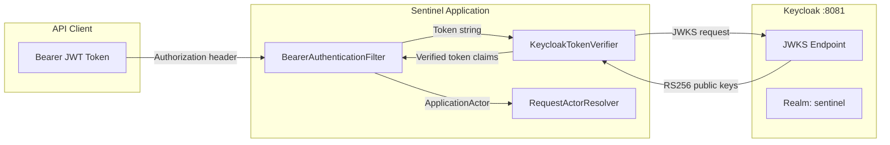

# Authentication

The Sentinel Enforcement Platform uses **Bearer JWT** authentication with **Keycloak** as the identity provider. All API endpoints except `GET /health` require a valid JWT access token.

## Architecture

**Source:** `sentinel-security/src/main/java/.../security/KeycloakTokenVerifier.java`, `sentinel-api/src/main/java/.../security/BearerAuthenticationFilter.java`

## JWT Verification Flow

### 1. Token Extraction (`BearerAuthenticationFilter`)

- The filter implements `ContainerRequestFilter` and runs on every request.
- Exempts `GET /health` from authentication checks.
- Extracts the `Authorization` header value and parses the Bearer token.
- If the header is missing or malformed, throws `UnauthenticatedException` → HTTP 401.

### 2. Token Verification (`KeycloakTokenVerifier`)

Uses the **Nimbus JOSE + JWT** library to:

- **Validate issuer:** Must match the Keycloak realm issuer URL (`http://keycloak:8081/realms/sentinel`)
- **Validate audience:** Must include the expected client ID
- **Validate expiry:** Token must not be expired (`exp` claim)
- **Validate not-before:** Token must be active (`nbf` claim, if present)
- **Verify signature:** Downloads JWKS from `{keycloakBaseUrl}/realms/{realm}/protocol/openid-connect/certs` using `RemoteJWKSet`
- **Extract custom claims:** Parses `jurisdictions`, `assigned_units`, `case_classifications`, and `conflicted_actor_ids` from the token

### 3. Actor Construction

The verified token is used to build an `ApplicationActor` containing:
- `id` — Actor unique identifier (from `sub` claim)
- `name` — Actor display name (from `name` claim)
- `email` — Actor email (from `email` claim)
- `roles` — List of Keycloak role assignments
- `jurisdictionCode` — From `jurisdictions` custom claim
- `assignedUnitId` — From `assigned_units` custom claim
- `caseClassification` — From `case_classifications` custom claim
- `conflictedActorIds` — From `conflicted_actor_ids` custom claim

The `ApplicationActor` is stored as a `ContainerRequestContext` property and accessed via `RequestActorResolver.resolveRequired()`.

**Source:** `sentinel-application/src/main/java/.../application/security/ApplicationActor.java`, `sentinel-api/src/main/java/.../security/RequestActorResolver.java`

## Public Endpoint Exemption

Only `GET /health` is exempt from authentication. The `BearerAuthenticationFilter` explicitly checks `UriInfo.getPath().equals("health")` and `request.getMethod().equals("GET")` before proceeding with token extraction.

## Keycloak Configuration

- **Realm:** `sentinel`
- **Realm import:** `/deployment/keycloak/realm/sentinel-realm.json`
- **Default users:** 14 predefined users with roles mapping to the authorization model
- **Docker Compose:** Keycloak runs on port 8081, configured via environment variables in `docker-compose.yaml`

## Error Handling

| Condition | Exception | HTTP Status |
|---|---|---|
| Missing or malformed Authorization header | `UnauthenticatedException` | 401 Unauthorized |
| Expired token | `UnauthenticatedException` | 401 Unauthorized |
| Invalid signature | `UnauthenticatedException` | 401 Unauthorized |
| Invalid issuer/audience | `UnauthenticatedException` | 401 Unauthorized |

All authentication failures produce an RFC 7807 Problem Details JSON response body with error type, title, status, and detail.

**Source:** `sentinel-api/src/main/java/.../api/error/UnauthenticatedExceptionMapper.java`, `sentinel-api/src/main/java/.../api/error/ErrorResponseFactory.java`

## Token Propagation Within the Application

See [Context Propagation](../runtime/context-propagation.md) for how the actor context flows through filters, application services, and persistence layers.

## Knowledge Gaps

- Token refresh (OIDC refresh token flow) is not implemented; clients must obtain new tokens from Keycloak directly.
- No support for OAuth2 client credentials flow (machine-to-machine).
- JWKS caching behavior is managed by the Nimbus library defaults; no custom caching is configured.
- No token revocation or blacklist support.

## Source References

- `sentinel-api/src/main/java/.../security/BearerAuthenticationFilter.java` — Token extraction, public endpoint exemption
- `sentinel-security/src/main/java/.../security/KeycloakTokenVerifier.java` — JWT verification with Nimbus
- `sentinel-security/src/main/java/.../security/KeycloakSecurityConfiguration.java` — Keycloak connection config
- `sentinel-api/src/main/java/.../security/RequestActorResolver.java` — Actor extraction from request context
- `sentinel-application/src/main/java/.../application/security/ApplicationActor.java` — Actor value object
- `sentinel-api/src/main/java/.../api/error/UnauthenticatedExceptionMapper.java` — 401 error mapping
- `deployment/keycloak/realm/sentinel-realm.json` — Keycloak realm definition
- `/docker-compose.yaml` — Keycloak service configuration
- `/openwiki/runtime/context-propagation.md` — Actor context propagation
- `/openwiki/security/authorization.md` — Authorization layer
