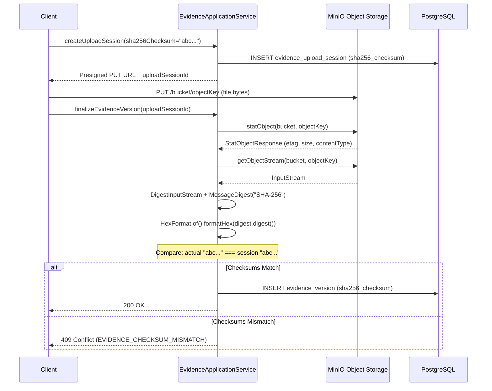

# Cryptography

## Overview

The Sentinel Enforcement Platform does **not implement any custom encryption algorithms**. All cryptographic operations use standard Java libraries (`java.security.MessageDigest`, `java.security.DigestInputStream`, `HexFormat`) or are delegated to external systems (Keycloak for password hashing, Nimbus JOSE for JWT verification, MinIO for object storage integrity, PostgreSQL for at-rest encryption).

| Concern | Algorithm | Implementation | Source |
|---|---|---|---|
| Evidence integrity | **SHA-256** | `MessageDigest.getInstance("SHA-256")` via `DigestInputStream` | `EvidenceApplicationService.java` |
| JWT signature verification | **RS256** (RSA with SHA-256) | Nimbus JOSE `JWSAlgorithmFamilyJWSKeySelector` with `RemoteJWKSet` | `KeycloakTokenVerifier.java` |
| Object storage etag | **MD5** (MinIO default) | `StatObjectResponse` etag from MinIO | `MinioEvidenceStorageAdapter.java` |
| Password hashing | **PBKDF2** | Keycloak realm configuration | `sentinel-realm.json` |
| At-rest encryption | **TLS + disk encryption** | PostgreSQL TLS + filesystem encryption | External (not in application) |

## Evidence Integrity — SHA-256

### Storage

The `EvidenceVersion` domain record stores the SHA-256 checksum as a required field:

```java
// EvidenceVersion.java (sentinel-domain) — lines 7-21
public record EvidenceVersion(
    UUID id,
    UUID evidenceId,
    int versionNumber,
    String originalFilename,
    String generatedFilename,
    String bucket,
    String objectKey,
    String mediaType,
    long sizeBytes,
    String sha256Checksum,  // 64-character lowercase hex string
    Instant uploadedAt,
    String uploadedBy,
    Instant createdAt,
    String createdBy
) {
  // sha256Checksum is validated in compact constructor:
  //   requireNonBlank(sha256Checksum, "sha256Checksum")
}
```

The persistence layer stores the checksum in the `evidence_version.sha256_checksum` column:

```java
// EvidenceVersionRecord.java (sentinel-persistence) — lines 6-20
public record EvidenceVersionRecord(
    // ...
    String sha256Checksum,  // persisted as sha256_checksum column
    // ...
) {}
```

### Verification on Finalize

When an evidence upload session is finalized, the application **recomputes the SHA-256 hash** of the object stored in MinIO and compares it against the checksum provided during the upload session creation:

```java
// EvidenceApplicationService.java — lines 205-210
String actualChecksum = calculateSha256(uploadSession.bucket(), uploadSession.objectKey());
if (!actualChecksum.equals(uploadSession.sha256Checksum())) {
  throw new EvidenceConflictException(
      "EVIDENCE_CHECKSUM_MISMATCH",
      "Uploaded object checksum does not match the evidence upload session contract.");
}
```

The SHA-256 computation streams the object from MinIO:

```java
// EvidenceApplicationService.java — lines 426-442
private String calculateSha256(String bucket, String objectKey) {
  MessageDigest digest;
  try {
    digest = MessageDigest.getInstance("SHA-256");
  } catch (NoSuchAlgorithmException exception) {
    throw new IllegalStateException("SHA-256 digest is not available.", exception);
  }
  try (InputStream inputStream =
      new DigestInputStream(evidenceStoragePort.getObjectStream(bucket, objectKey), digest)) {
    inputStream.transferTo(java.io.OutputStream.nullOutputStream());
    return HexFormat.of().formatHex(digest.digest());
  } catch (IOException exception) {
    throw new IllegalStateException(
        "Failed to compute SHA-256 for object " + objectKey + " in bucket " + bucket + ".",
        exception);
  }
}
```

**Checksum normalization** (at upload session creation time):

```java
// EvidenceApplicationService.java — lines 414-424
private static String normalizeChecksum(String checksum) {
  String normalized = checksum.trim().toLowerCase(Locale.ROOT);
  if (normalized.length() != 64) {
    throw new IllegalArgumentException(
        "sha256Checksum must be a 64 character lowercase hex digest");
  }
  return normalized;
}
```

The checksum is also written into audit event metadata during finalization:

```java
// EvidenceApplicationService.java — lines 244-246
"checksum=" + evidenceVersion.sha256Checksum(),
```

### Upload Session Checksum Contracts

The checksum is provided at upload session creation time and validated against the actual upload during finalization:



## JWT Signature Verification — RS256

JWT signature verification uses the **Nimbus JOSE + JWT** library with **RS256** (RSA signature with SHA-256):

```java
// KeycloakTokenVerifier.java — lines 156-168
private static JWTProcessor<SecurityContext> createJwtProcessor(
    KeycloakSecurityConfiguration configuration) {
  URL jwksUrl = configuration.jwksUri().toURL();
  JWKSource<SecurityContext> jwkSource = new RemoteJWKSet<>(jwksUrl);
  DefaultJWTProcessor<SecurityContext> processor = new DefaultJWTProcessor<>();
  processor.setJWSKeySelector(
      new JWSAlgorithmFamilyJWSKeySelector<>(JWSAlgorithm.Family.RSA, jwkSource));
  return processor;
}
```

- **Key source:** `RemoteJWKSet` fetches public keys from Keycloak's JWKS URI
- **Algorithm family:** RSA (supports RS256, RS384, RS512)
- **No custom key store** — keys are fetched dynamically from the remote JWKS endpoint
- **No custom JWT parsing** — all parsing and signature validation is delegated to Nimbus

## MinIO Object Storage Integrity — MD5 Etag

MinIO objects return an **etag** (by default an MD5 hash of the object content). While the application does not directly use the etag for integrity verification, it calls `statObject()` to validate object existence and metadata:

```java
// MinioEvidenceStorageAdapter.java — lines 95-113
@Override
public StoredEvidenceObject statObject(String bucket, String objectKey) {
  StatObjectResponse response = minioClient.statObject(
      StatObjectArgs.builder().bucket(validBucket(bucket)).object(validObjectKey(objectKey)).build());
  return new StoredEvidenceObject(
      response.size(), normalizeContentType(response.contentType()));
}
```

The `StatObjectResponse` (returned by MinIO) contains:
- `etag()` — MD5 hash of the object (or composite MD5 for multipart uploads)
- `size()` — object size in bytes
- `contentType()` — MIME type

The application uses `size()` and `contentType()` during finalization validation. **The primary evidence integrity check is the application-level SHA-256 hash**, not the MinIO etag.

## Password Hashing — Keycloak PBKDF2

Password hashing is entirely handled by **Keycloak**, which is configured via the `sentinel-realm.json` realm configuration file. Keycloak uses **PBKDF2** (Password-Based Key Derivation Function 2) with a configurable iteration count as its default password hashing algorithm.

The application never receives, stores, or processes plaintext passwords.

## At-Rest Encryption

The Sentinel Enforcement Platform does **not implement application-level at-rest encryption**:

- **Database (PostgreSQL):** Encryption is handled by PostgreSQL TLS (for in-transit) and filesystem-level disk encryption (for at-rest), configured at the infrastructure level
- **Object storage (MinIO):** Encryption is handled by MinIO's server-side encryption (SSE-S3, SSE-KMS) or bucket encryption policies, configured at the infrastructure level
- **Kafka:** Message encryption is handled by Kafka's TLS and at-rest encryption, configured at the infrastructure level

## Cryptographic Inventory Summary

| Operation | Algorithm | Library/Class | Key Management |
|---|---|---|---|
| Evidence SHA-256 computation | SHA-256 | `java.security.MessageDigest` | N/A (one-way hash) |
| Evidence checksum validation | SHA-256 | `java.security.DigestInputStream` + `HexFormat` | Hash compared against session contract |
| JWT signature verification | RS256 (RSA) | Nimbus JOSE `JWSAlgorithmFamilyJWSKeySelector` + `RemoteJWKSet` | Public keys fetched dynamically from Keycloak JWKS |
| MinIO object etag | MD5 | MinIO Java SDK (`StatObjectResponse.etag()`) | Server-managed |
| Password hashing | PBKDF2 | Keycloak (external) | Managed in Keycloak realm |
| Transport security | TLS | PostgreSQL, Kafka, MinIO (external) | Infrastructure-managed |
| At-rest encryption | Disk encryption | Infrastructure-level | Infrastructure-managed |

## Source Files

| File | Module | Role |
|---|---|---|
| `EvidenceApplicationService.java` | `sentinel-application` | SHA-256 checksum computation and validation on finalize |
| `EvidenceVersion.java` | `sentinel-domain` | Domain record with `sha256Checksum` field |
| `EvidenceVersionRecord.java` | `sentinel-persistence` | Persistence record with `sha256Checksum` column |
| `MinioEvidenceStorageAdapter.java` | `sentinel-storage` | MinIO stat/etag retrieval, presigned URL generation |
| `KeycloakTokenVerifier.java` | `sentinel-security` | RS256 JWT verification via RemoteJWKSet |
| `KeycloakSecurityConfiguration.java` | `sentinel-security` | JWKS URI configuration |
| `sentinel-realm.json` | `sentinel-security` | Keycloak realm (PBKDF2 password policy) |
